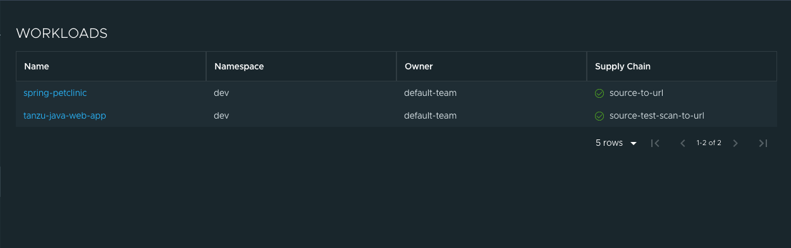
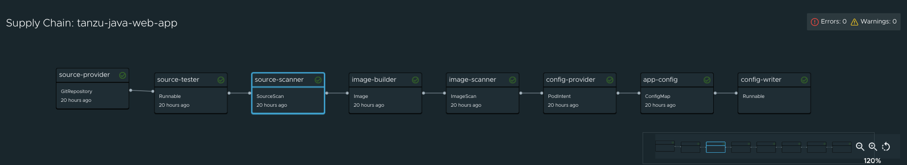
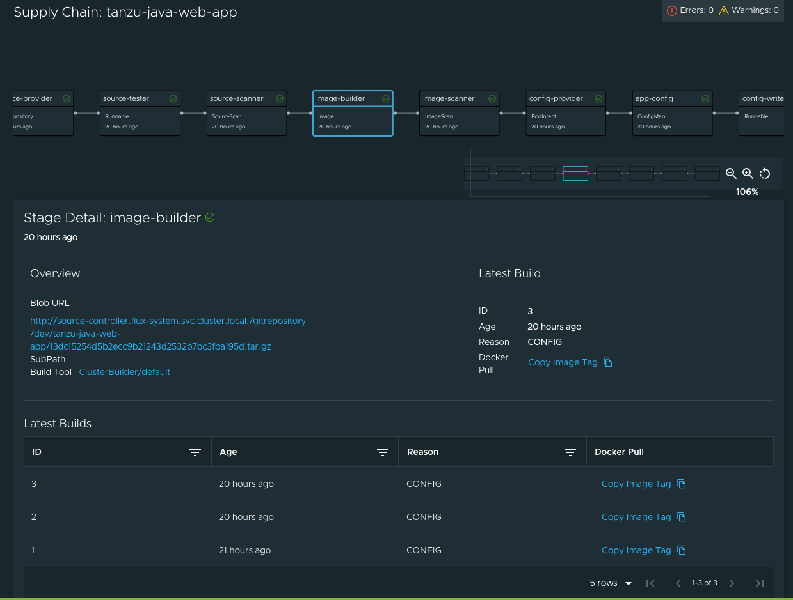
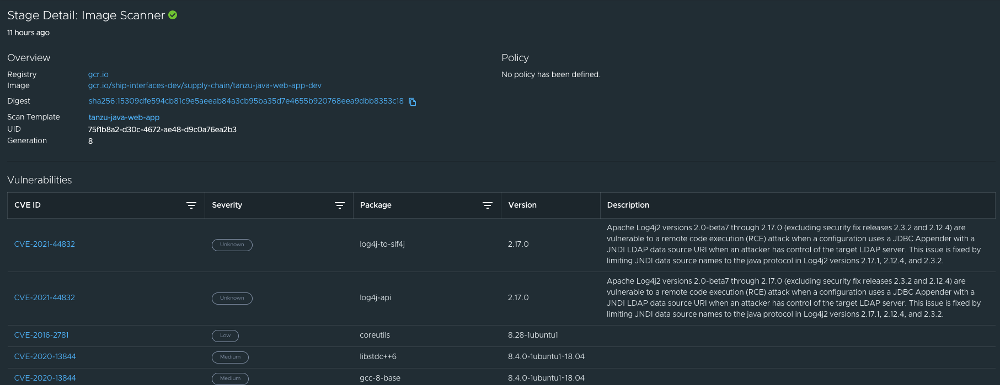

# Supply Chain Choreographer in Tanzu Application Platform GUI

This topic describes Supply Chain Choreographer in Tanzu Application Platform GUI.


## <a id="overview"></a> Overview

The Supply Chain Choreographer (SCC) plug-in enables you to visualize the execution of a workload
by using any of the installed Out-of-the-Box supply chains.
For more information about the Out-of-the-Box supply chains that are available in
Tanzu Application Platform, see [Supply Chain Choreographer for Tanzu](../../scc/about.md).


## <a id="prerequisites"></a> Prerequisites

To use Supply Chain Choreographer in Tanzu Application Platform GUI you must have:

* One of the following installed on your cluster:
  * [Tanzu Application Platform Full profile](../../install.md#install-profile)
  * [Tanzu Application Platform View profile](../../install.md#install-profile)
  * [Tanzu Application Platform GUI package](../install-tap-gui.md) and Metadata Store package
* One of the following installed on the target cluster where you want to deploy your workload:
  * [Tanzu Application Platform Run profile](../../install.md#install-profile)
  * [Tanzu Application Platform Full profile](../../install.md#install-profile)

For more information, see
[Overview of multicluster Tanzu Application Platform](../../multicluster/about.md)


## <a id="scan"></a> Enable CVE scan results

To enable CVE scan results:

1. [Create a read-only service account](../../scst-store/create-service-account-access-token.md#ro-serv-accts) to obtain an access token for the Metadata Store.
1. Add this proxy configuration to the `tap-gui:` section of `tap-values.yaml`:

    ```yaml
    tap_gui:
      app_config:
        proxy:
          /metadata-store:
            target: https://metadata-store-app.metadata-store:8443/api/v1
            changeOrigin: true
            secure: false
            headers:
              Authorization: "Bearer ACCESS-TOKEN"
              X-Custom-Source: project-star
    ```

    Where `ACCESS-TOKEN` is the token you obtained after creating a read-only service account.

## <a id="view-approvals"></a> Enable View Approvals 
To enable the supply chain graph to show **View Approvals**, follow the instructions on setting up GitOps and Pull Request in the [GitOps vs. RegistryOps](../../scc/gitops-vs-regops.md) topic.

## <a id="sc-visibility"></a> Supply Chain Visibility

To visualize your workload through the SCC plug-in, you must first create a workload.

The workload must have the `app.kubernetes.io/part-of` label specified, whether you manually create
the workload or use those supplied with the OOTB supply chains.

Use the left sidebar navigation to access your workload and visualize it in the supply chain that is
installed on your cluster.

For this example, we are looking at the `tanzu-java-web-app`.



Click **tanzu-java-web-app** in the **WORKLOADS** table to navigate to the visualization of the
supply chain.



There are two sections within this view:

- The graph section at the top shows all the configured CRDs that this supply chain uses, and any artifacts that the supply chain's execution outputs
- The stage details section at the bottom shows source data for each part of the supply chain that you select in the graph view

Here is a sample result of the Build stage for the `tanzu-java-web-app` by using Tanzu Build Service:



Here is a sample result of the Image Scan stage, using Grype - only available in the **test-scan** OOTB supply chain.  See [View Vulnerability Scan Results](#sc-view-scan-results) for more information.



When a workload is deployed to a cluster that has the `deliverable` package installed, a new section
appears in the supply chain that shows **Pull Config** and **Delivery**.


When you have a `Pull Request` configured in your environment, you can access the merge request from the supply chain by using the **Approve a Request** button that is displayed when **View Approvals**  is selected in the supply chain graph.

In the example below, the merge request is approved, leading to a **Pull Config** and **Delivery** shown in the supply chain graph.


## <a id="sc-view-scan-results"></a> View Vulnerability Scan Results

Vulnerability source scans and image scans for workload builds can be viewed by clicking on the Source Scan stage or Image Scan stage.  The data is provided by the [Supply Chain Security Tools - Store](../../scst-store/overview.md).

The vulnerabilities (i.e., CVEs) displayed represent any vulnerability associated to a package/version found in the source code or image, including vulnerabilities from past scans.  In other words, the vulnerability scan data represents the scan that just occurred, plus any other vulnerabilities related to the packages found in that scan.  

>**Note:** For example, the log4shell package is found in image ABC on January 1st without any CVEs.  On January 15th, the log4j CVE is found while scanning image DEF.  If a user returns to the Image Scan stage for image ABC, the log4j CVE will be shown associated to the log4shell package.