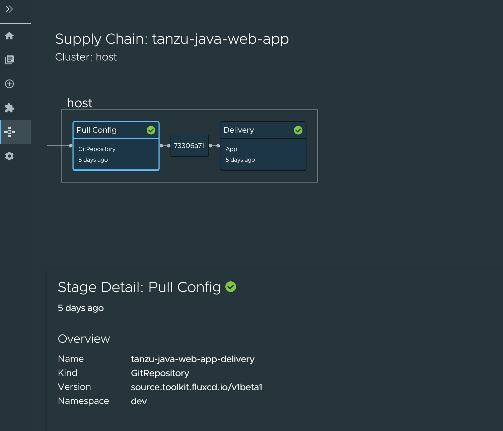

# Supply Chain Choreographer in Tanzu Application Platform GUI

This topic describes Supply Chain Choreographer in Tanzu Application Platform GUI.


## <a id="overview"></a> Overview

The Supply Chain Choreographer (SCC) plug-in enables you to visualize the execution of a workload
through any of the installed Out-Of-The-Box supply chains.
For more information about the Out-Of-The-Box Supply Chains that are available in
Tanzu Application Platform, and their installation guides, see [Supply Chain Choreographer for Tanzu](../../scc/about.md).


## <a id="prerequisites"></a> Prerequisites

You must have the Full profile or View profile installed on your cluster, which includes
Tanzu Application Platform GUI, or have installed the Tanzu Application Platform GUI package and
Metadata Store package, to visualize the supply chain.

You must have the Run or Full profile installed on the target cluster where you want to deploy your
workload, so that you can see your workload being deployed to that cluster. For more information, see
[Overview of multicluster Tanzu Application Platform](../../multicluster/about.md)

## <a id="scan"></a> Enable CVE scan results

1. [Create a read-only service account](../../scst-store/create-service-account-access-token.md#ro-serv-accts) to obtain an access token for the Metadata Store.
1. Add this proxy configuration to the `tap-gui:` section of `tap-values.yaml`:

    ```yaml
    tap_gui:
      app_config:
        proxy:
          /metadata-store:
            target: https://metadata-store-app.metadata-store:8443/api/v1
            changeOrigin: true
            secure: false
            headers:
              Authorization: "Bearer ACCESS-TOKEN"
              X-Custom-Source: project-star
    ```        

    Where `ACCESS-TOKEN` is the token you obtained after creating a read-only service account.


## <a id="sc-visibility"></a> Supply Chain Visibility

To visualize your workload through the SCC plug-in, you must first create a workload.

The workload must have the `app.kubernetes.io/part-of` label specified, whether you manually create
the workload or use those supplied with the OOTB supply chains.

Use the left sidebar navigation to access your workload and visualize it in the supply chain that is
installed on your cluster.

For this example, we are looking at the `tanzu-java-web-app`.


Click **tanzu-java-web-app** in the **WORKLOADS** table to navigate to the visualization of the
supply chain.


There are two sections within this view:

- the graph view at the top, which shows all the configured CRDs used by this supply chain and any artifacts that are outputs of the supply chain's execution
- the stage details view at the bottom, which shows source data for each part of the supply chain that you select in the graph view

Here is a sample result of the Build stage for the `tanzu-java-web-app` by using Tanzu Build Service:


Here is a sample result of the Image Scan stage, using Grype - only available in the **test-scan** OOTB supply chain


When a workload is deployed to a cluster that has the `deliverable` package installed, you will observe a new section in the supply chain that will show the **Pull Config** as well as the **Delivery**. A box will surround this section, showing the name of the cluster at the top, indicating which clusters the config has been deployed to.



