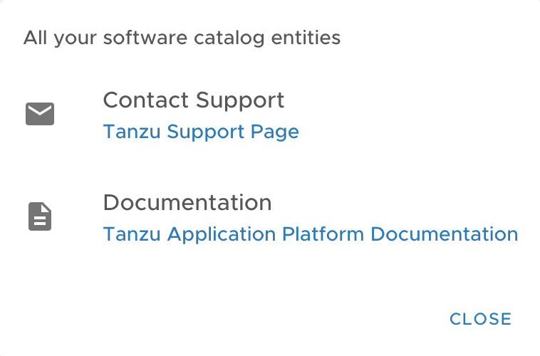
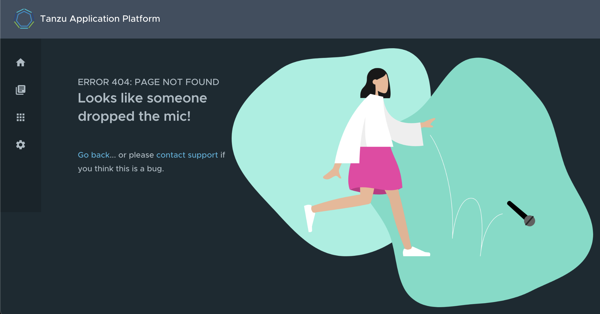

# Support Menu Customization

## What is the Support Menu?

Many important pages of Tanzu Application Platform GUI have a "Support"
button that displays a pop-out menu. This menu contains a one-line
description of the page the user is looking at, and a list of support
item groupings. For example, the default menu on the Catalog page looks like
this:



Out of the box, there are two support item groupings:
* Contact Support, which is marked with an "email" icon and contains a link to
  VMware Tanzu's support portal.
* Documentation, which is marked with a "docs" icon and contains a link to the
  Tanzu Application Platform documentation (which you are currently reading).

## Customizing

The set of support item groupings is completely customizable; however, you may
want to offer custom in-house links for your TAP users rather than simply
sending them to VMware support and documentation. You can provide this
configuration via your `tap-values-file.yml`. Here is a config snippet, which
produces the default support menu:

```
tap_gui:
  app_config:
    app:
      support:
        url: https://tanzu.vmware.com/support
        items:
          - title: Contact Support
            icon: email
            links:
              - url: https://tanzu.vmware.com/support
                title: Tanzu Support Page
          - title: Documentation
            icon: docs
            links:
              - url: https://docs.vmware.com/en/VMware-Tanzu-Application-Platform/index.html
                title: Tanzu Application Platform Documentation
```

## Structure of the Support Config

### URL

The `url` field under the `support` stanza, for example,

```
      support:
        url: https://tanzu.vmware.com/support
```

determines the address of the "contact support" link which appears on error
pages like this one:



### Items

The `items` field under the `support` stanza, for example,

determines the set of support item groupings to display when the support menu
is expanded.

#### Title

The `title` field on a support item grouping, for example,

```
        items:
          - title: Contact Support
```

determines the label for the grouping.

#### Icon

The `icon` field on a support item grouping, for example,

```
        items:
          - icon: email
```

determines the icon to use for that grouping. The valid choices are:
* `brokenImage`
* `catalog`
* `chat`
* `dashboard`
* `docs`
* `email`
* `github`
* `group`
* `help`
* `user`
* `warning`

#### Links

The `links` field on a support item grouping, for example,

```
        items:
          - links:
              - url: https://tanzu.vmware.com/support
                title: Tanzu Support Page
```

is a list of YAML objects which get rendered as links -- each link will have
the text given by the `title` field and link to the value of the `url` field.
