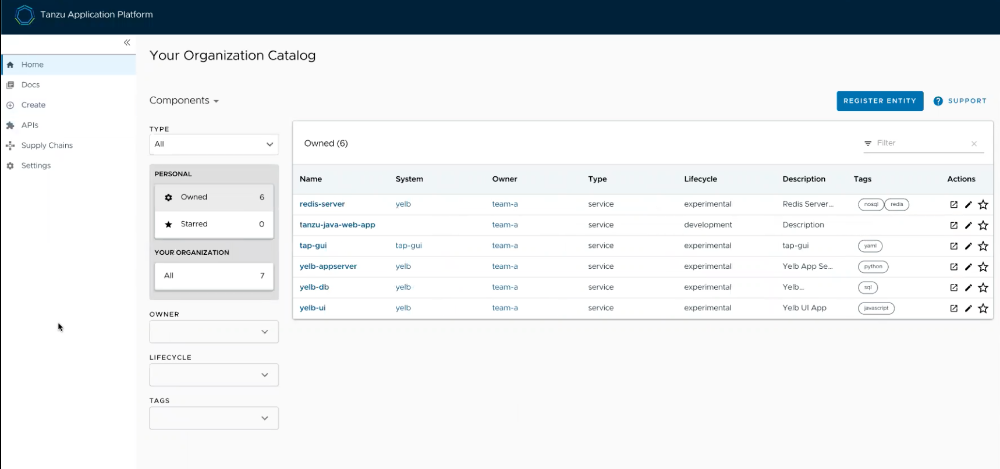

# Tanzu Application Platform GUI naming customization

## <a id="overview"></a> Overview

Tanzu Application Platform GUI portal provides the option to customize the logo and the name displayed at the top banner. 

Out of the box, the portal displays VMware Tanzu logo and is called `Tanzu Application Platform`:



## <a id="customizing"></a> Customizing

If you choose to customize your portal, you would need to provide additional configuration parameters via your `tap-values-file.yml` file or `tap-gui-values.yml` file if you installed Tanzu Application Platform GUI separately.

Here is a configuration snippet for `tap-values.yml` to customize your portal:

```
tap_gui:
  app_config:
    customize:
      custom_logo: 'BASE-64-IMAGE'
      custom_name: 'YOUR-PORTAL-NAME'
```

Where:

- `BASE-64-IMAGE` is the image encoded in base64. For optimal experience, we recommend using 72 px by 72 px PNG file format with transparent background. 
- `YOUR-PORTAL-NAME` is the name of the portal of choice.

Once the values configuration file has been updated, you would need to reinstall your Tanzu Application Platform GUI package as described in [Upgrading Tanzu Application Platform](/upgrading.md). 

## <a id="support-config-struct"></a> Customized Tanzu Application Platform GUI

Once the Tanzu Application Platform GUI is upgraded using the updated values configuration file, the user would see a customized version of their portal. For example:


If there is an error in the `BASE-64-IMAGE` or `YOUR-PORTAL-NAME`, the Tanzu Application Platform GUI would default to its original branding template.