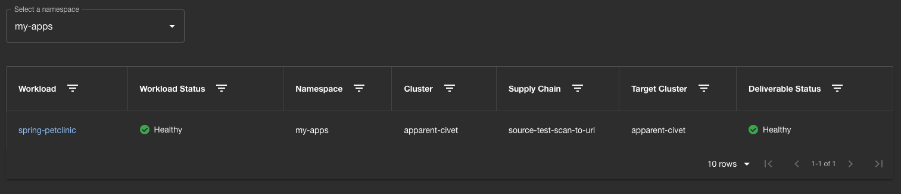

# Enable role-based access control for the Secure Supply Chains UI and Security Analysis UI plug-ins

This topic tells you how to make workloads visible on the Secure Supply Chains UI and the
Security Analysis UI when using a cluster with role-based access control (RBAC) and namespace-scoped
access.

## <a id="add-permissions"></a> Add permissions to list namespaces

To be able to get the information from the scoped namespaces, users must have permission to list
namespaces. To grant this permission, create a new `ClusterRole` and `ClusterRoleBinding`:

1. Add the following to `namespace-cluster-role.yaml`:

    ```yaml
    # namespace-cluster-role.yaml
    apiVersion: rbac.authorization.k8s.io/v1
    kind: ClusterRole
    metadata:
      name: namespaces-role
    rules:
    - apiGroups: ['']
      resources: ['namespaces']
      verbs: ['get', 'list']
    ```

2. Add the following to `namespaces-cluster-role-binding.yaml`:

    ```yaml
    # namespaces-cluster-role-binding.yaml
    apiVersion: rbac.authorization.k8s.io/v1
    kind: ClusterRoleBinding
    metadata:
      name: namespaces-rolebinding
    roleRef:
      apiGroup: rbac.authorization.k8s.io
      kind: ClusterRole
      name: namespaces-role
    subjects:
    - apiGroup: rbac.authorization.k8s.io
      kind: User
      name: YOUR-USER-ID
    ```

## <a id="add-label"></a> Add a label to the scoped namespaces

The current implementation requires the scoped namespaces to have a specific label or annotation.
If you are using Namespace Provisioner, one of the required labels is present.
However, to be safe, add the supported annotation to the scoped namespaces by running:

```console
kubectl annotate namespaces NAMESPACE apps.tanzu.vmware.com/tap-managed-ns=""
```

Where `NAMESPACE` is your namespace

With this annotation the UI can target the scoped namespaces and show you workloads on such
namespaces.

