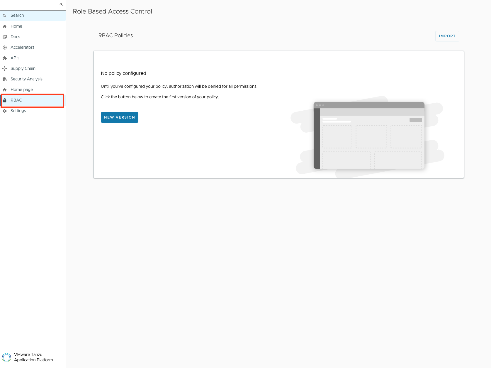

# Set up the Backstage role-based access control plug-in for Tanzu Developer Portal

This topic provides you an overview of the Backstage role-based access control (RBAC) plug-in and
demonstrates how to enable it in Tanzu Developer Portal. For more information about the plug-in, see
the:

- [Backstage official website](https://backstage.spotify.com/marketplace/spotify/plugin/rbac/)
- [Front-end plug-in documentation](https://www.npmjs.com/package/@spotify/backstage-plugin-rbac)
- [Back-end plug-in documentation](https://www.npmjs.com/package/@spotify/backstage-plugin-rbac-backend)

## <a id='rbac-overview'></a> Overview of the RBAC plug-in

The Backstage RBAC plug-in works with the [permission framework](set-up-tap-gui-prmssn-frmwrk.hbs.md)
to enable support for RBAC for Tanzu Application Platform operators.

## <a id='install-rbac'></a> Install the RBAC plug-in

To create a customized Tanzu Developer Portal with the RBAC plug-in, follow the steps in
[building a customized Tanzu Developer Portal with Configurator](../configurator/building.hbs.md)
modifying the steps to be like so:

1. Create a `tdp-config.yaml` file with the following structure:

    ```yaml
    app:
      plugins:
        - name: "@vmware-tanzu/tdp-plugin-rbac"
          version: "2.0.0"

    backend:
      plugins:
        - name: "@vmware-tanzu/tdp-plugin-rbac-backend"
          version: "2.0.0"
        - name: "@vmware-tanzu/tdp-plugin-permission-backend"
          version: "2.0.0"
    ```

    > **Important** If you want to install additional plug-ins, `@vmware-tanzu/tdp-plugin-rbac-backend`
    > must still come before `@vmware-tanzu/tdp-plugin-permission-backend` in the `backend.plugins`
    > section in `tdp-config.yaml`.

1. Encode the `tdp-config.yaml` file in Base64 by running:

    ```console
    base64 -i tdp-config.yaml
    ```

1. In your `tdp-workload.yaml` file, replace `ENCODED-TDP-CONFIG-VALUE` with the result of the
   Base64-encoded value from the prior step. Here is an example of what the `tdp-workload.yaml` file
   can look like:

    ```yaml
    apiVersion: carto.run/v1alpha1
    kind: Workload
    metadata:
      name: tdp-configurator
      labels:
        apps.tanzu.vmware.com/workload-type: web
        app.kubernetes.io/part-of: tdp-configurator
    spec:
      build:
        env:
          - name: BP_NODE_RUN_SCRIPTS
            value: "set-tdp-config,portal:pack"
          - name: TPB_CONFIG
            value: /tmp/tdp-config.yaml
          - name: TPB_CONFIG_STRING
            value: YXBwOgogIHBsdWdpbnM6CiAgICAtIG5hbWU6ICJAdm13YXJlLXRhbnp1L3RkcC1wbHVnaW4tcmJhYyIKICAgICAgdmVyc2lvbjogIjIuMC4wIgoKYmFja2VuZDoKICBwbHVnaW5zOgogICAgLSBuYW1lOiAiQHZtd2FyZS10YW56dS90ZHAtcGx1Z2luLXJiYWMtYmFja2VuZCIKICAgICAgdmVyc2lvbjogIjIuMC4wIgogICAgLSBuYW1lOiAiQHZtd2FyZS10YW56dS90ZHAtcGx1Z2luLXBlcm1pc3Npb24tYmFja2VuZCIKICAgICAgdmVyc2lvbjogIjIuMC4wIgo=
      source:
        image: TDP-IMAGE-LOCATION
        subPath: builder
    ```

    Where `TDP-IMAGE-LOCATION` is the location of the Configurator image.

1. Apply the `tdp-workload.yaml` file as a workload by running:

    ```console
    tanzu apps workload apply -f tdp-workload.yaml -n DEVELOPER-NAMESPACE
    ```

    Where `DEVELOPER-NAMESPACE` is the Kubernetes namespace you created to run your workloads.

    An example command to create such a namespace is:

    ```console
    $ kubectl create ns my-apps
    ```

1. After the workload has gone through the `image-provider` stage in the supply chain, follow the
   steps in [running a customized Tanzu Developer Portal](../configurator/running.hbs.md) to
   retrieve the location of the customized Tanzu Developer Portal image that the workload produces
   and overlay the customized image on to the instance of Tanzu Developer Portal currently running.

## <a id='enable-rbac'></a> Enable the RBAC plug-in

To enable the RBAC plug-in:

1. Ensure that the permission framework is enabled in the `tap_gui.app_config` section of
   `tap-values.yaml`:

    ```yaml
    permission:
      enabled: true
    ```

1. Add the plug-ins that use permissions and entity references for users and groups that you want to
   permit to configure RBAC. Also add the license key to use the RBAC plug-in:

    ```yaml
    permission:
      enabled: true
      permissionedPlugins:
        - PLUG-IN-NAME
      rbac:
        authorizedUsers:
          - group:NAMESPACE/NAME
          - user:NAMESPACE/NAME
    spotify:
      licenseKey: SPOTIFY-LICENSE-KEY
    ```

    Where:

    - `PLUG-IN-NAME` is a plug-in that includes permissions. Currently, the Catalog plug-in is the
      only first-party Backstage plug-in that includes permissions.
    - `NAMESPACE` is usually `default` unless defined otherwise in the definition file.
    - `NAME` is the name of the group or user.
    - `SPOTIFY-LICENSE-KEY` is the license key you received from Spotify.

   Example:

    ```yaml
    tap_gui:
      app_config:
        ... # other Tanzu Developer Portal app configuration
        permission:
          enabled: true
          permissionedPlugins:
            - PLUGIN-NAME
          rbac:
            authorizedUsers:
              - group:NAMESPACE/NAME
              - user:NAMESPACE/NAME
        spotify:
          licenseKey: SPOTIFY-LICENSE-KEY
    ```

1. With the overlay from [running a customized Tanzu Developer Portal](../configurator/running.hbs.md),
   ensure that the `tap-values.yaml` file has the `tap_gui` section and `package_overlays` section
   similar to this example:

    ```yaml
    tap_gui:
      app_config:
        ... # other Tanzu Developer Portal app configuration
        permission:
          enabled: true
          permissionedPlugins:
            - PLUGIN-NAME
          rbac:
            authorizedUsers:
              - group:NAMESPACE/NAME
              - user:NAMESPACE/NAME
        spotify:
          licenseKey: SPOTIFY-LICENSE-KEY

    package_overlays:
    - name: tap-gui
      secrets:
      - name: tdp-app-image-overlay-secret
    ```

1. Reinstall the Tanzu Developer Portal package by following the steps in
   [Upgrade Tanzu Application Platform](../../upgrading.hbs.md), and running this command with the
   `TAP_VERSION` you are using:

   ```console
   tanzu package installed update tap -p tap.tanzu.vmware.com -v ${TAP_VERSION}  \
   --values-file tap-values.yaml --namespace tap-install
   ```

1. Open Tanzu Developer Portal in your browser and verify that the **RBAC** tab is in the sidebar.

   

## <a id='extra'></a> Extra

You can identify someone who used an authentication provider to log in as a user authorized to author
RBAC policies.

To do so, edit your `tap_gui` section in `tdp-values.yaml` to look similar to this example that uses
Google authentication:

```yaml
tap_gui:
  app_config:
    auth:
      environment: development
      providers:
        google: # https://backstage.io/docs/auth/google/provider/
          development:
            clientId: GOOGLE-CLIENT-ID
            clientSecret: GOOGLE-CLIENT-SECRET
    permission:
      enabled: true
      permissionedPlugins:
      - catalog
      rbac:
        authorizedUsers:
        - group:default/admins
        - user:default/USER-GOOGLE-EMAIL
    spotify:
      licenseKey: SPOTIFY-LICENSE-KEY
```

Where:

- `GOOGLE-CLIENT-ID` and `GOOGLE-CLIENT-SECRET` are credentials provided after setting up Google
  authentication following [steps in the Backstage documentation](https://backstage.io/docs/auth/google/provider/)
- `USER-GOOGLE-EMAIL` is the Google account used to log in to Tanzu Developer Portal
- `SPOTIFY-LICENSE-KEY` is the license key provided by Spotify
