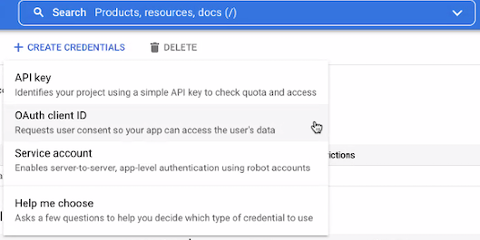
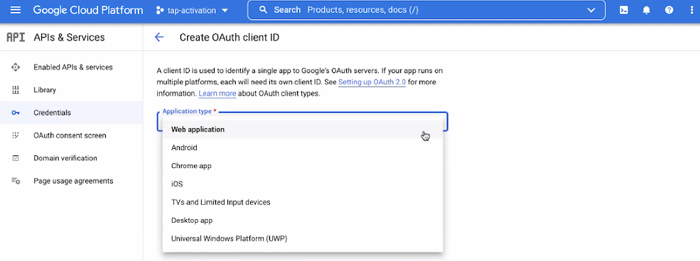
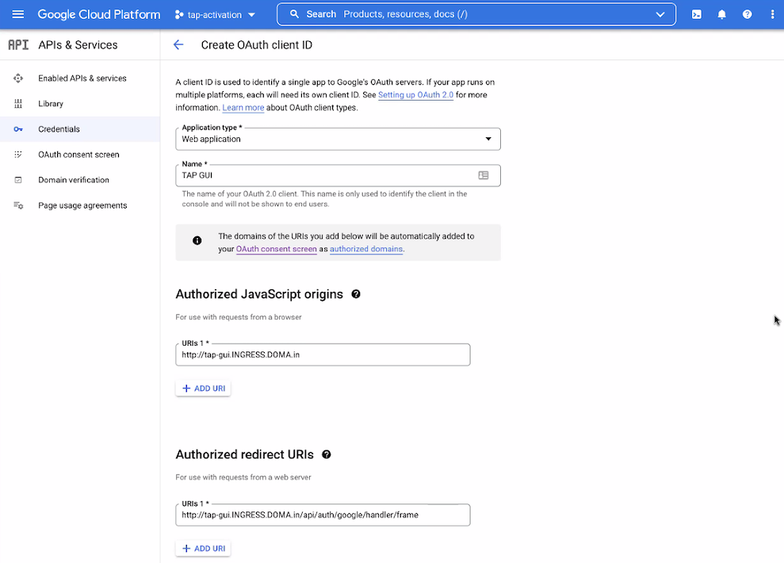
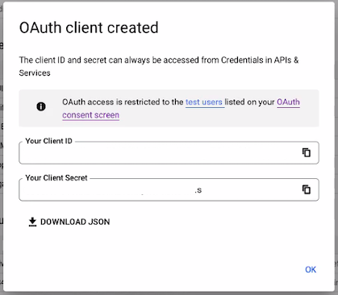

# Enable authorization on remote GKE clusters by using Google Auth

This section describes how to use Google Auth to add access-controlled visibility for a remote
GKE cluster.

After the authorization is enabled, you can view your runtime resources on a remote cluster in
Tanzu Application Platform GUI. For more information, see
[View runtime resources on remote clusters](view-rsrcs-rbac-only-global.md).

## <a id="googles-oidc-provider"></a> Use Google Auth

To use Google's OIDC provider to enable authorization:

1. [Create OAuth credentials in Google Cloud](#create-oauth-creds)
1. [Configure the Tanzu Application Platform GUI to view the remote GKE cluster](#configure-tap-gui)
1. [Upgrade the Tanzu Application GUI package](#upgrade-tap-gui)

### <a id="create-oauth-creds"></a> Create OAuth credentials in Google Cloud

Follow these steps to create OAuth credentials in Google Cloud. For more information, see
the [Consent](https://console.cloud.google.com/apis/credentials/consent) and
[Credentials](https://console.cloud.google.com/apis/credentials) topics in the Google Cloud
documentation.

1. Log in to the [Google Cloud console](https://console.cloud.google.com).
1. From the drop-down menu on the top bar, select the project to which your GKE cluster belongs.
1. If a consent screen has not already been configured for this project

    1. Go to **APIs & Services** > **OAuth consent screen**
    1. Add the top domain of your Tanzu Application Platform GUI server as an authorized domain
    1. For scopes, select **openid**, **auth/userinfo.email**, and **auth/userinfo.profile**

1. Go to **APIs & Services** > **Credentials**.
1. Click **Create Credentials** and select **OAuth client ID**.

    

1. Select **Web Application** as the **Application Type**.

    

1. Populate the following dialog boxes with these settings:

    - Name: `TAP GUI` or your custom app name
    - Authorized JavaScript origins: `http://tap-gui.INGRESS-DOMAIN`
    - Authorized redirect URIs: `http://tap-gui.INGRESS-DOMAIN/api/auth/google/handler/frame`

    Where `INGRESS-DOMAIN` is the ingress domain you specified during the installation of
    Tanzu Application Platform GUI

    

1. Click `Create` and store your credentials.

    

### <a id="configure-tap-gui"></a> Configure Tanzu Application Platform GUI to view the remote GKE cluster

Configure visibility of the remote GKE cluster in Tanzu Application Platform GUI:

1. Ensure you added an `auth` section to the `app_config` section that Tanzu Application Platform GUI
uses. In the example for Auth0, copy this YAML content into `tap-values.yaml`:

    ```yaml
    auth:
      environment: development
      providers:
        google:
          development:
            clientId: "CLIENT-ID"
            clientSecret: "CLIENT-SECRET"
    ```

    Where:

    - `CLIENT-ID` is the Client ID you obtained while setting up the OIDC provider
    - `CLIENT-SECRET` is the Client Secret you obtained while setting up the OIDC provider

1. Record your cluster URL for later use by running:

    ```console
    CLUSTER_URL=$(kubectl config view --minify -o jsonpath='{.clusters[0].cluster.server}')

    echo CLUSTER-URL: $CLUSTER_URL
    ```

1. Record the CA certificate data for later use by running:

    ```console
    CA_DATA=$(kubectl config view --minify -o jsonpath='{.clusters[0].cluster.certificate-authority-data}' --raw)

    echo CA-DATA: $CA_DATA
    ```

1. You must also add a `kubernetes` section to the `app_config` section that
Tanzu Application Platform GUI uses. This section must have an entry for each cluster that has
resources to view. To do so, copy this YAML content into `tap-values.yaml`:

    ```yaml
    kubernetes:
      clusterLocatorMethods:
        - type: 'config'
          clusters:
            - name: "CLUSTER-NAME-UNCONSTRAINED"
              url: "CLUSTER-URL"
              authProvider: google
              caData: "CA-DATA"
    ```

    Where:

    - `CLUSTER-NAME-UNCONSTRAINED` is the cluster name of your choice for your GKE cluster
    - `CLUSTER-URL` is the URL for the remote cluster you are connecting to
    Tanzu Application Platform GUI.
    - `CA-DATA` is the CA certificate data.

If there are any other clusters that you want to make visible in Tanzu Application Platform GUI, add
their entries to `clusters` as well.

### <a id="upgrade-tap-gui"></a> Upgrade the Tanzu Application Platform GUI package

To upgrade the Tanzu Application Platform GUI package:

1. Update the `tap-gui` package after the new configuration file is ready by running:

    ```console
    tanzu package installed update tap-gui --values-file tap-gui-values.yaml
    ```

    Or, if using the `tap-values.yaml` file, run:

    ```console
    tanzu package installed update tap --values-file tap-values.yaml
    ```

1. Wait a moment for the `tap-gui` package to update and then verify that `STATUS` is
`Reconcile succeeded` by running:

    ```console
    tanzu package installed get tap-gui -n tap-install
    ```
