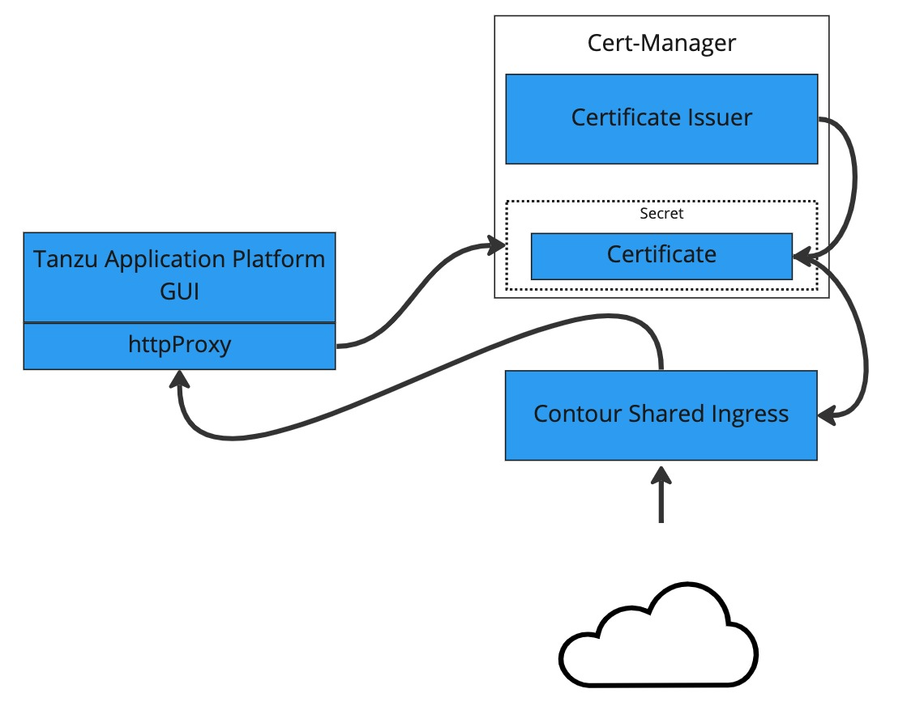

# Configure a TLS certificate by using a self-signed certificate

This topic tells you how to use cert-manager to create a self-signed certificate issuer and then
generate a certificate for Tanzu Application Platform GUI to use based on that issuer.

Some browsers and corporate policies do not allow you to visit webpages that have self-signed
certificates. You might need to navigate through a series of error messages to visit the page.



## <a id="prereq"></a> Prerequisite

Install a Tanzu Application Platform profile that includes cert-manager.
Verify you did this by running the following command to detect the cert-manager namespace:

```console
kubectl get ns
```

## <a id="procedure"></a> Procedure

To configure a self-signed TLS certificate for Tanzu Application Platform GUI:

1. Create a `certificate.yaml` file that defines an issuer and a certificate. For example:

   ```yaml
   apiVersion: cert-manager.io/v1
   kind: Issuer
   metadata:
     name: ca-issuer
     namespace: tap-gui
   spec:
     selfSigned: {}
   ---
   apiVersion: cert-manager.io/v1
   kind: Certificate
   metadata:
     name: tap-gui-cert
     namespace: tap-gui
   spec:
     secretName: tap-gui-cert
     dnsNames:
     - tap-gui.INGRESS-DOMAIN
     issuerRef:
       name: ca-issuer
   ```

   Where `INGRESS-DOMAIN` is your domain value that matches the values you used when you installed
   the profile.

2. Add the issuer and certificate to your cluster by running:

   ```console
   kubectl apply -f certificate.yaml
   ```

3. Configure Tanzu Application Platform GUI to use the newly created certificate.
   Update the `tap-values.yaml` file used during installation to include the following under the
   `tap-gui` section:

   - A top-level `tls` key with subkeys for `namespace` and `secretName`
   - A namespace referring to the namespace containing the `Certificate` object mentioned earlier
   - A secret name referring to the `secretName` value defined in your `Certificate` resource earlier

   Example:

   ```yaml
   tap_gui:
     tls:
       namespace: tap-gui
       secretName: tap-gui-cert
    # Additional configuration below this line as needed
   ```

4. Update the Tanzu Application Platform package with the new values in `tap-values.yaml`:

   ```console
   tanzu package installed update tap -p tap.tanzu.vmware.com -v TAP-VERSION  --values-file tap-values.yaml -n tap-install
   ```

   Where `TAP-VERSION` is the version that matches the values you used when you installed the profile.
