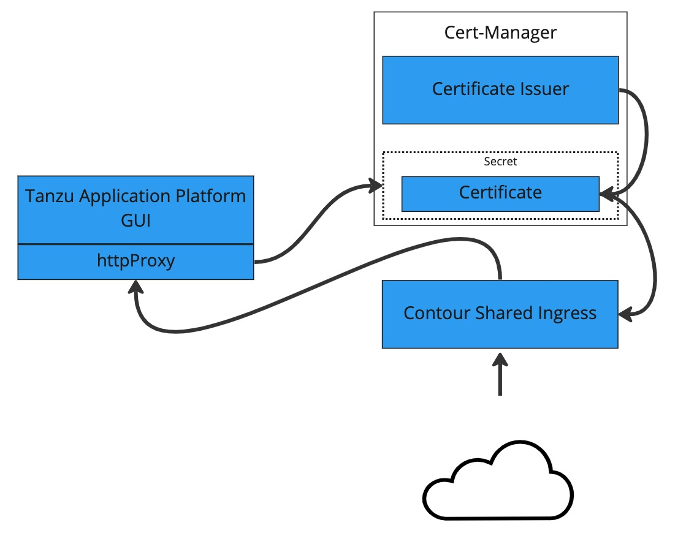

# Configuring TLS Certificate for Tanzu Application Platform GUI with a Self-signed Certificate

### Introduction

In the below procedure, we'll use `cert-manager` to create a self-signed certificate issuer and then generate a certificate for Tanzu Application Platform GUI to use based off that. It should be noted, some browsers or coroprate policies may not allow you to visit web pages that have self-signed certificates. You may have to navigate through a series of error messages to visit the page.


### Prerequisites

- Installation of Tanzu Application Platform profile that includes cert-manager. You can check for this by looking for the presence of the `cert-manager` namespace:

```console
kubectl get ns
```

### Procedure

To configure a self-signed TLS certificate for Tanzu Application Platform GUI:

1. Create a `certificate.yaml` file that defines an Issuer and a Certificate. For example:

   ```yaml
   apiVersion: cert-manager.io/v1
   kind: Issuer
   metadata:
     name: ca-issuer
     namespace: tap-gui
   spec:
     selfSigned: {}
   ---
   apiVersion: cert-manager.io/v1
   kind: Certificate
   metadata:
     name: tap-gui-cert
     namespace: tap-gui
   spec:
     secretName: tap-gui-cert
     dnsNames:
     - tap-gui.INGRESS-DOMAIN
     issuerRef:
       name: ca-issuer
   ```

   Where `INGRESS-DOMAIN` is your domain value that matches the values you used when you did the profile installation.

2. Add the Issuer and Certificate to your cluster by running:

   ```console
   kubectl apply -f certificate.yaml
   ```

3. Now we need to configure Tanzu Application Platform GUI to use to the newly created certificate. Update the `tap-values.yaml` used during the installation process to include the following under the `tap-gui` section:

   - a top-level `tls` key with subkeys for `namespace` and `secretName`
   - a namespace referring to the namespace containing the above `Certificate` object
   - a secret name referring to the `secretName` value defined in your `Certificate` resource earlier

   Example:

   ```yaml
   tap_gui:
     tls:
       namespace: tap-gui
       secretName: tap-gui-cert
    # Additional configuration below this line as needed
   ```

4. Update the Tanzu Application Platform package with the new values in the `tap-values.yaml`:

```console
tanzu package installed update tap -p tap.tanzu.vmware.com -v TAP_VERSION  --values-file tap-values.yaml -n tap-install
```

   Where `TAP-VERSION` is the version that matches the values you used when you did the profile installation.
