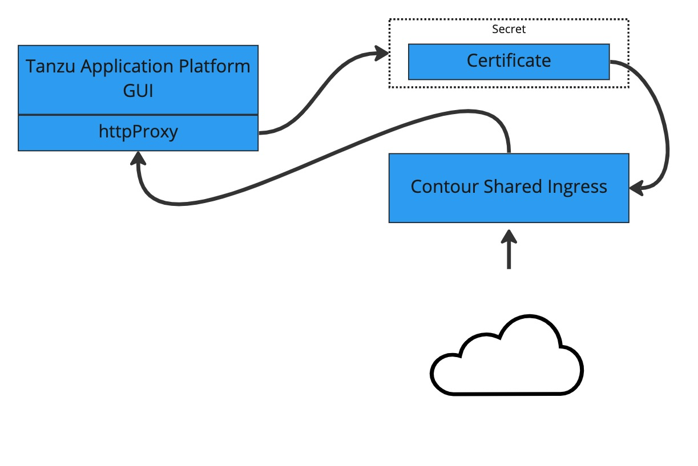

# Overview of enabling TLS for Tanzu Application Platform GUI

Many users want inbound traffic to Tanzu Application Platform GUI (commonly called TAP GUI) to be
properly encrypted. These topics tell you how to enable TLS encryption either with an existing
certificate or by using the included cert-manager instance.

##  Concepts

The two key concepts are certificate delegation and the relationship between cert-manager,
certificates, and ClusterIssuers.

###  Certificate delegation

Tanzu Application Platform GUI uses the established shared Contour ingress for TLS termination.

This enables you to store the certificate in a Kubernetes `secret` and then pass that `secret` and
`namespace` to the `httpProxy` that was created during installation.
To do this, see
[Configuring a TLS certificate by using an existing certificate](enable-tls-existing-cert.hbs.md).

###  cert-manager, certificates, and ClusterIssuers

Tanzu Application Platform GUI can also use the `cert-manager` package that is installed when
the profile was installed.

This tool allows cert-manager to automatically acquire a certificate from a `clusterIssuer` entity.

This external entity can be an external certificate authority, such as Let's Encrypt, or a
self-signed certificate.

##  Guides

The following topics describe different ways to configure TLS:

- [Configuring a TLS certificate by using an existing certificate](enable-tls-existing-cert.hbs.md)
- [Configuring a TLS certificate by using a self-signed certificate](enable-self-signed-cert.hbs.md)
- [Configuring a TLS certificate by using cert-manager and an external ClusterIssuer](cert-mngr-ext-clusterissuer.hbs.md)