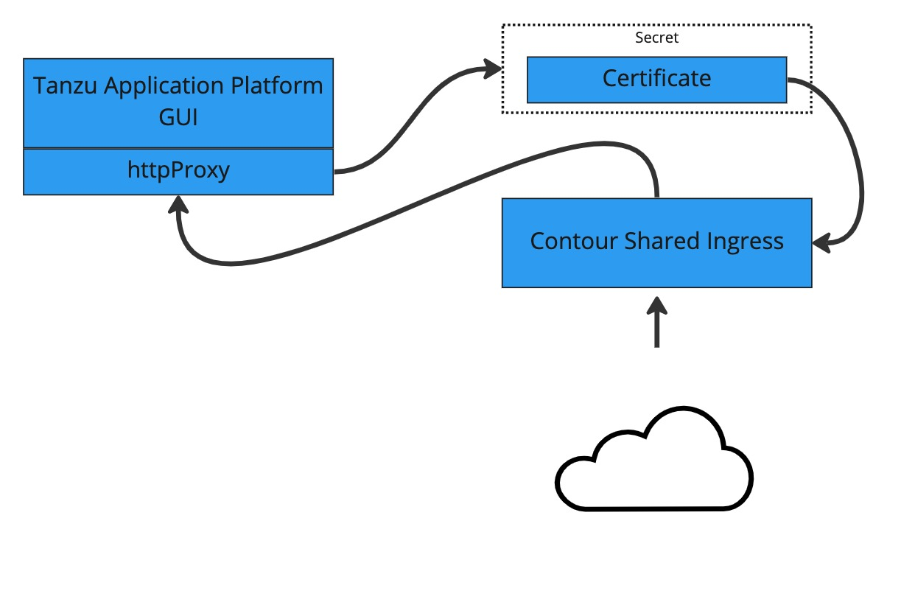

# Enabling TLS for Tanzu Application Platform GUI

## Introduction

Many users will want to ensure that inbound traffic to the Tanzu Application Platform GUI is properly encrypted. In these guides, the necessary steps are outlined and will enable TLS encryption either with an existign certificate, or by leveraging the included `cert-manager` instance.

## Concepts

### Certificate Delegation
Tanzu Application Platform GUI leverages the established shared Contour ingress for TLS termination. This means that we can store the certificate in a Kubernetes `secret`, then pass that `secret` and `namespace` to the `httpProxy` that is created as part of the installation. In order to do this, follow the steps outlined in [Using an Existing Certificate](./how-to-enable-tls-existing-cert.md)

### Cert-Manager, Certificates, and ClusterIssuers
Tanzu Application Platform GUI can also leverage the `cert-manager` package that is installed as part of the profile installation process. This tool allows `cert-manager` to automatically acquire a certificate from an `clusterIssuer` entity. This external entity can be an external Certificate Authority such as [Let's Encrypt](./how-to-cert-manager-external-clusterissuer-letsencrypt.md) or simply a [self-signed one](./how-to-enable-self-signed-cert.md).

## Guides

The following how-to guides will help you to configure TLS in a variety of scenarios:

- [Using an Existing Certificate](./how-to-enable-tls-existing-cert.md)
- [Using Cert-Manager and a Self-signed Certificate](./how-to-enable-self-signed-cert.md)
- [Leverage Cert-Manager and an External ClusterIssuer](./how-to-cert-manager-external-clusterissuer-letsencrypt.md) ([Let's Encrypt](https://letsencrypt.org))

