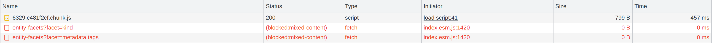
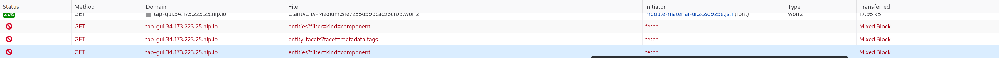

# Troubleshoot Tanzu Developer Portal

This topic tells you how to troubleshoot issues encountered when installing Tanzu Developer Portal
(formerly called Tanzu Application Platform GUI).

## <a id='port-range-invalid'></a> Tanzu Developer Portal reports that the port range is not valid

### Symptom

You provided a full URL in a `backend.reading.allow` entry, as in this example `tap-values.yaml` snippet:

```yaml
tap_gui:
  app_config:
    backend:
      reading:
        allow:
          - host: http://gitlab.example.com/some-group/some-repo/-/blob/main/catalog-info.yaml
```

and you see the following error message:

```console
Backend failed to start up, Error: Port range is not valid: //gitlab.example.com/some-group/some-repo/-/blob/main/catalog-info.yaml
```

### Cause

Tanzu Developer Portal expects a host name to be passed into the field `backend.reading.allow[].host`.

### Solution

Edit your `tap-values.yaml` file as in the following example:

```yaml
tap_gui:
  app_config:
    backend:
      reading:
        allow:
          - host: gitlab.example.com
            paths: ['/some-group/some-repo/']
```

## <a id='catalog-not-loading'></a> Tanzu Developer Portal does not load the catalog

### Symptom

You are able to visit Tanzu Developer Portal, but it does not load the catalog and you see the
following error message.

```console
> Error: Could not fetch catalog entities.
> TypeError: Failed to fetch
```

When viewing your network tab you see that your browser has not downloaded mixed content.
This might look different on different browsers.

Chrome
: In the **Status** column you see **(blocked:mixed-content)**
  

Firefox
: In the **Transferred** column you see **Mixed Block**
  

### Cause

As of Tanzu Application Platform v1.5, Tanzu Developer Portal provides TLS connections by default.
Because of this, if you visit a Tanzu Developer Portal site your connection is automatically
upgraded to https.

You might have manually set the fields `app.baseUrl`, `backend.baseUrl`, and `backend.cors.origin`
in your `tap-values.yaml` file.
Tanzu Developer Portal uses the `baseUrl` to determine how to create links to fetch from its
APIs. The combination of these two factors causes your browser to attempt to fetch mixed content.

### Solution

The solution is to delete these fields or update your values in `tap-values.yaml` to reflect that your
Tanzu Developer Portal instance is serving https, as in the following example:

```yaml
tap_gui:
  app_config:
    app:
      baseUrl: https://tap-gui.INGRESS-DOMAIN/
    backend:
      baseUrl: https://tap-gui.INGRESS-DOMAIN/
      cors:
        origin: https://tap-gui.INGRESS-DOMAIN/
```

Where `INGRESS-DOMAIN` is the ingress domain you have configured for Tanzu Application Platform.

The installer determines acceptable values based on your `tap_gui.ingressDomain` or
`shared.ingress_domain` and the TLS status of the installation.

## <a id='update-sc-err'></a> Updating a supply chain causes an error (`Can not create edge...`)

### Symptom

Updating a supply chain causes an error (`Can not create edge...`) when an existing workload
is clicked in the Workloads table and that supply chain is no longer present.

### Solution

Recreate the same workload to execute through the new or updated supply chain.

## <a id='catalog-not-found'></a> Catalog not found

### Symptom

When you pull up Tanzu Developer Portal, you get the error `Catalog Not Found`.

### Cause

The catalog plug-in can't read the Git location of your catalog definition files.

### Solution

1. Ensure you have built your own [Backstage](https://backstage.io/)-compatible catalog or that
   you have downloaded one of the Tanzu Developer Portal catalogs from VMware Tanzu Network.
2. Ensure you defined the catalog in the values file that you input as part of installation.
   To update this location, change the definition file:

      - Change the Tanzu Application Platform profile file if installed by using a profile.
      - Change the standalone Tanzu Developer Portal values file if you're only installing
        that package on its own.

    ```yaml
        namespace: tap-gui
        service_type: SERVICE-TYPE
        app_config:
          catalog:
            locations:
              - type: url
                target: https://GIT-CATALOG-URL/catalog-info.yaml
    ```

3. Provide the proper integration information for the Git location you specified earlier.

    ```yaml
        namespace: tap-gui
        service_type: SERVICE-TYPE
        app_config:
          app:
            baseUrl: https://EXTERNAL-IP:PORT
          integrations:
            gitlab: # Other integrations available
              - host: GITLAB-HOST
                apiBaseUrl: https://GITLAB-URL/api/v4
                token: GITLAB-TOKEN
    ```

You can substitute for other integrations as defined in the
[Backstage documentation](https://backstage.io/docs/integrations/).

## <a id='updating-tap-gui-values'></a> Issues updating the values file

### Symptom

After updating the configuration of Tanzu Developer Portal, either by using a profile or as a
standalone package installation, you don't know whether the configuration has reloaded.

### Solution

1. Get the name you need by running:

    ```console
    kubectl get pods -n tap-gui
    ```

    For example:

    ```console
    $ kubectl get pods -n tap-gui
    NAME                      READY   STATUS    RESTARTS   AGE
    server-6b9ff657bd-hllq9   1/1     Running   0          13m
    ```

1. Read the log of the pod to see if the configuration reloaded by running:

    ```console
    kubectl logs NAME -n tap-gui
    ```

    Where `NAME` is the value you recorded earlier, such as `server-6b9ff657bd-hllq9`.

1. Search for a line similar to this one:

   ```console
   2021-10-29T15:08:49.725Z backstage info Reloaded config from app-config.yaml, app-config.yaml
   ```

1. If need be, delete and re-instantiate the pod.

   > **Caution** Depending on your database configuration, deleting, and re-instantiating
   > the pod might cause the loss of user preferences and manually registered entities.
   > If you have configured an external PostgreSQL database, `tap-gui` pods are not stateful.
   > In most cases, state is held in ConfigMaps, Secrets, or the database.
   > For more information, see [Configuring the Tanzu Developer Portal database](database.md)
   > and [Register components](catalog/catalog-operations.md#register-comp).

   To delete and re-instantiate the pod, run:

    ```console
    kubectl delete pod -l app=backstage -n tap-gui
    ```

## <a id='tap-gui-logs'></a> Pull logs from Tanzu Developer Portal

### Symptom

You have a problem with Tanzu Developer Portal, such as `Catalog: Not Found`, and don't have
enough information to diagnose it.

### Solution

Get timestamped logs from the running pod and review the logs:

1. Pull the logs by using the pod label by running:

    ```console
    kubectl logs -l app=backstage -n tap-gui
    ```

2. Review the logs.

## <a id='ad-block-interference'></a> Ad-blocking software interference

### Symptom

One or both of the following is true:

- You cannot access some, or all, of Tanzu Developer Portal.
- Telemetry collection within the VMware
  [Customer Experience Improvement Program](https://www.vmware.com/solutions/trustvmware/ceip.html)
  is failing.

### Cause

Your ad-blocking browser extension or standalone ad-blocking software is causing interference.

### Solution

Add Tanzu Developer Portal to your ad-blocking allowlist.
Alternatively, deactivate the ad-blocking software or
[turn off Pendo telemetry collection](../opting-out-telemetry.hbs.md#turn-off-pendo-telemetry-collection).

## <a id='runtime-resource-visibility'></a> Runtime Resources tab

Here are some common troubleshooting steps for errors presented in the **Runtime Resources** tab.

### <a id='rrv-network-error'></a> Error communicating with Tanzu Application Platform web server

#### Symptom

When accessing the **Runtime Resource Visibility** tab, the system displays
`Error communicating with TAP GUI back end.`

#### Causes

- An interrupted Internet connection
- Error with the back end service

#### Solution

1. Confirm that you have Internet access.
2. Confirm that the back-end service is running correctly.
3. Confirm the cluster configuration is correct.

### <a id='rrv-no-data-found'></a> No data available

#### Symptom

When accessing the **Runtime Resource Visibility** tab, the system displays

```console
One or more resources are missing. This could be due to a label mismatch. \
Please make sure your resources have the label(s) "LABEL_SELECTOR".
```

#### Cause

No communications error has occurred, but no resources were found.

#### Solution

Confirm that you are using the correct label:

1. Verify the [Component definition](catalog/catalog-operations.md) includes the annotation
   `backstage.io/kubernetes-label-selector`.

2. Confirm your Kubernetes resources correspond to that label drop-down menu.

### Errors retrieving resources

#### Symptom

When opening the **Runtime Resource Visibility** tab, the system displays
`One or more resources might be missing because of cluster query errors.`

The reported errors might not indicate a real problem.
A build cluster might not have runtime CRDs installed, such as Knative Service, and a run cluster
might not have build CRDs installed, such as a Cartographer workload.
In these cases, 403 and 404 errors might be false positives.

You might receive the following error messages:

- `Access error when querying cluster CLUSTER_NAME for resource KUBERNETES_RESOURCE_PATH (status: 401). Contact your administrator.`
  - **Cause:** There is a problem with the cluster configuration.
  - **Solution:** Confirm the access token used to request information in the cluster.

- `Access error when querying cluster CLUSTER_NAME for resource KUBERNETES_RESOURCE_PATH (status: 403). Contact your administrator.`
  - **Cause:** The service account used doesn’t have access to the specific resource type in the cluster.
  - **Solution:** If the cluster is the same where **Tanzu Application Platform** is running, review
    the version installed to confirm it contains the desired resource.
    If the error is in a watched cluster, review the process to grant access to it in
    [Viewing resources on multiple clusters in Tanzu Developer Portal](cluster-view-setup.md).

- `Knative is not installed on CLUSTER_NAME (status: 404). Contact your administrator.`
  - **Cause:** The cluster does not have Cloud Native Runtimes installed.
  - **Solution:** Install the Knative components by following the instructions in
    [Install Cloud Native Runtimes](../cloud-native-runtimes/install-cnrt.md).

- `Error when querying cluster CLUSTER_NAME for resource KUBERNETES_RESOURCE_PATH (status: 404). Contact your administrator.`
  - **Cause:** The package that contains the resource is not installed.
  - **Solution:** Install the missing package.

## <a id='app-accelerators-page'></a> Accelerators page

Here are some common troubleshooting steps for errors displayed on the **Accelerators** page.

### <a id='no-accelerators'></a> No accelerators

#### Symptom

When the `app_config.backend.reading.allow` section is configured in the `tap-values.yaml` file
during the `tap-gui` package installation, there are no accelerators on the **Accelerators** page.

#### Cause

This section in `tap-values.yaml` overrides the default configuration that gives
Tanzu Developer Portal access to the accelerators.

#### Solution

As a workaround, provide a value for Application Accelerator in this section.
For example:

```yaml
app_config:
  # Existing tap-values yaml above
  backend:
    reading:
      allow:
      - host: acc-server.accelerator-system.svc.cluster.local
```

### <a id='ivs-support'></a> Supporting ImageVulnerabilityScans

#### Symptom

SCST - Scan 2.0 is enabled and there is no vulnerability data on the Security Analysis and
Supply Chain Choreographer dashboards.

#### Cause

Tanzu Developer Portal lacks the required access to detect the new `ImageVulnerabilityScan`
custom resource.

#### Solution

As a workaround, you can apply a ytt overlay to add permissions to the Kubernetes role that
is used to access the `ImageVulnerabilityScan` resource. For more information about how
overlays work with Tanzu Application Platform, see
[Customize your package installation](../customize-package-installation.hbs.md).

1. Create a `secret.yml` file with a `Secret` that contains your ytt overlay. For example:

    ```yaml
    kind: Secret
    metadata:
      name: add-tap-portal-ivs-permissions
      namespace: tap-install
      annotations:
        kapp.k14s.io/change-group: "tap-overlays"
    type: Opaque
    stringData:
      add-tap-portal-ivs-permissions.yaml: |
        #@ load("@ytt:overlay", "overlay")
        #@overlay/match by=overlay.subset({"metadata":{"name":"k8s-reader"}, "kind": "ClusterRole"})
        ---
        rules:
          #@overlay/append
            - apiGroups:
              - app-scanning.apps.tanzu.vmware.com
              resources:
              - imagevulnerabilityscans
              verbs:
              - get
              - watch
              - list
    ```

1. Apply the `Secret` to your cluster by running:

   ```console
   kubectl apply -f secret.yml
   ```

1. Update your values file to include a `package_overlays` field:

    ```yaml
    package_overlays:
    - name: tap-gui
    secrets:
    - name: add-tap-portal-ivs-permissions
    ```

1. Update Tanzu Developer Portal with the new Tanzu Application Platform values by running:

   ```console
   tanzu package installed update tap -p tap.tanzu.vmware.com -n tap-install --values-file tap-values.yaml
   ```

## Security Analysis plug-in

These are troubleshooting issues for the [Security Analysis plug-in](plugins/sa-tap-gui.hbs.md).

### <a id='empty-impctd-wrklds-table'></a> Empty Impacted Workloads table

#### Symptom

The Impacted Workloads table is empty on the **CVE and Package Details** pages.

#### Cause

The relevant CVE belongs to a workload that has only completed one type of vulnerability scan
(either image or source).

#### Solution

A fix is planned for Tanzu Developer Portal v1.5.1.

## Supply Chain Choreographer plug-in

These are troubleshooting issues for the [Supply Chain Choreographer plug-in](plugins/scc-tap-gui.hbs.md).

{{> 'partials/tap-gui/ts-err-load-metadata-store' }}

## <a id='sbom-not-working'></a> SBOMs do not download when automatically configuring Tanzu Developer Portal for SCST - Store

### Symptom

The auto configuration between Tanzu Developer Portal and SCST - Store prevents the SBOM feature from
working. The SBOM feature was introduced in Tanzu Application Platform v1.6.

### Cause

Backstage expects `allowedHeaders` values for SCST - Store to reply with proper XML and JSON SBOM
responses. The `allowedHeaders` values are missing.

### Solution

Edit your `tap-values.yaml` file so that `allowedHeaders` and the accompanying values are included:

```yaml
tap_gui:
  app_config:
    proxy:
      /metadata-store:
        target: https://metadata-store-app.metadata-store:8443/api/v1
        changeOrigin: true
        secure: false
        allowedHeaders: ['Accept', 'Report-Type-Format']
        headers:
          Authorization: "Bearer ACCESS-TOKEN"
          X-Custom-Source: project-star
```

Where `ACCESS-TOKEN` is the token you obtained after creating a read-write service account.
For more information, see
[Manually connect Tanzu Developer Portal to Metadata Store](../tap-gui/plugins/scc-tap-gui.hbs.md#scan-manual).