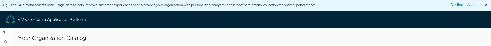
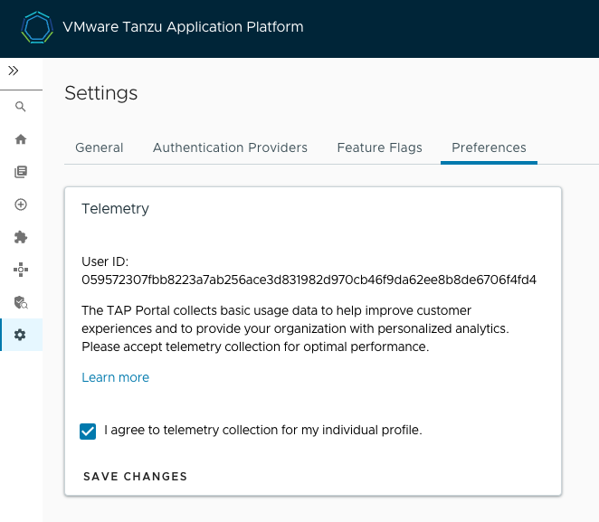

# Opt in or opt out of Pendo telemetry for Tanzu Application Platform GUI

<!-- This topic must be accessible from https://docs.vmware.com/en/VMware-Tanzu-Application-Platform/{{ vars.url_version }}/tap/tap-portal-telemetry.html. And possibly all the content needs to be in one place, exactly as below, because it's a legal disclosure about data collection. Be careful wrt to content strategy, in other words. -->

Tanzu Application Platform GUI uses Pendo.io to better understand the way users interact with it in
order to provide a better user experience for our customers and to improve VMware products and services.

Pendo.io collects data based on your interaction with the software, such as clickstream data and page
loads, hashed user ID, and limited browser and device information.

By default, each instance of Tanzu Application Platform GUI is assigned to a random organization ID to ensure that your sensitive information is not revealed. However, you may choose to customize your organization ID and self-identify. That would allow VMware to observe account-level telemetry: frequency of portal usage, most popular functionality, etc. To do that, please follow the steps specified in [Customize the Tanzu Application Platform GUI telemetry collection](//tap-gui/customize/customize-telemetry.hbs.md).

To enable or deactivate Pendo telemetry for the organization, see
[Enable or deactivate the Pendo telemetry for the organization](opting-out-telemetry.hbs.md#nbl-or-dsbl-pendo-for-org).

> **Note** Pendo telemetry is separate from the VMware CEIP telemetry.
> There is a separate process for opting in or out of the VMware CEIP. For more information, see
> [Opt out of telemetry collection](opting-out-telemetry.hbs.md).

##  Opt in or opt out of Pendo telemetry from Tanzu Application Platform GUI

After the Pendo telemetry is enabled for the organization, in accordance with VMware policy each user
is prompted to agree to participate in the program or decline.

  

Each individual's preference is stored in Tanzu Application Platform GUI and can be modified at any
time. To change your preferences, go to **Settings** > **Preferences**.

  

##  Request to delete your anonymized data

If you no longer want to participate in the program and you want VMware to delete all your anonymized
data, please send an email requesting deletion, with your hashed User ID, to
[tap-pendo@groups.vmware.com](mailto:tap-pendo@groups.vmware.com).

This enables VMware to identify your anonymized data and delete it in accordance with the applicable
regulations.

To find your hashed User ID, go to **Settings** > **Preferences** in Tanzu Application Platform GUI.