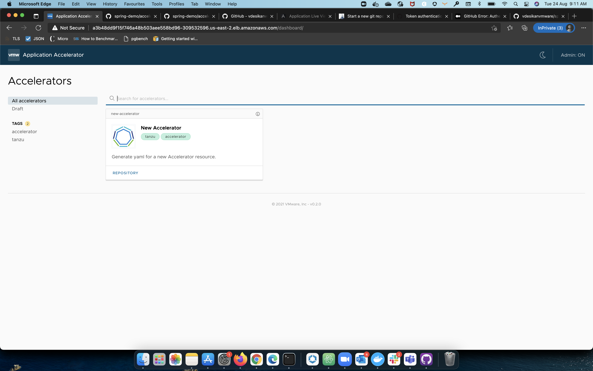
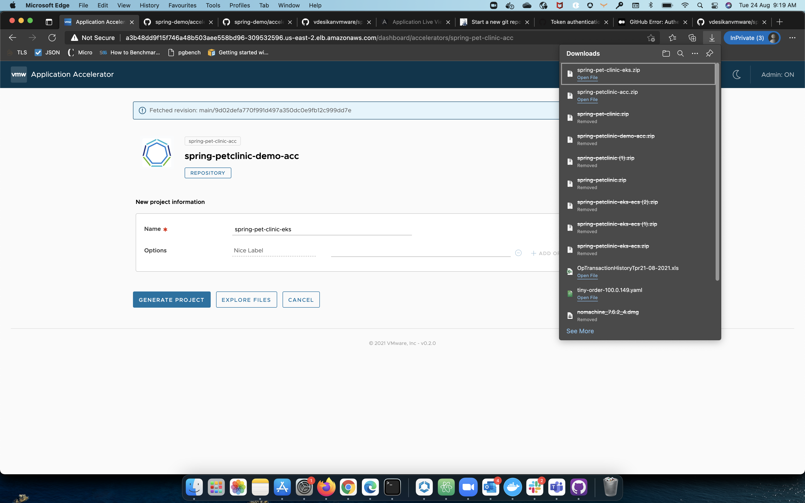
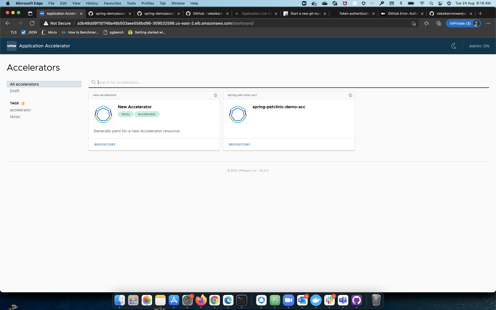

# Tanzu Application Platform Tutorial: Install and Deploy the Spring Pet Clinic App 
This topic describes how to use Tanzu Application Platform capabilities to install, configure, and deploy the Spring Pet Clinic app. This procedure includes Cloud Native Runtimes, Application Live View, Application Accelerator, and Tanzu Build Service. 

## Install and Configure the  Tanzu Application Platform Bundle

1. Install Tanzu Application Platform. See [Installing Tanzu Application Platform](install.md).

## Deploying the Spring Pet Clinic App
1. Create an Application Accelerator template for the `spring-pet-clinic` app from your git repository.
  1. Create a New Accelerator.
      ```
      tap-install % more new-accelerator.yaml
      apiVersion: accelerator.apps.tanzu.vmware.com/v1alpha1
      kind: Accelerator
      metadata:
        name: new-accelerator
      spec:
        git:
          url: https://github.com/sample-accelerators/new-accelerator
          ref:
            branch: main
            tag: v0.2.x
      tap-install % kubectl apply -f new-accelerator.yaml
      accelerator.accelerator.apps.tanzu.vmware.com/new-accelerator created
      tap-install % kubectl get accelerator                 
      NAME              READY   REASON   AGE
      new-accelerator   True             5s
      ```
      
  2. Create the `spring-pet-clinic` accelerator, and add the accelerator.yaml to your git repo. You will see the accelerator you created in the Application Accelerator UI.
      ```
      tap-install % cd ../Downloads
      Downloads % ls | grep spring
      spring-petclinic-acc.zip
      Downloads % unzip spring-petclinic-acc.zip
      Archive:  spring-petclinic-acc.zip
         creating: spring-petclinic-acc/
        inflating: spring-petclinic-acc/accelerator.yaml 
        inflating: spring-petclinic-acc/k8s-resource.yaml 
        inflating: spring-petclinic-acc/README.md 
        inflating: spring-petclinic-acc/accelerator-log.md 
      Downloads % cd spring-petclinic-acc
      spring-petclinic-acc % ls
      README.md       accelerator-log.md  accelerator.yaml    k8s-resource.yaml
      spring-petclinic-acc % kubectl apply -f k8s-resource.yaml
      accelerator.accelerator.apps.tanzu.vmware.com/spring-pet-clinic-acc created
      spring-petclinic-acc % kubectl get accelerator             
      NAME                    READY   REASON   AGE
      new-accelerator         True             4m32s
      spring-pet-clinic-acc   True             7s
      spring-petclinic-acc % more accelerator.yaml  
      accelerator:
        displayName: spring-petclinic-acc
        description: spring per clinic accelerator
        iconUrl: https://raw.githubusercontent.com/sample-accelerators/icons/master/icon-tanzu-light.png
        tags: []
        options:
        - name: optionName
          label: Nice Label
          display: true
          defaultValue: ""
      engine:
        include:
        - '**'
      ```
      
      
      
2. Generate a project named `spring-pet-clinic-eks`. Create a new git repo `spring-pet-clinic-eks.git`. Using the new `spring-petclinic-demo-acc`, add the `spring-pet-clinic-eks` project to the `spring-pet-clinic-eks.git` git repo.
  
  ```
  spring-petclinic-acc % cd ../
  Downloads % ls | grep spring                 
  spring-pet-clinic-eks.zip
  spring-petclinic-acc
  spring-petclinic-acc.zip
  Downloads % unzip spring-pet-clinic-eks.zip
  Archive:  spring-pet-clinic-eks.zip
     creating: spring-pet-clinic-eks/
    inflating: spring-pet-clinic-eks/mvnw 
     creating: spring-pet-clinic-eks/src/
     creating: spring-pet-clinic-eks/src/main/
     creating: spring-pet-clinic-eks/src/main/java/
     creating: spring-pet-clinic-eks/src/main/java/org/
     creating: spring-pet-clinic-eks/src/main/java/org/springframework/
     creating: spring-pet-clinic-eks/src/main/java/org/springframework/samples/
     creating: spring-pet-clinic-eks/src/main/java/org/springframework/samples/petclinic/
     creating: spring-pet-clinic-eks/src/main/java/org/springframework/samples/petclinic/vet/
    inflating: spring-pet-clinic-eks/src/main/java/org/springframework/samples/petclinic/vet/VetController.java 
    inflating: spring-pet-clinic-eks/src/main/java/org/springframework/samples/petclinic/vet/Vet.java 
    inflating: spring-pet-clinic-eks/src/main/java/org/springframework/samples/petclinic/vet/Specialty.java 
    inflating: spring-pet-clinic-eks/src/main/java/org/springframework/samples/petclinic/vet/Vets.java 
    inflating: spring-pet-clinic-eks/src/main/java/org/springframework/samples/petclinic/vet/VetRepository.java 
     creating: spring-pet-clinic-eks/src/main/java/org/springframework/samples/petclinic/model/
    inflating: spring-pet-clinic-eks/src/main/java/org/springframework/samples/petclinic/model/package-info.java 
    inflating: spring-pet-clinic-eks/src/main/java/org/springframework/samples/petclinic/model/NamedEntity.java 
    inflating: spring-pet-clinic-eks/src/main/java/org/springframework/samples/petclinic/model/Person.java 
    inflating: spring-pet-clinic-eks/src/main/java/org/springframework/samples/petclinic/model/BaseEntity.java 
     creating: spring-pet-clinic-eks/src/main/java/org/springframework/samples/petclinic/owner/
    inflating: spring-pet-clinic-eks/src/main/java/org/springframework/samples/petclinic/owner/OwnerController.java 
    inflating: spring-pet-clinic-eks/src/main/java/org/springframework/samples/petclinic/owner/Owner.java 
    inflating: spring-pet-clinic-eks/src/main/java/org/springframework/samples/petclinic/owner/OwnerRepository.java 
    inflating: spring-pet-clinic-eks/src/main/java/org/springframework/samples/petclinic/owner/PetType.java 
    inflating: spring-pet-clinic-eks/src/main/java/org/springframework/samples/petclinic/owner/PetValidator.java 
    inflating: spring-pet-clinic-eks/src/main/java/org/springframework/samples/petclinic/owner/PetRepository.java 
    inflating: spring-pet-clinic-eks/src/main/java/org/springframework/samples/petclinic/owner/Pet.java 
    inflating: spring-pet-clinic-eks/src/main/java/org/springframework/samples/petclinic/owner/VisitController.java 
    inflating: spring-pet-clinic-eks/src/main/java/org/springframework/samples/petclinic/owner/PetTypeFormatter.java 
    inflating: spring-pet-clinic-eks/src/main/java/org/springframework/samples/petclinic/owner/PetController.java 
     creating: spring-pet-clinic-eks/src/main/java/org/springframework/samples/petclinic/system/
    inflating: spring-pet-clinic-eks/src/main/java/org/springframework/samples/petclinic/system/WelcomeController.java 
    inflating: spring-pet-clinic-eks/src/main/java/org/springframework/samples/petclinic/system/CrashController.java 
    inflating: spring-pet-clinic-eks/src/main/java/org/springframework/samples/petclinic/system/CacheConfiguration.java 
     creating: spring-pet-clinic-eks/src/main/java/org/springframework/samples/petclinic/visit/
    inflating: spring-pet-clinic-eks/src/main/java/org/springframework/samples/petclinic/visit/VisitRepository.java 
    inflating: spring-pet-clinic-eks/src/main/java/org/springframework/samples/petclinic/visit/Visit.java 
    inflating: spring-pet-clinic-eks/src/main/java/org/springframework/samples/petclinic/PetClinicApplication.java 
     creating: spring-pet-clinic-eks/src/main/resources/
     creating: spring-pet-clinic-eks/src/main/resources/templates/
     creating: spring-pet-clinic-eks/src/main/resources/templates/owners/
    inflating: spring-pet-clinic-eks/src/main/resources/templates/owners/ownerDetails.html 
    inflating: spring-pet-clinic-eks/src/main/resources/templates/owners/createOrUpdateOwnerForm.html 
    inflating: spring-pet-clinic-eks/src/main/resources/templates/owners/ownersList.html 
    inflating: spring-pet-clinic-eks/src/main/resources/templates/owners/findOwners.html 
     creating: spring-pet-clinic-eks/src/main/resources/templates/fragments/
    inflating: spring-pet-clinic-eks/src/main/resources/templates/fragments/inputField.html 
    inflating: spring-pet-clinic-eks/src/main/resources/templates/fragments/selectField.html 
    inflating: spring-pet-clinic-eks/src/main/resources/templates/fragments/layout.html 
     creating: spring-pet-clinic-eks/src/main/resources/templates/vets/
    inflating: spring-pet-clinic-eks/src/main/resources/templates/vets/vetList.html 
    inflating: spring-pet-clinic-eks/src/main/resources/templates/error.html 
     creating: spring-pet-clinic-eks/src/main/resources/templates/pets/
    inflating: spring-pet-clinic-eks/src/main/resources/templates/pets/createOrUpdateVisitForm.html 
    inflating: spring-pet-clinic-eks/src/main/resources/templates/pets/createOrUpdatePetForm.html 
    inflating: spring-pet-clinic-eks/src/main/resources/templates/welcome.html 
     creating: spring-pet-clinic-eks/src/main/resources/static/
     creating: spring-pet-clinic-eks/src/main/resources/static/resources/
     creating: spring-pet-clinic-eks/src/main/resources/static/resources/images/
    inflating: spring-pet-clinic-eks/src/main/resources/static/resources/images/pets.png 
    inflating: spring-pet-clinic-eks/src/main/resources/static/resources/images/spring-pivotal-logo.png 
    inflating: spring-pet-clinic-eks/src/main/resources/static/resources/images/spring-logo-dataflow.png 
    inflating: spring-pet-clinic-eks/src/main/resources/static/resources/images/favicon.png 
    inflating: spring-pet-clinic-eks/src/main/resources/static/resources/images/platform-bg.png 
    inflating: spring-pet-clinic-eks/src/main/resources/static/resources/images/spring-logo-dataflow-mobile.png 
     creating: spring-pet-clinic-eks/src/main/resources/static/resources/fonts/
    inflating: spring-pet-clinic-eks/src/main/resources/static/resources/fonts/varela_round-webfont.ttf 
    inflating: spring-pet-clinic-eks/src/main/resources/static/resources/fonts/varela_round-webfont.eot 
    inflating: spring-pet-clinic-eks/src/main/resources/static/resources/fonts/montserrat-webfont.ttf 
    inflating: spring-pet-clinic-eks/src/main/resources/static/resources/fonts/varela_round-webfont.woff 
    inflating: spring-pet-clinic-eks/src/main/resources/static/resources/fonts/varela_round-webfont.svg 
    inflating: spring-pet-clinic-eks/src/main/resources/static/resources/fonts/montserrat-webfont.eot 
    inflating: spring-pet-clinic-eks/src/main/resources/static/resources/fonts/montserrat-webfont.svg 
    inflating: spring-pet-clinic-eks/src/main/resources/static/resources/fonts/montserrat-webfont.woff 
     creating: spring-pet-clinic-eks/src/main/resources/messages/
    inflating: spring-pet-clinic-eks/src/main/resources/messages/messages_de.properties 
    inflating: spring-pet-clinic-eks/src/main/resources/messages/messages_en.properties 
    inflating: spring-pet-clinic-eks/src/main/resources/messages/messages_es.properties 
    inflating: spring-pet-clinic-eks/src/main/resources/messages/messages.properties 
     creating: spring-pet-clinic-eks/src/main/resources/db/
     creating: spring-pet-clinic-eks/src/main/resources/db/h2/
    inflating: spring-pet-clinic-eks/src/main/resources/db/h2/schema.sql 
    inflating: spring-pet-clinic-eks/src/main/resources/db/h2/data.sql 
     creating: spring-pet-clinic-eks/src/main/resources/db/hsqldb/
    inflating: spring-pet-clinic-eks/src/main/resources/db/hsqldb/schema.sql 
    inflating: spring-pet-clinic-eks/src/main/resources/db/hsqldb/data.sql 
     creating: spring-pet-clinic-eks/src/main/resources/db/mysql/
    inflating: spring-pet-clinic-eks/src/main/resources/db/mysql/data.sql 
    inflating: spring-pet-clinic-eks/src/main/resources/db/mysql/user.sql 
    inflating: spring-pet-clinic-eks/src/main/resources/db/mysql/petclinic_db_setup_mysql.txt 
    inflating: spring-pet-clinic-eks/src/main/resources/db/mysql/schema.sql 
    inflating: spring-pet-clinic-eks/src/main/resources/application.properties 
    inflating: spring-pet-clinic-eks/src/main/resources/banner.txt 
    inflating: spring-pet-clinic-eks/src/main/resources/application-mysql.properties 
     creating: spring-pet-clinic-eks/src/main/wro/
    inflating: spring-pet-clinic-eks/src/main/wro/wro.properties 
    inflating: spring-pet-clinic-eks/src/main/wro/wro.xml 
     creating: spring-pet-clinic-eks/src/main/less/
    inflating: spring-pet-clinic-eks/src/main/less/typography.less 
    inflating: spring-pet-clinic-eks/src/main/less/responsive.less 
    inflating: spring-pet-clinic-eks/src/main/less/petclinic.less 
    inflating: spring-pet-clinic-eks/src/main/less/header.less 
     creating: spring-pet-clinic-eks/src/test/
     creating: spring-pet-clinic-eks/src/test/java/
     creating: spring-pet-clinic-eks/src/test/java/org/
     creating: spring-pet-clinic-eks/src/test/java/org/springframework/
     creating: spring-pet-clinic-eks/src/test/java/org/springframework/samples/
     creating: spring-pet-clinic-eks/src/test/java/org/springframework/samples/petclinic/
     creating: spring-pet-clinic-eks/src/test/java/org/springframework/samples/petclinic/owner/
    inflating: spring-pet-clinic-eks/src/test/java/org/springframework/samples/petclinic/owner/PetTypeFormatterTests.java 
    inflating: spring-pet-clinic-eks/src/test/java/org/springframework/samples/petclinic/owner/VisitControllerTests.java 
    inflating: spring-pet-clinic-eks/src/test/java/org/springframework/samples/petclinic/owner/OwnerControllerTests.java 
    inflating: spring-pet-clinic-eks/src/test/java/org/springframework/samples/petclinic/owner/PetControllerTests.java 
     creating: spring-pet-clinic-eks/src/test/java/org/springframework/samples/petclinic/service/
    inflating: spring-pet-clinic-eks/src/test/java/org/springframework/samples/petclinic/service/ClinicServiceTests.java 
    inflating: spring-pet-clinic-eks/src/test/java/org/springframework/samples/petclinic/service/EntityUtils.java 
     creating: spring-pet-clinic-eks/src/test/java/org/springframework/samples/petclinic/vet/
    inflating: spring-pet-clinic-eks/src/test/java/org/springframework/samples/petclinic/vet/VetTests.java 
    inflating: spring-pet-clinic-eks/src/test/java/org/springframework/samples/petclinic/vet/VetControllerTests.java 
     creating: spring-pet-clinic-eks/src/test/java/org/springframework/samples/petclinic/model/
    inflating: spring-pet-clinic-eks/src/test/java/org/springframework/samples/petclinic/model/ValidatorTests.java 
     creating: spring-pet-clinic-eks/src/test/java/org/springframework/samples/petclinic/system/
    inflating: spring-pet-clinic-eks/src/test/java/org/springframework/samples/petclinic/system/CrashControllerTests.java 
    inflating: spring-pet-clinic-eks/src/test/java/org/springframework/samples/petclinic/PetclinicIntegrationTests.java 
     creating: spring-pet-clinic-eks/src/test/jmeter/
    inflating: spring-pet-clinic-eks/src/test/jmeter/petclinic_test_plan.jmx 
     creating: spring-pet-clinic-eks/src/checkstyle/
    inflating: spring-pet-clinic-eks/src/checkstyle/nohttp-checkstyle-suppressions.xml 
    inflating: spring-pet-clinic-eks/src/checkstyle/nohttp-checkstyle.xml 
    inflating: spring-pet-clinic-eks/mvnw.cmd 
     creating: spring-pet-clinic-eks/.mvn/
     creating: spring-pet-clinic-eks/.mvn/wrapper/
    inflating: spring-pet-clinic-eks/.mvn/wrapper/maven-wrapper.properties 
    inflating: spring-pet-clinic-eks/.mvn/wrapper/MavenWrapperDownloader.java 
    inflating: spring-pet-clinic-eks/.mvn/wrapper/maven-wrapper.jar 
    inflating: spring-pet-clinic-eks/docker-compose.yml 
    inflating: spring-pet-clinic-eks/pom.xml 
    inflating: spring-pet-clinic-eks/.travis.yml 
    inflating: spring-pet-clinic-eks/tes1 
     creating: spring-pet-clinic-eks/.tanzu/
    inflating: spring-pet-clinic-eks/.tanzu/tanzu_develop.py 
    inflating: spring-pet-clinic-eks/readme.md 
    inflating: spring-pet-clinic-eks/.editorconfig 
  replace spring-pet-clinic-eks/README.md? [y]es, [n]o, [A]ll, [N]one, [r]ename: y
    inflating: spring-pet-clinic-eks/README.md 
     creating: spring-pet-clinic-eks/.vscode/
    inflating: spring-pet-clinic-eks/.vscode/launch.json 
    inflating: spring-pet-clinic-eks/.gitignore 
     creating: spring-pet-clinic-eks/config/
    inflating: spring-pet-clinic-eks/config/workload.yaml 
    inflating: spring-pet-clinic-eks/Tiltfile 
    inflating: spring-pet-clinic-eks/accelerator-log.md 
  Downloads % cd spring-pet-clinic-eks
  spring-pet-clinic-eks % ls
  README.md       Tiltfile        accelerator-log.md  config          docker-compose.yml  mvnw            mvnw.cmd        pom.xml         src         tes1
  spring-pet-clinic-eks % git init -b main
  Initialized empty Git repository in /Users/vdesikan/Downloads/spring-pet-clinic-eks/.git/
  spring-pet-clinic-eks % git add .
  spring-pet-clinic-eks % git commit -m "First commit"
  [main (root-commit) a3592d4] First commit
   103 files changed, 14853 insertions(+)
   create mode 100644 .editorconfig
   create mode 100644 .gitignore
   create mode 100644 .mvn/wrapper/MavenWrapperDownloader.java
   create mode 100755 .mvn/wrapper/maven-wrapper.jar
   create mode 100755 .mvn/wrapper/maven-wrapper.properties
   create mode 100644 .tanzu/tanzu_develop.py
   create mode 100644 .travis.yml
   create mode 100644 .vscode/launch.json
   create mode 100644 README.md
   create mode 100644 Tiltfile
   create mode 100644 accelerator-log.md
   create mode 100644 config/workload.yaml
   create mode 100644 docker-compose.yml
   create mode 100755 mvnw
   create mode 100644 mvnw.cmd
   create mode 100644 pom.xml
   create mode 100644 src/checkstyle/nohttp-checkstyle-suppressions.xml
   create mode 100644 src/checkstyle/nohttp-checkstyle.xml
   create mode 100644 src/main/java/org/springframework/samples/petclinic/PetClinicApplication.java
   create mode 100644 src/main/java/org/springframework/samples/petclinic/model/BaseEntity.java
   create mode 100644 src/main/java/org/springframework/samples/petclinic/model/NamedEntity.java
   create mode 100644 src/main/java/org/springframework/samples/petclinic/model/Person.java
   create mode 100644 src/main/java/org/springframework/samples/petclinic/model/package-info.java
   create mode 100644 src/main/java/org/springframework/samples/petclinic/owner/Owner.java
   create mode 100644 src/main/java/org/springframework/samples/petclinic/owner/OwnerController.java
   create mode 100644 src/main/java/org/springframework/samples/petclinic/owner/OwnerRepository.java
   create mode 100644 src/main/java/org/springframework/samples/petclinic/owner/Pet.java
   create mode 100644 src/main/java/org/springframework/samples/petclinic/owner/PetController.java
   create mode 100644 src/main/java/org/springframework/samples/petclinic/owner/PetRepository.java
   create mode 100644 src/main/java/org/springframework/samples/petclinic/owner/PetType.java
   create mode 100644 src/main/java/org/springframework/samples/petclinic/owner/PetTypeFormatter.java
   create mode 100644 src/main/java/org/springframework/samples/petclinic/owner/PetValidator.java
   create mode 100644 src/main/java/org/springframework/samples/petclinic/owner/VisitController.java
   create mode 100644 src/main/java/org/springframework/samples/petclinic/system/CacheConfiguration.java
   create mode 100644 src/main/java/org/springframework/samples/petclinic/system/CrashController.java
   create mode 100644 src/main/java/org/springframework/samples/petclinic/system/WelcomeController.java
   create mode 100644 src/main/java/org/springframework/samples/petclinic/vet/Specialty.java
   create mode 100644 src/main/java/org/springframework/samples/petclinic/vet/Vet.java
   create mode 100644 src/main/java/org/springframework/samples/petclinic/vet/VetController.java
   create mode 100644 src/main/java/org/springframework/samples/petclinic/vet/VetRepository.java
   create mode 100644 src/main/java/org/springframework/samples/petclinic/vet/Vets.java
   create mode 100644 src/main/java/org/springframework/samples/petclinic/visit/Visit.java
   create mode 100644 src/main/java/org/springframework/samples/petclinic/visit/VisitRepository.java
   create mode 100644 src/main/less/header.less
   create mode 100644 src/main/less/petclinic.less
   create mode 100644 src/main/less/responsive.less
   create mode 100644 src/main/less/typography.less
   create mode 100644 src/main/resources/application-mysql.properties
   create mode 100644 src/main/resources/application.properties
   create mode 100644 src/main/resources/banner.txt
   create mode 100644 src/main/resources/db/h2/data.sql
   create mode 100644 src/main/resources/db/h2/schema.sql
   create mode 100644 src/main/resources/db/hsqldb/data.sql
   create mode 100644 src/main/resources/db/hsqldb/schema.sql
   create mode 100644 src/main/resources/db/mysql/data.sql
   create mode 100644 src/main/resources/db/mysql/petclinic_db_setup_mysql.txt
   create mode 100644 src/main/resources/db/mysql/schema.sql
   create mode 100644 src/main/resources/db/mysql/user.sql
   create mode 100644 src/main/resources/messages/messages.properties
   create mode 100644 src/main/resources/messages/messages_de.properties
   create mode 100644 src/main/resources/messages/messages_en.properties
   create mode 100644 src/main/resources/messages/messages_es.properties
   create mode 100644 src/main/resources/static/resources/fonts/montserrat-webfont.eot
   create mode 100644 src/main/resources/static/resources/fonts/montserrat-webfont.svg
   create mode 100644 src/main/resources/static/resources/fonts/montserrat-webfont.ttf
   create mode 100644 src/main/resources/static/resources/fonts/montserrat-webfont.woff
   create mode 100644 src/main/resources/static/resources/fonts/varela_round-webfont.eot
   create mode 100644 src/main/resources/static/resources/fonts/varela_round-webfont.svg
   create mode 100644 src/main/resources/static/resources/fonts/varela_round-webfont.ttf
   create mode 100644 src/main/resources/static/resources/fonts/varela_round-webfont.woff
   create mode 100644 src/main/resources/static/resources/images/favicon.png
   create mode 100644 src/main/resources/static/resources/images/pets.png
   create mode 100644 src/main/resources/static/resources/images/platform-bg.png
   create mode 100644 src/main/resources/static/resources/images/spring-logo-dataflow-mobile.png
   create mode 100644 src/main/resources/static/resources/images/spring-logo-dataflow.png
   create mode 100644 src/main/resources/static/resources/images/spring-pivotal-logo.png
   create mode 100644 src/main/resources/templates/error.html
   create mode 100644 src/main/resources/templates/fragments/inputField.html
   create mode 100644 src/main/resources/templates/fragments/layout.html
   create mode 100644 src/main/resources/templates/fragments/selectField.html
   create mode 100644 src/main/resources/templates/owners/createOrUpdateOwnerForm.html
   create mode 100644 src/main/resources/templates/owners/findOwners.html
   create mode 100644 src/main/resources/templates/owners/ownerDetails.html
   create mode 100644 src/main/resources/templates/owners/ownersList.html
   create mode 100644 src/main/resources/templates/pets/createOrUpdatePetForm.html
   create mode 100644 src/main/resources/templates/pets/createOrUpdateVisitForm.html
   create mode 100644 src/main/resources/templates/vets/vetList.html
   create mode 100644 src/main/resources/templates/welcome.html
   create mode 100644 src/main/wro/wro.properties
   create mode 100644 src/main/wro/wro.xml
   create mode 100644 src/test/java/org/springframework/samples/petclinic/PetclinicIntegrationTests.java
   create mode 100644 src/test/java/org/springframework/samples/petclinic/model/ValidatorTests.java
   create mode 100644 src/test/java/org/springframework/samples/petclinic/owner/OwnerControllerTests.java
   create mode 100644 src/test/java/org/springframework/samples/petclinic/owner/PetControllerTests.java
   create mode 100644 src/test/java/org/springframework/samples/petclinic/owner/PetTypeFormatterTests.java
   create mode 100644 src/test/java/org/springframework/samples/petclinic/owner/VisitControllerTests.java
   create mode 100644 src/test/java/org/springframework/samples/petclinic/service/ClinicServiceTests.java
   create mode 100644 src/test/java/org/springframework/samples/petclinic/service/EntityUtils.java
   create mode 100644 src/test/java/org/springframework/samples/petclinic/system/CrashControllerTests.java
   create mode 100644 src/test/java/org/springframework/samples/petclinic/vet/VetControllerTests.java
   create mode 100644 src/test/java/org/springframework/samples/petclinic/vet/VetTests.java
   create mode 100644 src/test/jmeter/petclinic_test_plan.jmx
   create mode 100644 tes1
  spring-pet-clinic-eks % git remote add origin https://github.com/vdesikanvmware/spring-pet-clinic-eks.git
  spring-pet-clinic-eks % git branch -M main
  spring-pet-clinic-eks % git remote set-url origin ssh://git@github.com/vdesikanvmware/spring-pet-clinic-eks.git
  spring-pet-clinic-eks % git push -u origin main                                                               
  Warning: Permanently added the RSA host key for IP address '13.234.210.38' to the list of known hosts.
  Enumerating objects: 149, done.
  Counting objects: 100% (149/149), done.
  Delta compression using up to 12 threads
  Compressing objects: 100% (133/133), done.
  Writing objects: 100% (149/149), 404.15 KiB | 1.99 MiB/s, done.
  Total 149 (delta 24), reused 0 (delta 0), pack-reused 0
  remote: Resolving deltas: 100% (24/24), done.
  To ssh://github.com/vdesikanvmware/spring-pet-clinic-eks.git
   * [new branch]      main -> main
  Branch 'main' set up to track remote branch 'main' from 'origin'.
  ```
3. Use Tanzu Build Service to create an image for the app from the new git repo added using App Accelerator Template.
  1. Create a Tanzu Application Platform service account and a secret for Tanzu Build Service. Patch the secret to the service account's Image Pull secret.
      ```
      tap-install % more tap-sa.yaml
      apiVersion: v1
      kind: ServiceAccount
      metadata:
        name: tap-service-account
        namespace: tap-install
      ---
      kind: ClusterRole
      apiVersion: rbac.authorization.k8s.io/v1
      metadata:
        name: cluster-admin-cluster-role
      rules:
      - apiGroups: ["*"]
        resources: ["*"]
        verbs: ["*"]
      ---
      kind: ClusterRoleBinding
      apiVersion: rbac.authorization.k8s.io/v1
      metadata:
        name: cluster-admin-cluster-role-binding
      subjects:
      - kind: ServiceAccount
        name: tap-service-account
        namespace: tap-install
      roleRef:
        apiGroup: rbac.authorization.k8s.io
        kind: ClusterRole
        name: cluster-admin-cluster-role
      tap-install % kubectl apply -f tap-sa.yaml
      serviceaccount/tap-service-account created
      clusterrole.rbac.authorization.k8s.io/cluster-admin-cluster-role unchanged
      clusterrolebinding.rbac.authorization.k8s.io/cluster-admin-cluster-role-binding configured
      tap-install % kubectl create secret docker-registry tbs-secret -n tap-install --docker-server='dev.registry.pivotal.io' --docker-username=$USRFULL --docker-password=$PASS
      secret/tbs-secret created
      tap-install % kubectl patch serviceaccount default -p "{\"imagePullSecrets\": [{\"name\": \"tbs-secret\"}]}" -n tap-install
      serviceaccount/default patched
      ```
  2. Use Tanzu Build Service to create an image for the git-repo created with Application Accelerator. Specify the `dev.registry.pivotal.io/tanzu-advanced-edition/vdesikan/spring-petclinic-eks` container registry where you can push the image.
      ```
      tap-install % more image.yaml
      apiVersion: kpack.io/v1alpha1
      tap-install % more tap-sa.yaml
      apiVersion: v1
      kind: ServiceAccount
      metadata:
        name: tap-service-account
        namespace: tap-install
      ---
      kind: ClusterRole
      apiVersion: rbac.authorization.k8s.io/v1
      metadata:
        name: cluster-admin-cluster-role
      rules:
      - apiGroups: ["*"]
        resources: ["*"]
        verbs: ["*"]
      ---
      kind: ClusterRoleBinding
      apiVersion: rbac.authorization.k8s.io/v1
      metadata:
        name: cluster-admin-cluster-role-binding
      subjects:
      - kind: ServiceAccount
        name: tap-service-account
        namespace: tap-install
      roleRef:
        apiGroup: rbac.authorization.k8s.io
        kind: ClusterRole
        name: cluster-admin-cluster-role
      tap-install % kubectl apply -f tap-sa.yaml
      serviceaccount/tap-service-account created
      clusterrole.rbac.authorization.k8s.io/cluster-admin-cluster-role unchanged
      clusterrolebinding.rbac.authorization.k8s.io/cluster-admin-cluster-role-binding configured
      tap-install % kubectl create secret docker-registry tbs-secret -n tap-install --docker-server='dev.registry.pivotal.io' --docker-username=$USRFULL --docker-password=$PASS
      secret/tbs-secret created
      tap-install % kubectl patch serviceaccount default -p "{\"imagePullSecrets\": [{\"name\": \"tbs-secret\"}]}" -n tap-install
      serviceaccount/default patched
      tap-install % kubectl patch serviceaccount default -p "{\"secrets\": [{\"name\": \"tbs-secret\"}]}" -n tap-install
      serviceaccount/default patched
      ```
2. Use Tanzu Build Service to create an image for the git-repo created with Application Accelerator. Specify a container registry where you can push the image.
  ```
  tap-install % more image.yaml
  apiVersion: kpack.io/v1alpha1
  kind: Image
  metadata:
    name: spring-petclinic-image
  spec:
    tag: dev.registry.pivotal.io/tanzu-advanced-edition/vdesikan/spring-petclinic-eks
    serviceAccount: default
    builder:
      kind: ClusterBuilder
      name: default
    source:
      git:
        url: https://github.com/vdesikanvmware/spring-pet-clinic-eks
        revision: main
  tap-install % kubectl apply -f image.yaml -n tap-install  
  image.kpack.io/spring-petclinic-image created
  tap-install % kp image list
  Error: no images found
  tap-install % kp image list -n tap-install
  NAME                      READY      LATEST REASON    LATEST IMAGE    NAMESPACE
  spring-petclinic-image    Unknown    CONFIG                           tap-install
   
   
  tap-install % kp build list -n tap-install
  BUILD    STATUS      IMAGE    REASON
  1        BUILDING             CONFIG
   
   
  tap-install % kp image list -n tap-install
  NAME                      READY      LATEST REASON    LATEST IMAGE    NAMESPACE
  spring-petclinic-image    Unknown    CONFIG                           tap-install
   
   
  tap-install % kp build list -n tap-install
  BUILD    STATUS      IMAGE    REASON
  1        BUILDING             CONFIG
   
   
  tap-install % kp build status spring-petclinic-image -n tap-install
  Image:            --
  Status:           BUILDING
  Reason:           CONFIG
                    resources: {}
                    - source: {}
                    + source:
                    +   git:
                    +     revision: a3592d4d1a47ae3e6f6e0143d0369a9476da7620
                    +     url: https://github.com/vdesikanvmware/spring-pet-clinic-eks
  Status Reason:    PodInitializing
   
   
  Started:     2021-08-24 10:09:27
  Finished:    --
   
   
  Pod Name:    spring-petclinic-image-build-1-vl7j5-build-pod
   
   
  Builder:      dev.registry.pivotal.io/tanzu-advanced-edition/beta1/tbs/default@sha256:c3acd9780a055d9657f702426460d2fbd0b9dcdac3facbaec894646a580d6f6d
  Run Image:    --
   
   
  Source:      GitUrl
  Url:         https://github.com/vdesikanvmware/spring-pet-clinic-eks
  Revision:    a3592d4d1a47ae3e6f6e0143d0369a9476da7620
   
   
  BUILDPACK ID    BUILDPACK VERSION    HOMEPAGE
   
   
  tap-install % kp image list -n tap-install                        
  NAME                      READY      LATEST REASON    LATEST IMAGE    NAMESPACE
  spring-petclinic-image    Unknown    CONFIG                           tap-install
   
   
  tap-install % kp build list -n tap-install                        
  BUILD    STATUS      IMAGE    REASON
  1        BUILDING             CONFIG
   
   
  tap-install % kp image list -n tap-install
  NAME                      READY    LATEST REASON    LATEST IMAGE                                                                                                                                            NAMESPACE
  spring-petclinic-image    True     CONFIG           dev.registry.pivotal.io/tanzu-advanced-edition/vdesikan/spring-petclinic-eks@sha256:be889cf313016eb4fc168556493c2b1672c8e2af725e33696bf461b8212f9872    tap-install
   
   
  tap-install % kp build list -n tap-install
  BUILD    STATUS     IMAGE                                                                                                                                                   REASON
  1        SUCCESS    dev.registry.pivotal.io/tanzu-advanced-edition/vdesikan/spring-petclinic-eks@sha256:be889cf313016eb4fc168556493c2b1672c8e2af725e33696bf461b8212f9872    CONFIG
   
   
  tap-install % kp build status spring-petclinic-image -n tap-install
  Image:     dev.registry.pivotal.io/tanzu-advanced-edition/vdesikan/spring-petclinic-eks@sha256:be889cf313016eb4fc168556493c2b1672c8e2af725e33696bf461b8212f9872
  Status:    SUCCESS
  Reason:    CONFIG
             resources: {}
             - source: {}
             + source:
             +   git:
             +     revision: a3592d4d1a47ae3e6f6e0143d0369a9476da7620
             +     url: https://github.com/vdesikanvmware/spring-pet-clinic-eks
   
   
  Started:     2021-08-24 10:09:27
  Finished:    2021-08-24 10:10:58
   
   
  Pod Name:    spring-petclinic-image-build-1-vl7j5-build-pod
   
   
  Builder:      dev.registry.pivotal.io/tanzu-advanced-edition/beta1/tbs/default@sha256:c3acd9780a055d9657f702426460d2fbd0b9dcdac3facbaec894646a580d6f6d
  Run Image:    dev.registry.pivotal.io/tanzu-advanced-edition/beta1/tbs/run@sha256:ae65c51e7fb215fa3ed3ffddf9e438a3f9c571e591db71dec7d903ce5bc9bf92
   
   
  Source:      GitUrl
  Url:         https://github.com/vdesikanvmware/spring-pet-clinic-eks
  Revision:    a3592d4d1a47ae3e6f6e0143d0369a9476da7620
   
   
  BUILDPACK ID                           BUILDPACK VERSION    HOMEPAGE
  paketo-buildpacks/ca-certificates      2.3.2                https://github.com/paketo-buildpacks/ca-certificates
  paketo-buildpacks/bellsoft-liberica    8.2.0                https://github.com/paketo-buildpacks/bellsoft-liberica
  paketo-buildpacks/maven                5.3.3                https://github.com/paketo-buildpacks/maven
  paketo-buildpacks/executable-jar       5.1.2                https://github.com/paketo-buildpacks/executable-jar
  paketo-buildpacks/apache-tomcat        6.0.0                https://github.com/paketo-buildpacks/apache-tomcat
  paketo-buildpacks/dist-zip             4.1.2                https://github.com/paketo-buildpacks/dist-zip
  paketo-buildpacks/spring-boot          4.4.2                https://github.com/paketo-buildpacks/spring-boot
  ```
3. Deploy the image you generated as a service with Cloud Native Runtimes. Deploy the image in the namespace where Application Live View is running with the labels `tanzu.app.live.view=true` and `tanzu.app.live.view.application.name=<app_name>`. Add the appropriate DNS entries using `/etc/hosts`.
  ```
  tap-install % more kapp-deploy-spring-petclinic.yaml
      apiVersion: kappctrl.k14s.io/v1alpha1
      kind: App
      metadata:
        name: spring-petclinic
      spec:
        serviceAccountName: tap-service-account
        fetch:
          - inline:
              paths:
                manifest.yml: |
                  ---
                  apiVersion: kapp.k14s.io/v1alpha1
                  kind: Config
                  rebaseRules:
                    - path: [metadata, annotations, serving.knative.dev/creator]
                      type: copy
                      sources: [new, existing]
                      resourceMatchers: &matchers
                        - apiVersionKindMatcher: {apiVersion: serving.knative.dev/v1, kind: Service}
                    - path: [metadata, annotations, serving.knative.dev/lastModifier]
                      type: copy
                      sources: [new, existing]
                      resourceMatchers: *matchers
                  ---
                  apiVersion: serving.knative.dev/v1
                  kind: Service
                  metadata:
                    name: petclinic
                  spec:
                    template:
                      metadata:
                        annotations:
                          client.knative.dev/user-image: ""
                        labels:
                          tanzu.app.live.view: "true"
                          tanzu.app.live.view.application.name: "spring-petclinic"
                      spec:
                        containers:
                        - image: dev.registry.pivotal.io/tanzu-advanced-edition/vdesikan/spring-petclinic-eks@sha256:be889cf313016eb4fc168556493c2b1672c8e2af725e33696bf461b8212f9872
                          securityContext:
                            runAsUser: 1000
        template:
          - ytt: {}
        deploy:
          - kapp: {}
  tap-install % kubectl apply -f kapp-deploy-spring-petclinic.yaml -n tap-install
  app.kappctrl.k14s.io/spring-petclinic created
  tap-install % kubectl get pods -n tap-install
  NAME                                                    READY   STATUS              RESTARTS   AGE
  application-live-view-connector-57cd7c6c6-pv8dk         1/1     Running             0          17h
  application-live-view-crd-controller-5b659f8f57-7zz25   1/1     Running             0          17h
  application-live-view-server-79bd874566-qtcbc           1/1     Running             0          17h
  petclinic-00001-deployment-5f7b86665f-lqhfs             0/2     ContainerCreating   0          10s
  spring-petclinic-image-build-1-vl7j5-build-pod          0/1     Completed           0          7m56s
  tap-install % kubectl get pods -n tap-install
  NAME                                                    READY   STATUS      RESTARTS   AGE
  application-live-view-connector-57cd7c6c6-pv8dk         1/1     Running     0          17h
  application-live-view-crd-controller-5b659f8f57-7zz25   1/1     Running     0          17h
  application-live-view-server-79bd874566-qtcbc           1/1     Running     0          17h
  petclinic-00001-deployment-5f7b86665f-lqhfs             2/2     Running     0          23s
  spring-petclinic-image-build-1-vl7j5-build-pod          0/1     Completed   0          8m9s
  tap-install % kubectl get service -n tap-install
  NAME                         TYPE           CLUSTER-IP       EXTERNAL-IP                                                               PORT(S)                                      AGE
  application-live-view-5112   LoadBalancer   10.100.176.238   ac229c2c3af2f48be896688d5f176c16-1335129677.us-east-2.elb.amazonaws.com   5112:32387/TCP                               17h
  application-live-view-7000   ClusterIP      10.100.29.252    <none>                                                                    7000/TCP                                     17h
  petclinic                    ExternalName   <none>           envoy.contour-internal.svc.cluster.local                                  80/TCP                                       19s
  petclinic-00001              ClusterIP      10.100.254.12    <none>                                                                    80/TCP                                       37s
  petclinic-00001-private      ClusterIP      10.100.219.255   <none>                                                                    80/TCP,9090/TCP,9091/TCP,8022/TCP,8012/TCP   37s
    tap-install % kubectl get service -A           
  NAMESPACE                NAME                                 TYPE           CLUSTER-IP       EXTERNAL-IP                                                               PORT(S)                                      AGE
  accelerator-system       acc-engine                           ClusterIP      10.100.253.164   <none>                                                                    80/TCP                                       17h
  accelerator-system       acc-ui-server                        LoadBalancer   10.100.74.90     a3b48dd9f15f746a48b503aee558bd96-309532596.us-east-2.elb.amazonaws.com    80:31689/TCP                                 17h
  build-service            cert-injection-webhook               ClusterIP      10.100.98.116    <none>                                                                    443/TCP                                      16h
  contour-external         contour                              ClusterIP      10.100.10.20     <none>                                                                    8001/TCP                                     17h
  contour-external         envoy                                LoadBalancer   10.100.29.235    afc0cc5526ef74617a20f89f27433b6f-609822777.us-east-2.elb.amazonaws.com    80:31346/TCP,443:32120/TCP                   17h
  contour-internal         contour                              ClusterIP      10.100.247.212   <none>                                                                    8001/TCP                                     17h
  contour-internal         envoy                                ClusterIP      10.100.3.195     <none>                                                                    80/TCP,443/TCP                               17h
  default                  kubernetes                           ClusterIP      10.100.0.1       <none>                                                                    443/TCP                                      4d18h
  flux-system              notification-controller              ClusterIP      10.100.153.120   <none>                                                                    80/TCP                                       17h
  flux-system              source-controller                    ClusterIP      10.100.214.3     <none>                                                                    80/TCP                                       17h
  flux-system              webhook-receiver                     ClusterIP      10.100.54.115    <none>                                                                    80/TCP                                       17h
  kapp-controller          packaging-api                        ClusterIP      10.100.66.222    <none>                                                                    443/TCP                                      17h
  knative-discovery        webhook                              ClusterIP      10.100.204.141   <none>                                                                    9090/TCP,8008/TCP,443/TCP                    17h
  knative-eventing         broker-filter                        ClusterIP      10.100.200.214   <none>                                                                    80/TCP,9092/TCP                              17h
  knative-eventing         broker-ingress                       ClusterIP      10.100.50.73     <none>                                                                    80/TCP,9092/TCP                              17h
  knative-eventing         eventing-webhook                     ClusterIP      10.100.188.40    <none>                                                                    443/TCP                                      17h
  knative-eventing         imc-dispatcher                       ClusterIP      10.100.54.100    <none>                                                                    80/TCP                                       17h
  knative-eventing         inmemorychannel-webhook              ClusterIP      10.100.72.121    <none>                                                                    443/TCP                                      17h
  knative-serving          activator-service                    ClusterIP      10.100.114.196   <none>                                                                    9090/TCP,8008/TCP,80/TCP,81/TCP              17h
  knative-serving          autoscaler                           ClusterIP      10.100.2.22      <none>                                                                    9090/TCP,8008/TCP,8080/TCP                   17h
  knative-serving          autoscaler-bucket-00-of-01           ClusterIP      10.100.3.124     <none>                                                                    8080/TCP                                     17h
  knative-serving          controller                           ClusterIP      10.100.40.142    <none>                                                                    9090/TCP,8008/TCP                            17h
  knative-serving          net-certmanager-webhook              ClusterIP      10.100.168.189   <none>                                                                    9090/TCP,8008/TCP,443/TCP                    17h
  knative-serving          networking-certmanager               ClusterIP      10.100.168.29    <none>                                                                    9090/TCP,8008/TCP                            17h
  knative-serving          webhook                              ClusterIP      10.100.228.52    <none>                                                                    9090/TCP,8008/TCP,443/TCP                    17h
  knative-sources          rabbitmq-controller                  ClusterIP      10.100.150.219   <none>                                                                    443/TCP                                      17h
  knative-sources          rabbitmq-webhook                     ClusterIP      10.100.86.29     <none>                                                                    443/TCP                                      17h
  kpack                    kpack-webhook                        ClusterIP      10.100.67.127    <none>                                                                    443/TCP                                      16h
  kube-system              kube-dns                             ClusterIP      10.100.0.10      <none>                                                                    53/UDP,53/TCP                                4d18h
  stacks-operator-system   controller-manager-metrics-service   ClusterIP      10.100.118.226   <none>                                                                    8443/TCP                                     16h
  tap-install              application-live-view-5112           LoadBalancer   10.100.176.238   ac229c2c3af2f48be896688d5f176c16-1335129677.us-east-2.elb.amazonaws.com   5112:32387/TCP                               17h
  tap-install              application-live-view-7000           ClusterIP      10.100.29.252    <none>                                                                    7000/TCP                                     17h
  tap-install              petclinic                            ExternalName   <none>           envoy.contour-internal.svc.cluster.local                                  80/TCP                                       35s
  tap-install              petclinic-00001                      ClusterIP      10.100.254.12    <none>                                                                    80/TCP                                       53s
  tap-install              petclinic-00001-private              ClusterIP      10.100.219.255   <none>                                                                    80/TCP,9090/TCP,9091/TCP,8022/TCP,8012/TCP   53s
  vmware-sources           webhook                              ClusterIP      10.100.192.82 <none>                                                                    443/TCP                                      17h
  tap-install % kubectl get ksvc -n tap-install
  NAME        URL                                        LATESTCREATED     LATESTREADY       READY   REASON
  petclinic   http://petclinic.tap-install.example.com   petclinic-00001   petclinic-00001   True   
  tap-install % ping afc0cc5526ef74617a20f89f27433b6f-609822777.us-east-2.elb.amazonaws.com 
  PING afc0cc5526ef74617a20f89f27433b6f-609822777.us-east-2.elb.amazonaws.com (3.19.166.204): 56 data bytes
  Request timeout for icmp_seq 0
  Request timeout for icmp_seq 1
  ^C
  --- afc0cc5526ef74617a20f89f27433b6f-609822777.us-east-2.elb.amazonaws.com ping statistics ---
  3 packets transmitted, 0 packets received, 100.0% packet loss
  tap-install % sudo vi /etc/hosts                                                        
  tap-install % more /etc/hosts
  ##
  # Host Database
  #
  # localhost is used to configure the loopback interface
  # when the system is booting.  Do not change this entry.
  ##
  127.0.0.1       localhost
  255.255.255.255 broadcasthost
  ::1             localhost
  # Added by Docker Desktop
  # To allow the same kube context to work on the host and the container:
  127.0.0.1 kubernetes.docker.internal
  3.19.166.204 petclinic.tap-install.example.com
  # End of section
  tap-install %
  ```
4. Verify that you can access the Spring Pet Clinic app. Ensure that Application Live View is also displaying the Spring Pet Clinic app.
  
  
5. Make some code changes in the git repo and commit the change. Verify that the new build is created automatically and the new image is generated.
  ```
  spring-pet-clinic-eks % ls
  README.md       Tiltfile        accelerator-log.md  config          docker-compose.yml  mvnw            mvnw.cmd        pom.xml         src         tes1
  spring-pet-clinic-eks % cd src
  src % ls
  checkstyle  main        test
  src % cd main
  main % ls
  java        less        resources   wro
  main % cd resources
  resources % ls
  application-mysql.properties    application.properties      banner.txt          db              messages            static              templates
  resources % cd templates
  templates % ls
  error.html  fragments   owners      pets        vets        welcome.html
  templates % cd vets
  vets % ls
  vetList.html
  vets % vi vetList.html
  vets % more vetList.html
  <!DOCTYPE html>
   
   
  <html xmlns:th="https://www.thymeleaf.org"
    th:replace="~{fragments/layout :: layout (~{::body},'vets')}">
   
   
  <body>
   
   
    <h2>Veterinarians at VMware</h2>
   
   
    <table id="vets" class="table table-striped">
      <thead>
        <tr>
          <th>Name</th>
          <th>Specialties</th>
        </tr>
      </thead>
      <tbody>
        <tr th:each="vet : ${vets.vetList}">
          <td th:text="${vet.firstName + ' ' + vet.lastName}"></td>
          <td><span th:each="specialty : ${vet.specialties}"
            th:text="${specialty.name + ' '}" /> <span
            th:if="${vet.nrOfSpecialties == 0}">none</span></td>
        </tr>
      </tbody>
    </table>
  </body>
  </html>
  vets % vi vetList.html
  vets % more vetList.html
  <!DOCTYPE html>
   
   
  <html xmlns:th="https://www.thymeleaf.org"
    th:replace="~{fragments/layout :: layout (~{::body},'vets')}">
   
   
  <body>
   
   
    <h2>Veterinarians at VMware - Updated by MAPBU DAP Delivery Team</h2>
   
   
    <table id="vets" class="table table-striped">
      <thead>
        <tr>
          <th>Name</th>
          <th>Specialties</th>
        </tr>
      </thead>
      <tbody>
        <tr th:each="vet : ${vets.vetList}">
          <td th:text="${vet.firstName + ' ' + vet.lastName}"></td>
          <td><span th:each="specialty : ${vet.specialties}"
            th:text="${specialty.name + ' '}" /> <span
            th:if="${vet.nrOfSpecialties == 0}">none</span></td>
        </tr>
      </tbody>
    </table>
  </body>
  </html>
  vets % cd ../../../
  main % cd ../../
  spring-pet-clinic-eks % git add .
  spring-pet-clinic-eks %  git commit -m "Updated Veterinarians Page"
  [main e672afd] Updated Veterinarians Page
   1 file changed, 1 insertion(+), 1 deletion(-)
  spring-pet-clinic-eks % git push -u origin main
  Enumerating objects: 15, done.
  Counting objects: 100% (15/15), done.
  Delta compression using up to 12 threads
  Compressing objects: 100% (7/7), done.
  Writing objects: 100% (8/8), 777 bytes | 777.00 KiB/s, done.
  Total 8 (delta 4), reused 0 (delta 0), pack-reused 0
  remote: Resolving deltas: 100% (4/4), completed with 4 local objects.
  To ssh://github.com/vdesikanvmware/spring-pet-clinic-eks.git
     a3592d4..e672afd  main -> main
  Branch 'main' set up to track remote branch 'main' from 'origin'.
  spring-pet-clinic-eks % kp build list -n tap-install
  BUILD    STATUS      IMAGE                                                                                                                                                   REASON
  1        SUCCESS     dev.registry.pivotal.io/tanzu-advanced-edition/vdesikan/spring-petclinic-eks@sha256:be889cf313016eb4fc168556493c2b1672c8e2af725e33696bf461b8212f9872    CONFIG
  2        BUILDING                                                                                                                                                            COMMIT
   
  spring-pet-clinic-eks % kp image list -n tap-install
  NAME                      READY      LATEST REASON    LATEST IMAGE                                                                                                                                            NAMESPACE
  spring-petclinic-image    Unknown    COMMIT           dev.registry.pivotal.io/tanzu-advanced-edition/vdesikan/spring-petclinic-eks@sha256:be889cf313016eb4fc168556493c2b1672c8e2af725e33696bf461b8212f9872    tap-install
   
   
  spring-pet-clinic-eks % kp build list -n tap-install
  BUILD    STATUS      IMAGE                                                                                                                                                   REASON
  1        SUCCESS     dev.registry.pivotal.io/tanzu-advanced-edition/vdesikan/spring-petclinic-eks@sha256:be889cf313016eb4fc168556493c2b1672c8e2af725e33696bf461b8212f9872    CONFIG
  2        BUILDING                                                                                                                                                            COMMIT
   
   
  spring-pet-clinic-eks % kp image list -n tap-install
  NAME                      READY    LATEST REASON    LATEST IMAGE                                                                                                                                            NAMESPACE
  spring-petclinic-image    True     COMMIT           dev.registry.pivotal.io/tanzu-advanced-edition/vdesikan/spring-petclinic-eks@sha256:0b627060147d7d80d8aae5a650a70ebca67bbb73001420580b2effa77c4b90cd    tap-install
   
   
  spring-pet-clinic-eks % kp build list -n tap-install
  BUILD    STATUS     IMAGE                                                                                                                                                   REASON
  1        SUCCESS    dev.registry.pivotal.io/tanzu-advanced-edition/vdesikan/spring-petclinic-eks@sha256:be889cf313016eb4fc168556493c2b1672c8e2af725e33696bf461b8212f9872    CONFIG
  2        SUCCESS    dev.registry.pivotal.io/tanzu-advanced-edition/vdesikan/spring-petclinic-eks@sha256:0b627060147d7d80d8aae5a650a70ebca67bbb73001420580b2effa77c4b90cd    COMMIT
  ```
6. Update the Cloud Native Runtimes service with the new image.
  ```
  tap-install % more kapp-deploy-spring-petclinic.yaml
      apiVersion: kappctrl.k14s.io/v1alpha1
      kind: App
      metadata:
        name: spring-petclinic
      spec:
        serviceAccountName: tap-service-account
        fetch:
          - inline:
              paths:
                manifest.yml: |
                  ---
                  apiVersion: kapp.k14s.io/v1alpha1
                  kind: Config
                  rebaseRules:
                    - path: [metadata, annotations, serving.knative.dev/creator]
                      type: copy
                      sources: [new, existing]
                      resourceMatchers: &matchers
                        - apiVersionKindMatcher: {apiVersion: serving.knative.dev/v1, kind: Service}
                    - path: [metadata, annotations, serving.knative.dev/lastModifier]
                      type: copy
                      sources: [new, existing]
                      resourceMatchers: *matchers
                  ---
                  apiVersion: serving.knative.dev/v1
                  kind: Service
                  metadata:
                    name: petclinic
                  spec:
                    template:
                      metadata:
                        annotations:
                          client.knative.dev/user-image: ""
                        labels:
                          tanzu.app.live.view: "true"
                          tanzu.app.live.view.application.name: "spring-petclinic"
                      spec:
                        containers:
                        - image: dev.registry.pivotal.io/tanzu-advanced-edition/vdesikan/spring-petclinic-eks@sha256:0b627060147d7d80d8aae5a650a70ebca67bbb73001420580b2effa77c4b90cd
                          securityContext:
                            runAsUser: 1000
        template:
          - ytt: {}
        deploy:
          - kapp: {}
  tap-install % kubectl apply -f kapp-deploy-spring-petclinic.yaml -n tap-install
  app.kappctrl.k14s.io/spring-petclinic configured
  tap-install % kubectl get pods -n tap-install
  NAME                                                    READY   STATUS      RESTARTS   AGE
  application-live-view-crd-controller-5b659f8f57-7zz25   1/1     Running     0          23h
  application-live-view-server-79bd874566-qtcbc           1/1     Running     0          23h
  petclinic-00002-deployment-9bcf8bdc9-mrvf7              1/2     Running     0          15s
  spring-petclinic-image-build-1-vl7j5-build-pod          0/1     Completed   0          5h54m
  spring-petclinic-image-build-2-gthhl-build-pod          0/1     Completed   0          11m
  ```
7. Verify that the code changes are reflected in the app.
  
