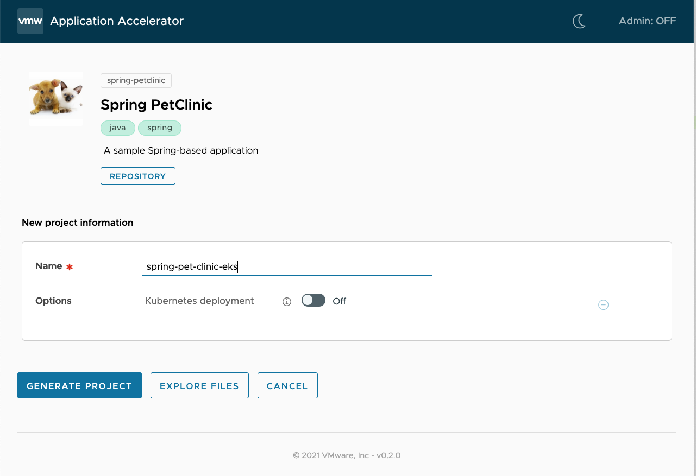
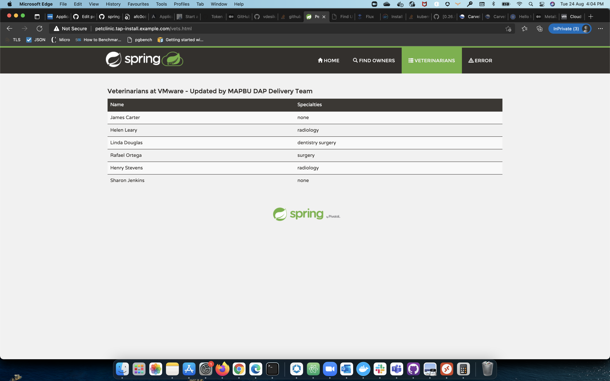
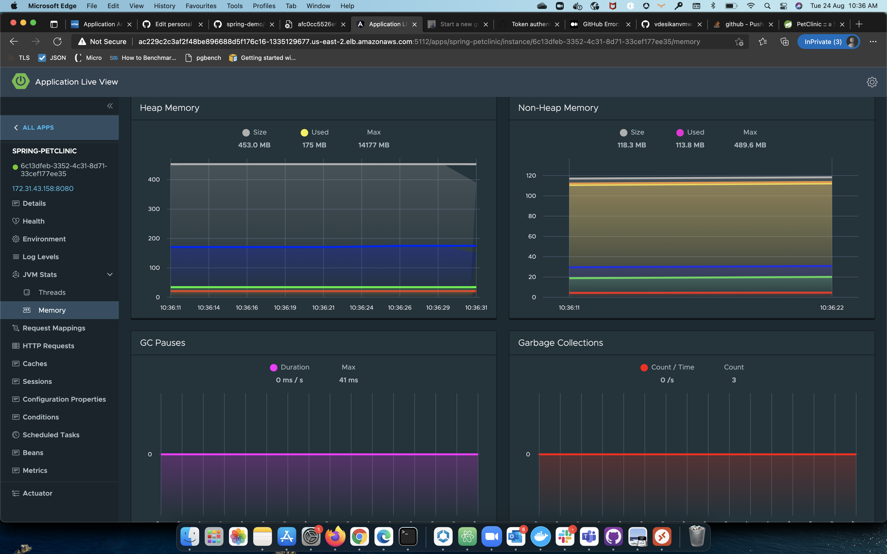

# Tanzu Application Platform Tutorial: Install and Deploy the Spring Pet Clinic App 
This topic describes how to use Tanzu Application Platform capabilities to install, configure, and deploy the Spring Pet Clinic app. This procedure includes Cloud Native Runtimes, Application Live View, Application Accelerator, and Tanzu Build Service. 

Before following the procedure below, install Tanzu Application Platform. For information about how to install, see [Installing Tanzu Application Platform](install.md).

## Deploying the Spring Pet Clinic App
1. Use the "Spring PetClinic sample Accelerator to generate a new project called `spring-pet-clinic-eks` and download the zip file.
    
2. Push the unzipped project to a new git repo.
    ```
    Downloads % unzip spring-pet-clinic-eks.zip
    Downloads % cd spring-pet-clinic-eks
    spring-pet-clinic-eks % ls
    README.md       Tiltfile        accelerator-log.md  config          docker-compose.yml  mvnw            mvnw.cmd        pom.xml         src         tes1
    spring-pet-clinic-eks % git init -b main
    spring-pet-clinic-eks % git add .
    spring-pet-clinic-eks % git commit -m "First commit"
    spring-pet-clinic-eks % git remote add origin https://github.com/<github-user>/spring-pet-clinic-eks.git
    spring-pet-clinic-eks % git branch -M main
    spring-pet-clinic-eks % git remote set-url origin ssh://git@github.com/<github-user>/spring-pet-clinic-eks.git
    spring-pet-clinic-eks % git push -u origin main
    ```
3. Create a Tanzu Application Platform service account and a secret for Tanzu Build Service. Patch the secret to the service account's Image Pull secret.
    ```
    tap-install % more tap-sa.yaml
    apiVersion: v1
    kind: ServiceAccount
    metadata:
      name: tap-service-account
      namespace: tap-install
    ---
    kind: ClusterRole
    apiVersion: rbac.authorization.k8s.io/v1
    metadata:
      name: cluster-admin-cluster-role
    rules:
    - apiGroups: ["*"]
      resources: ["*"]
      verbs: ["*"]
    ---
    kind: ClusterRoleBinding
    apiVersion: rbac.authorization.k8s.io/v1
    metadata:
      name: cluster-admin-cluster-role-binding
    subjects:
    - kind: ServiceAccount
      name: tap-service-account
      namespace: tap-install
    roleRef:
      apiGroup: rbac.authorization.k8s.io
      kind: ClusterRole
      name: cluster-admin-cluster-role
    tap-install % kubectl apply -f tap-sa.yaml
    serviceaccount/tap-service-account created
    clusterrole.rbac.authorization.k8s.io/cluster-admin-cluster-role unchanged
    clusterrolebinding.rbac.authorization.k8s.io/cluster-admin-cluster-role-binding configured
    tap-install % kubectl create secret docker-registry tbs-secret -n tap-install --docker-server='dev.registry.pivotal.io' --docker-username=$USRFULL --docker-password=$PASS
    secret/tbs-secret created
    tap-install % kubectl patch serviceaccount default -p "{\"imagePullSecrets\": [{\"name\": \"tbs-secret\"}]}" -n tap-install
    serviceaccount/default patched
    ```
4. Use Tanzu Build Service to create an image for the git-repo created with Application Accelerator. Specify a container registry where you can push the image.
    ```
    tap-install % more image.yaml
    apiVersion: kpack.io/v1alpha1
    kind: Image
    metadata:
      name: spring-petclinic-image
    spec:
      tag: dev.registry.pivotal.io/tanzu-advanced-edition/vdesikan/spring-petclinic-eks
      serviceAccount: default
      builder:
        kind: ClusterBuilder
        name: default
      source:
        git:
          url: https://github.com/<github-user>/spring-pet-clinic-eks
          revision: main
    tap-install % kubectl apply -f image.yaml -n tap-install  
    image.kpack.io/spring-petclinic-image created
    tap-install % kp image list
    Error: no images found
    tap-install % kp image list -n tap-install
    NAME                      READY      LATEST REASON    LATEST IMAGE    NAMESPACE
    spring-petclinic-image    Unknown    CONFIG                           tap-install
    
    
    tap-install % kp build list -n tap-install
    BUILD    STATUS      IMAGE    REASON
    1        BUILDING             CONFIG
    
    
    tap-install % kp image list -n tap-install
    NAME                      READY      LATEST REASON    LATEST IMAGE    NAMESPACE
    spring-petclinic-image    Unknown    CONFIG                           tap-install
    
    
    tap-install % kp build list -n tap-install
    BUILD    STATUS      IMAGE    REASON
    1        BUILDING             CONFIG
    
    
    tap-install % kp build status spring-petclinic-image -n tap-install
    Image:            --
    Status:           BUILDING
    Reason:           CONFIG
                      resources: {}
                      - source: {}
                      + source:
                      +   git:
                      +     revision: a3592d4d1a47ae3e6f6e0143d0369a9476da7620
                      +     url: https://github.com/<github-user>/spring-pet-clinic-eks
    Status Reason:    PodInitializing
    
    
    Started:     2021-08-24 10:09:27
    Finished:    --
    
    
    Pod Name:    spring-petclinic-image-build-1-vl7j5-build-pod
    
    
    Builder:      dev.registry.pivotal.io/tanzu-advanced-edition/beta1/tbs/default@sha256:c3acd9780a055d9657f702426460d2fbd0b9dcdac3facbaec894646a580d6f6d
    Run Image:    --
    
    
    Source:      GitUrl
    Url:         https://github.com/<github-user>/spring-pet-clinic-eks
    Revision:    a3592d4d1a47ae3e6f6e0143d0369a9476da7620
    
    
    BUILDPACK ID    BUILDPACK VERSION    HOMEPAGE
    
    
    tap-install % kp image list -n tap-install                        
    NAME                      READY      LATEST REASON    LATEST IMAGE    NAMESPACE
    spring-petclinic-image    Unknown    CONFIG                           tap-install
    
    
    tap-install % kp build list -n tap-install                        
    BUILD    STATUS      IMAGE    REASON
    1        BUILDING             CONFIG
    
    
    tap-install % kp image list -n tap-install
    NAME                      READY    LATEST REASON    LATEST IMAGE                                                                                                                                            NAMESPACE
    spring-petclinic-image    True     CONFIG           dev.registry.pivotal.io/tanzu-advanced-edition/vdesikan/spring-petclinic-eks@sha256:be889cf313016eb4fc168556493c2b1672c8e2af725e33696bf461b8212f9872    tap-install
    
    
    tap-install % kp build list -n tap-install
    BUILD    STATUS     IMAGE                                                                                                                                                   REASON
    1        SUCCESS    dev.registry.pivotal.io/tanzu-advanced-edition/vdesikan/spring-petclinic-eks@sha256:be889cf313016eb4fc168556493c2b1672c8e2af725e33696bf461b8212f9872    CONFIG
    
    
    tap-install % kp build status spring-petclinic-image -n tap-install
    Image:     dev.registry.pivotal.io/tanzu-advanced-edition/vdesikan/spring-petclinic-eks@sha256:be889cf313016eb4fc168556493c2b1672c8e2af725e33696bf461b8212f9872
    Status:    SUCCESS
    Reason:    CONFIG
              resources: {}
              - source: {}
              + source:
              +   git:
              +     revision: a3592d4d1a47ae3e6f6e0143d0369a9476da7620
              +     url: https://github.com/<github-user>/spring-pet-clinic-eks
    
    
    Started:     2021-08-24 10:09:27
    Finished:    2021-08-24 10:10:58
    
    
    Pod Name:    spring-petclinic-image-build-1-vl7j5-build-pod
    
    
    Builder:      dev.registry.pivotal.io/tanzu-advanced-edition/beta1/tbs/default@sha256:c3acd9780a055d9657f702426460d2fbd0b9dcdac3facbaec894646a580d6f6d
    Run Image:    dev.registry.pivotal.io/tanzu-advanced-edition/beta1/tbs/run@sha256:ae65c51e7fb215fa3ed3ffddf9e438a3f9c571e591db71dec7d903ce5bc9bf92
    
    
    Source:      GitUrl
    Url:         https://github.com/<github-user>/spring-pet-clinic-eks
    Revision:    a3592d4d1a47ae3e6f6e0143d0369a9476da7620
    
    
    BUILDPACK ID                           BUILDPACK VERSION    HOMEPAGE
    paketo-buildpacks/ca-certificates      2.3.2                https://github.com/paketo-buildpacks/ca-certificates
    paketo-buildpacks/bellsoft-liberica    8.2.0                https://github.com/paketo-buildpacks/bellsoft-liberica
    paketo-buildpacks/maven                5.3.3                https://github.com/paketo-buildpacks/maven
    paketo-buildpacks/executable-jar       5.1.2                https://github.com/paketo-buildpacks/executable-jar
    paketo-buildpacks/apache-tomcat        6.0.0                https://github.com/paketo-buildpacks/apache-tomcat
    paketo-buildpacks/dist-zip             4.1.2                https://github.com/paketo-buildpacks/dist-zip
    paketo-buildpacks/spring-boot          4.4.2                https://github.com/paketo-buildpacks/spring-boot
    ```
3. Deploy the image you generated as a service with Cloud Native Runtimes. Deploy the image in the namespace where Application Live View is running with the labels `tanzu.app.live.view=true` and `tanzu.app.live.view.application.name=<app_name>`. Add the appropriate DNS entries using `/etc/hosts`.
  ```
  tap-install % more kapp-deploy-spring-petclinic.yaml
      apiVersion: kappctrl.k14s.io/v1alpha1
      kind: App
      metadata:
        name: spring-petclinic
      spec:
        serviceAccountName: tap-service-account
        fetch:
          - inline:
              paths:
                manifest.yml: |
                  ---
                  apiVersion: kapp.k14s.io/v1alpha1
                  kind: Config
                  rebaseRules:
                    - path: [metadata, annotations, serving.knative.dev/creator]
                      type: copy
                      sources: [new, existing]
                      resourceMatchers: &matchers
                        - apiVersionKindMatcher: {apiVersion: serving.knative.dev/v1, kind: Service}
                    - path: [metadata, annotations, serving.knative.dev/lastModifier]
                      type: copy
                      sources: [new, existing]
                      resourceMatchers: *matchers
                  ---
                  apiVersion: serving.knative.dev/v1
                  kind: Service
                  metadata:
                    name: petclinic
                  spec:
                    template:
                      metadata:
                        annotations:
                          client.knative.dev/user-image: ""
                        labels:
                          tanzu.app.live.view: "true"
                          tanzu.app.live.view.application.name: "spring-petclinic"
                      spec:
                        containers:
                        - image: dev.registry.pivotal.io/tanzu-advanced-edition/vdesikan/spring-petclinic-eks@sha256:be889cf313016eb4fc168556493c2b1672c8e2af725e33696bf461b8212f9872
                          securityContext:
                            runAsUser: 1000
        template:
          - ytt: {}
        deploy:
          - kapp: {}
  tap-install % kubectl apply -f kapp-deploy-spring-petclinic.yaml -n tap-install
  app.kappctrl.k14s.io/spring-petclinic created
  tap-install % kubectl get pods -n tap-install
  NAME                                                    READY   STATUS              RESTARTS   AGE
  application-live-view-connector-57cd7c6c6-pv8dk         1/1     Running             0          17h
  application-live-view-crd-controller-5b659f8f57-7zz25   1/1     Running             0          17h
  application-live-view-server-79bd874566-qtcbc           1/1     Running             0          17h
  petclinic-00001-deployment-5f7b86665f-lqhfs             0/2     ContainerCreating   0          10s
  spring-petclinic-image-build-1-vl7j5-build-pod          0/1     Completed           0          7m56s
  tap-install % kubectl get pods -n tap-install
  NAME                                                    READY   STATUS      RESTARTS   AGE
  application-live-view-connector-57cd7c6c6-pv8dk         1/1     Running     0          17h
  application-live-view-crd-controller-5b659f8f57-7zz25   1/1     Running     0          17h
  application-live-view-server-79bd874566-qtcbc           1/1     Running     0          17h
  petclinic-00001-deployment-5f7b86665f-lqhfs             2/2     Running     0          23s
  spring-petclinic-image-build-1-vl7j5-build-pod          0/1     Completed   0          8m9s
  tap-install % kubectl get service -n tap-install
  NAME                         TYPE           CLUSTER-IP       EXTERNAL-IP                                                               PORT(S)                                      AGE
  application-live-view-5112   LoadBalancer   10.100.176.238   ac229c2c3af2f48be896688d5f176c16-1335129677.us-east-2.elb.amazonaws.com   5112:32387/TCP                               17h
  application-live-view-7000   ClusterIP      10.100.29.252    <none>                                                                    7000/TCP                                     17h
  petclinic                    ExternalName   <none>           envoy.contour-internal.svc.cluster.local                                  80/TCP                                       19s
  petclinic-00001              ClusterIP      10.100.254.12    <none>                                                                    80/TCP                                       37s
  petclinic-00001-private      ClusterIP      10.100.219.255   <none>                                                                    80/TCP,9090/TCP,9091/TCP,8022/TCP,8012/TCP   37s
    tap-install % kubectl get service -A           
  NAMESPACE                NAME                                 TYPE           CLUSTER-IP       EXTERNAL-IP                                                               PORT(S)                                      AGE
  accelerator-system       acc-engine                           ClusterIP      10.100.253.164   <none>                                                                    80/TCP                                       17h
  accelerator-system       acc-ui-server                        LoadBalancer   10.100.74.90     a3b48dd9f15f746a48b503aee558bd96-309532596.us-east-2.elb.amazonaws.com    80:31689/TCP                                 17h
  build-service            cert-injection-webhook               ClusterIP      10.100.98.116    <none>                                                                    443/TCP                                      16h
  contour-external         contour                              ClusterIP      10.100.10.20     <none>                                                                    8001/TCP                                     17h
  contour-external         envoy                                LoadBalancer   10.100.29.235    afc0cc5526ef74617a20f89f27433b6f-609822777.us-east-2.elb.amazonaws.com    80:31346/TCP,443:32120/TCP                   17h
  contour-internal         contour                              ClusterIP      10.100.247.212   <none>                                                                    8001/TCP                                     17h
  contour-internal         envoy                                ClusterIP      10.100.3.195     <none>                                                                    80/TCP,443/TCP                               17h
  default                  kubernetes                           ClusterIP      10.100.0.1       <none>                                                                    443/TCP                                      4d18h
  flux-system              notification-controller              ClusterIP      10.100.153.120   <none>                                                                    80/TCP                                       17h
  flux-system              source-controller                    ClusterIP      10.100.214.3     <none>                                                                    80/TCP                                       17h
  flux-system              webhook-receiver                     ClusterIP      10.100.54.115    <none>                                                                    80/TCP                                       17h
  kapp-controller          packaging-api                        ClusterIP      10.100.66.222    <none>                                                                    443/TCP                                      17h
  knative-discovery        webhook                              ClusterIP      10.100.204.141   <none>                                                                    9090/TCP,8008/TCP,443/TCP                    17h
  knative-eventing         broker-filter                        ClusterIP      10.100.200.214   <none>                                                                    80/TCP,9092/TCP                              17h
  knative-eventing         broker-ingress                       ClusterIP      10.100.50.73     <none>                                                                    80/TCP,9092/TCP                              17h
  knative-eventing         eventing-webhook                     ClusterIP      10.100.188.40    <none>                                                                    443/TCP                                      17h
  knative-eventing         imc-dispatcher                       ClusterIP      10.100.54.100    <none>                                                                    80/TCP                                       17h
  knative-eventing         inmemorychannel-webhook              ClusterIP      10.100.72.121    <none>                                                                    443/TCP                                      17h
  knative-serving          activator-service                    ClusterIP      10.100.114.196   <none>                                                                    9090/TCP,8008/TCP,80/TCP,81/TCP              17h
  knative-serving          autoscaler                           ClusterIP      10.100.2.22      <none>                                                                    9090/TCP,8008/TCP,8080/TCP                   17h
  knative-serving          autoscaler-bucket-00-of-01           ClusterIP      10.100.3.124     <none>                                                                    8080/TCP                                     17h
  knative-serving          controller                           ClusterIP      10.100.40.142    <none>                                                                    9090/TCP,8008/TCP                            17h
  knative-serving          net-certmanager-webhook              ClusterIP      10.100.168.189   <none>                                                                    9090/TCP,8008/TCP,443/TCP                    17h
  knative-serving          networking-certmanager               ClusterIP      10.100.168.29    <none>                                                                    9090/TCP,8008/TCP                            17h
  knative-serving          webhook                              ClusterIP      10.100.228.52    <none>                                                                    9090/TCP,8008/TCP,443/TCP                    17h
  knative-sources          rabbitmq-controller                  ClusterIP      10.100.150.219   <none>                                                                    443/TCP                                      17h
  knative-sources          rabbitmq-webhook                     ClusterIP      10.100.86.29     <none>                                                                    443/TCP                                      17h
  kpack                    kpack-webhook                        ClusterIP      10.100.67.127    <none>                                                                    443/TCP                                      16h
  kube-system              kube-dns                             ClusterIP      10.100.0.10      <none>                                                                    53/UDP,53/TCP                                4d18h
  stacks-operator-system   controller-manager-metrics-service   ClusterIP      10.100.118.226   <none>                                                                    8443/TCP                                     16h
  tap-install              application-live-view-5112           LoadBalancer   10.100.176.238   ac229c2c3af2f48be896688d5f176c16-1335129677.us-east-2.elb.amazonaws.com   5112:32387/TCP                               17h
  tap-install              application-live-view-7000           ClusterIP      10.100.29.252    <none>                                                                    7000/TCP                                     17h
  tap-install              petclinic                            ExternalName   <none>           envoy.contour-internal.svc.cluster.local                                  80/TCP                                       35s
  tap-install              petclinic-00001                      ClusterIP      10.100.254.12    <none>                                                                    80/TCP                                       53s
  tap-install              petclinic-00001-private              ClusterIP      10.100.219.255   <none>                                                                    80/TCP,9090/TCP,9091/TCP,8022/TCP,8012/TCP   53s
  vmware-sources           webhook                              ClusterIP      10.100.192.82 <none>                                                                    443/TCP                                      17h
  tap-install % kubectl get ksvc -n tap-install
  NAME        URL                                        LATESTCREATED     LATESTREADY       READY   REASON
  petclinic   http://petclinic.tap-install.example.com   petclinic-00001   petclinic-00001   True   
  tap-install % ping afc0cc5526ef74617a20f89f27433b6f-609822777.us-east-2.elb.amazonaws.com 
  PING afc0cc5526ef74617a20f89f27433b6f-609822777.us-east-2.elb.amazonaws.com (3.19.166.204): 56 data bytes
  Request timeout for icmp_seq 0
  Request timeout for icmp_seq 1
  ^C
  --- afc0cc5526ef74617a20f89f27433b6f-609822777.us-east-2.elb.amazonaws.com ping statistics ---
  3 packets transmitted, 0 packets received, 100.0% packet loss
  tap-install % sudo vi /etc/hosts                                                        
  tap-install % more /etc/hosts
  ##
  # Host Database
  #
  # localhost is used to configure the loopback interface
  # when the system is booting.  Do not change this entry.
  ##
  127.0.0.1       localhost
  255.255.255.255 broadcasthost
  ::1             localhost
  # Added by Docker Desktop
  # To allow the same kube context to work on the host and the container:
  127.0.0.1 kubernetes.docker.internal
  3.19.166.204 petclinic.tap-install.example.com
  # End of section
  tap-install %
  ```
4. Verify that you can access the Spring Pet Clinic app. Ensure that Application Live View is also displaying the Spring Pet Clinic app.
  
  
5. Make some code changes in the git repo and commit the change. Verify that the new build is created automatically and the new image is generated.
  ```
  spring-pet-clinic-eks % ls
  README.md       Tiltfile        accelerator-log.md  config          docker-compose.yml  mvnw            mvnw.cmd        pom.xml         src         tes1
  spring-pet-clinic-eks % cd src
  src % ls
  checkstyle  main        test
  src % cd main
  main % ls
  java        less        resources   wro
  main % cd resources
  resources % ls
  application-mysql.properties    application.properties      banner.txt          db              messages            static              templates
  resources % cd templates
  templates % ls
  error.html  fragments   owners      pets        vets        welcome.html
  templates % cd vets
  vets % ls
  vetList.html
  vets % vi vetList.html
  vets % more vetList.html
  <!DOCTYPE html>
   
   
  <html xmlns:th="https://www.thymeleaf.org"
    th:replace="~{fragments/layout :: layout (~{::body},'vets')}">
   
   
  <body>
   
   
    <h2>Veterinarians at VMware</h2>
   
   
    <table id="vets" class="table table-striped">
      <thead>
        <tr>
          <th>Name</th>
          <th>Specialties</th>
        </tr>
      </thead>
      <tbody>
        <tr th:each="vet : ${vets.vetList}">
          <td th:text="${vet.firstName + ' ' + vet.lastName}"></td>
          <td><span th:each="specialty : ${vet.specialties}"
            th:text="${specialty.name + ' '}" /> <span
            th:if="${vet.nrOfSpecialties == 0}">none</span></td>
        </tr>
      </tbody>
    </table>
  </body>
  </html>
  vets % vi vetList.html
  vets % more vetList.html
  <!DOCTYPE html>
   
   
  <html xmlns:th="https://www.thymeleaf.org"
    th:replace="~{fragments/layout :: layout (~{::body},'vets')}">
   
   
  <body>
   
   
    <h2>Veterinarians at VMware - Updated by MAPBU DAP Delivery Team</h2>
   
   
    <table id="vets" class="table table-striped">
      <thead>
        <tr>
          <th>Name</th>
          <th>Specialties</th>
        </tr>
      </thead>
      <tbody>
        <tr th:each="vet : ${vets.vetList}">
          <td th:text="${vet.firstName + ' ' + vet.lastName}"></td>
          <td><span th:each="specialty : ${vet.specialties}"
            th:text="${specialty.name + ' '}" /> <span
            th:if="${vet.nrOfSpecialties == 0}">none</span></td>
        </tr>
      </tbody>
    </table>
  </body>
  </html>
  vets % cd ../../../
  main % cd ../../
  spring-pet-clinic-eks % git add .
  spring-pet-clinic-eks %  git commit -m "Updated Veterinarians Page"
  [main e672afd] Updated Veterinarians Page
   1 file changed, 1 insertion(+), 1 deletion(-)
  spring-pet-clinic-eks % git push -u origin main
  Enumerating objects: 15, done.
  Counting objects: 100% (15/15), done.
  Delta compression using up to 12 threads
  Compressing objects: 100% (7/7), done.
  Writing objects: 100% (8/8), 777 bytes | 777.00 KiB/s, done.
  Total 8 (delta 4), reused 0 (delta 0), pack-reused 0
  remote: Resolving deltas: 100% (4/4), completed with 4 local objects.
  To ssh://github.com/<github-user>/spring-pet-clinic-eks.git
     a3592d4..e672afd  main -> main
  Branch 'main' set up to track remote branch 'main' from 'origin'.
  spring-pet-clinic-eks % kp build list -n tap-install
  BUILD    STATUS      IMAGE                                                                                                                                                   REASON
  1        SUCCESS     dev.registry.pivotal.io/tanzu-advanced-edition/vdesikan/spring-petclinic-eks@sha256:be889cf313016eb4fc168556493c2b1672c8e2af725e33696bf461b8212f9872    CONFIG
  2        BUILDING                                                                                                                                                            COMMIT
   
  spring-pet-clinic-eks % kp image list -n tap-install
  NAME                      READY      LATEST REASON    LATEST IMAGE                                                                                                                                            NAMESPACE
  spring-petclinic-image    Unknown    COMMIT           dev.registry.pivotal.io/tanzu-advanced-edition/vdesikan/spring-petclinic-eks@sha256:be889cf313016eb4fc168556493c2b1672c8e2af725e33696bf461b8212f9872    tap-install
   
   
  spring-pet-clinic-eks % kp build list -n tap-install
  BUILD    STATUS      IMAGE                                                                                                                                                   REASON
  1        SUCCESS     dev.registry.pivotal.io/tanzu-advanced-edition/vdesikan/spring-petclinic-eks@sha256:be889cf313016eb4fc168556493c2b1672c8e2af725e33696bf461b8212f9872    CONFIG
  2        BUILDING                                                                                                                                                            COMMIT
   
   
  spring-pet-clinic-eks % kp image list -n tap-install
  NAME                      READY    LATEST REASON    LATEST IMAGE                                                                                                                                            NAMESPACE
  spring-petclinic-image    True     COMMIT           dev.registry.pivotal.io/tanzu-advanced-edition/vdesikan/spring-petclinic-eks@sha256:0b627060147d7d80d8aae5a650a70ebca67bbb73001420580b2effa77c4b90cd    tap-install
   
   
  spring-pet-clinic-eks % kp build list -n tap-install
  BUILD    STATUS     IMAGE                                                                                                                                                   REASON
  1        SUCCESS    dev.registry.pivotal.io/tanzu-advanced-edition/vdesikan/spring-petclinic-eks@sha256:be889cf313016eb4fc168556493c2b1672c8e2af725e33696bf461b8212f9872    CONFIG
  2        SUCCESS    dev.registry.pivotal.io/tanzu-advanced-edition/vdesikan/spring-petclinic-eks@sha256:0b627060147d7d80d8aae5a650a70ebca67bbb73001420580b2effa77c4b90cd    COMMIT
  ```
6. Update the Cloud Native Runtimes service with the new image.
  ```
  tap-install % more kapp-deploy-spring-petclinic.yaml
      apiVersion: kappctrl.k14s.io/v1alpha1
      kind: App
      metadata:
        name: spring-petclinic
      spec:
        serviceAccountName: tap-service-account
        fetch:
          - inline:
              paths:
                manifest.yml: |
                  ---
                  apiVersion: kapp.k14s.io/v1alpha1
                  kind: Config
                  rebaseRules:
                    - path: [metadata, annotations, serving.knative.dev/creator]
                      type: copy
                      sources: [new, existing]
                      resourceMatchers: &matchers
                        - apiVersionKindMatcher: {apiVersion: serving.knative.dev/v1, kind: Service}
                    - path: [metadata, annotations, serving.knative.dev/lastModifier]
                      type: copy
                      sources: [new, existing]
                      resourceMatchers: *matchers
                  ---
                  apiVersion: serving.knative.dev/v1
                  kind: Service
                  metadata:
                    name: petclinic
                  spec:
                    template:
                      metadata:
                        annotations:
                          client.knative.dev/user-image: ""
                        labels:
                          tanzu.app.live.view: "true"
                          tanzu.app.live.view.application.name: "spring-petclinic"
                      spec:
                        containers:
                        - image: dev.registry.pivotal.io/tanzu-advanced-edition/vdesikan/spring-petclinic-eks@sha256:0b627060147d7d80d8aae5a650a70ebca67bbb73001420580b2effa77c4b90cd
                          securityContext:
                            runAsUser: 1000
        template:
          - ytt: {}
        deploy:
          - kapp: {}
  tap-install % kubectl apply -f kapp-deploy-spring-petclinic.yaml -n tap-install
  app.kappctrl.k14s.io/spring-petclinic configured
  tap-install % kubectl get pods -n tap-install
  NAME                                                    READY   STATUS      RESTARTS   AGE
  application-live-view-crd-controller-5b659f8f57-7zz25   1/1     Running     0          23h
  application-live-view-server-79bd874566-qtcbc           1/1     Running     0          23h
  petclinic-00002-deployment-9bcf8bdc9-mrvf7              1/2     Running     0          15s
  spring-petclinic-image-build-1-vl7j5-build-pod          0/1     Completed   0          5h54m
  spring-petclinic-image-build-2-gthhl-build-pod          0/1     Completed   0          11m
  ```
7. Verify that the code changes are reflected in the app.
  
