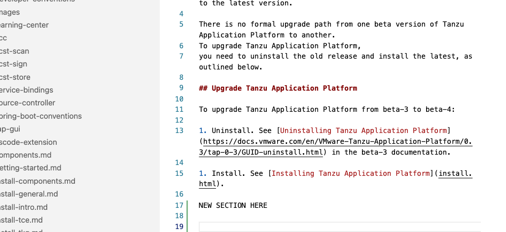

# Upgrading Tanzu Application Platform

This topic describes how to upgrade Tanzu Application Platform to the latest version.

There is no formal upgrade path from one beta version of Tanzu Application Platform to another.
To upgrade Tanzu Application Platform,
you need to uninstall the old release and install the latest, as outlined below.

## Upgrade Tanzu Application Platform

To upgrade Tanzu Application Platform from beta-3 to beta-4:

1. Uninstall. See [Uninstalling Tanzu Application Platform](https://docs.vmware.com/en/VMware-Tanzu-Application-Platform/0.3/tap-0-3/GUID-uninstall.html) in the beta-3 documentation.

1. Install. See [Installing Tanzu Application Platform](install.html).

NEW SECTION HERE

Some additional text for the section