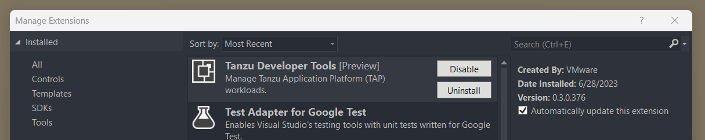

# Install Tanzu Developer Tools for Visual Studio

This topic explains how to install VMware Tanzu Developer Tools for Visual Studio.

## <a id="prereqs"/>Prerequisites

Before installing the extension, you must have:

- [Visual Studio 2022](https://visualstudio.microsoft.com/vs/)
- [kubectl](https://kubernetes.io/docs/tasks/tools/)
- [Tilt](https://docs.tilt.dev/install.html) v0.30.12 or later
- [Tanzu CLI and plug-ins](../install-tanzu-cli.md#cli-and-plugin)
- [A cluster with the Tanzu Application Platform Full profile or Iterate profile](../install.md)

> **Note** If you are an app developer, someone else in your organization might have already set up the Tanzu Application Platform environment.

## <a id="install"/>Install

To install Tanzu Developer Tools for Visual Studio:

1. Download VMware Tanzu Developer Tools for Visual Studio from the [VMware Tanzu Network](https://network.tanzu.vmware.com/products/tanzu-application-platform/).
1. Double-click the `.vsix` install file and click through the prompts.
1. Open Visual Studio, from top menu select **Extensions**, then select **Manage Extensions**.
1. Verify that the extension is installed and the version.
   

## <a id="update"/>Update

To update to a later version, repeat the steps in the [Install](#install) section.
You do not need to uninstall the current version.

## <a id="uninstall"/>Uninstall

To uninstall:

1. From the top menu select **Extensions** tab, then select **Manage Extensions**.
1. Click on the **Installed** section and then click the **Uninstall** button for this extension.

## <a id="next-steps"/>Next steps

[Getting Started with Tanzu Developer Tools for Visual Studio](getting-started.hbs.md).
