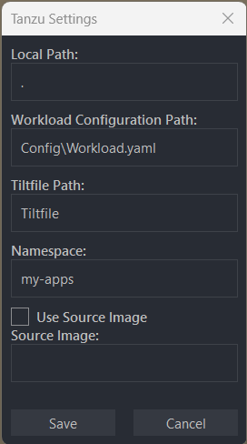
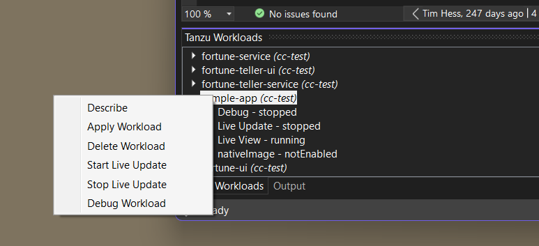

# Use Tanzu Developer Tools for Visual Studio

This topic tells you how to use VMware Tanzu Developer Tools for Visual Studio.

> **Note** This extension is in the beta stage of development.

## <a id="prereqs"/> Prerequisites

Ensure that you meet the following prerequisites:

- The Tanzu CLI is installed in a location in your `PATH` environment variable.
- A valid `workload.yaml` file is in the project. For more information, see the specification for
  [Tanzu apps workload apply](../cli-plugins/apps/command-reference/workload_create_update_apply.hbs.md).
- You have a functional Tanzu Application Platform environment.
- Your kubeconfig file is modified for Tanzu Application Platform workload deployments.
- You have an image repository to which source code in the local file system can be uploaded before
  Build Service builds it.

## <a id="settings"/> Configure Tanzu settings

To configure settings:

1. Right-click the Solution Explorer project.
1. Click **Tanzu: Settings**.
1. Confirm or enter the settings.

   

## <a id="apply-workload"/> Apply a workload

To apply a workload:

1. Right-click the Solution Explorer project.
2. Click **Tanzu: Apply Workload**.
3. Output appears in the Tanzu Output pane of the Visual Studio Output tool window.

## <a id="delete-workload"/> Delete a workload

To delete a workload:

1. Right-click the Solution Explorer project.
1. Click **Tanzu: Delete Workload**.
1. Output appears in the Tanzu Output pane of the Visual Studio Output tool window.

## <a id="use-live-update"/> Use Live Update

To use Live Update:

1. Right-click the Solution Explorer project.
1. To Start Live Update, click **Tanzu: Start Live Update**.
1. To Stop Live Update, click **Tanzu: Stop Live Update**.

## <a id="use-remote-debug"/> Use Remote Debug

1. Deploy a workload using `Apply Workload` or `Live Update`.
1. Right-click the Solution Explorer project.
1. Click **Tanzu: Remote Debug**.
1. Select your application pod from the prompted list.

Visual Studio establishes a debugging session with your remote application.
A file named `.tanzu-vs-launch-config.json` is created in the root directory of your project.
This file specifies the configuration needed to attach the Visual Studio debugger to the agent running
in your workload's container.
It is only needed to initiate remote debugging and can be safely deleted at any time.
This file location is temporary and will change in a future version.

> **Caution** Do not use the red square Stop button in the Visual Studio top toolbar.
> Doing so causes the Tanzu Application Platform workload to fail or become unresponsive indefinitely.
> Instead, in the top menu click **Debug** > **Detach All**.
> A fix for this issue is planned for a future release.
>
> If the name of your running app process (the app DLL process), does not match the name
> of your .NET project as shown in the Visual Studio Solution Explorer, the remote debugging agent
> might fail to attach.

## <a id="workload-panel"></a> Tanzu Workloads panel

{{> 'partials/ide-extensions/workload-panel-intro' }}



## <a id="extension-log"/> Access the extension logs

The extension creates log entries in two files named `tanzu-dev-tools-{GUID}.log` and `tanzu-language-server-{GUID}.log`.
These files are in the directory where Visual Studio Installer installed the extension.

To find the log files, run:

```console
C:> dir $Env:LOCALAPPDATA\Microsoft\VisualStudio\*\Extensions\*\Logs\tanzu-*.log
```

The log file paths can be overridden by setting the environment variables `TANZU_DT_LOG` and `TANZU_LS_LOG`.
