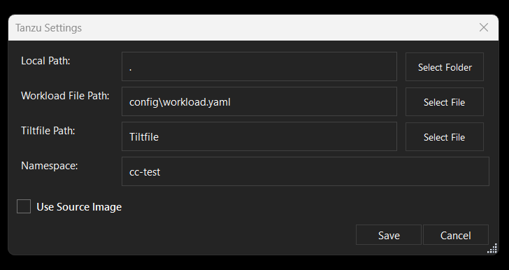
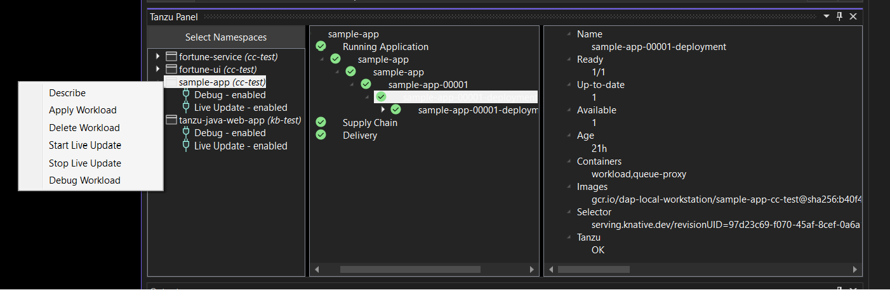

# Use Tanzu Developer Tools for Visual Studio

This topic tells you how to use VMware Tanzu Developer Tools for Visual Studio.

> **Note** This extension is in the beta stage of development.

## <a id="settings"></a> Configure settings

To configure settings, right-click anywhere in the Solution Explorer and click
**Tanzu** > **Settings...**.

   

## <a id="workload-actions"></a> Workload Actions

The extension enables you to apply, debug, and Live Update your application on a Kubernetes cluster
that has Tanzu Application Platform.
The developer sandbox experience enables developers to Live Update their code and simultaneously
debug the updated code, without having to deactivate Live Update when debugging.

### <a id="apply-workload"></a> Apply a workload

To apply a workload, right-click anywhere in the Solution Explorer and click
**Tanzu** > **Apply Workload**, or right-click on an associated workload in the Tanzu Panel and
click **Apply Workload**.

### <a id="delete-workload"></a> Delete a workload

To delete a workload, right-click anywhere in the Solution Explorer and click
**Tanzu** > **Delete Workload**, or right-click on an associated workload in the Tanzu Panel and
click **Delete Workload**.

### <a id="debugging"></a> Start debugging on the cluster

To remote debug a workload, right-click anywhere in the Solution Explorer and click
**Tanzu** > **Debug Workload**, or right-click on an associated workload in the Tanzu Panel and
click **Debug Workload**.

If a `tilt` process is already running and you try to start Live Update, a message in the Tanzu Output
window appears, which is similar to:

```console
Error: listen tcp 127.0.0.1:10350: bind: Only one usage of each socket address \
(protocol/network address/port) is normally permitted.
```

To resolve this, stop any running `tilt` processes. The following example is a PowerShell snippet,
but you can get a similar result by using Task Manager.

```console
Get-Process "tilt" | ForEach-Object { $_.kill() }
```

## <a id='lv-update-path-not-found'></a> Live Update failure because the system cannot find the path specified

### Symptom

In v0.1.0 and earlier, the `Tanzu: Start Live Update` command gives the following error message
when first run:

```console
The system cannot find the path specified
```

### Cause

The Tiltfile is configured to direct output to the location that Unix operating systems use for
discarding output, `/dev/null`. This doesn't work on Windows machines, which use `NUL` instead.

### Solution

In your Tiltfile, change the line

```text
OUTPUT_TO_NULL_COMMAND = os.getenv("OUTPUT_TO_NULL_COMMAND", default=' > /dev/null ')
```

to

```text
OUTPUT_TO_NULL_COMMAND = os.getenv("OUTPUT_TO_NULL_COMMAND", default=' > NUL ')
```

This makes the path discoverable and enables Live Update to run.

## <a id="use-remote-debug"></a> Use Remote Debug

Before using Remote Debug, ensure that you have the following prerequisites:

- A running .NET workload in Tanzu Application Platform.
- The Tanzu CLI is installed in a location included in your `PATH` environment variable.
- The Kubernetes CLI (kubectl) is installed in a location included in your `PATH` environment variable.

### <a id="run-workload"></a> Run a workload in Tanzu Application Platform

To run a workload in Tanzu Application Platform:

1. Generate a Steeltoe Weather Project by using
   [Application Accelerator](../application-accelerator/about-application-accelerator.hbs.md).
1. Right-click on the project node and then click **Tanzu: Apply Workload**.
   For more information, see
   [Tanzu apps workload apply](../cli-plugins/apps/command-reference/workload_create_update_apply.hbs.md).

### <a id="start-remote-debug"></a> Start Remote Debug

To start a remote debug, right-click on a project in the Solution Explorer and then click on
**Tanzu: Remote Debug**.

- If no workload pods are running, you are prompted to deploy a new workload.
  If you want to do so, click on **OK** in the dialog box and proceed with the steps in
  [Apply a Workload](#apply-workload).
  After the workload is deployed, click **Tanzu: Remote Debug** again to start debugging.

- If just one workload pod is running, the debugger attaches to your running app process
  automatically.

- If more than one workload pod is running, you are prompted to select the workload that corresponds
  to the project you want to debug. Select the relevant pod name and then click **Begin Debugging**.
  The pod confirmation window then closes and the Output window opens to the Debug Adapter Host Log
  pane as Visual Studio enters debug mode.

Visual Studio prompts the debugging agent to attach to a running app process with the name
`/workspace/DOT-NET-PROJECT-NAME`.

> **Caution** If the name of your running app process (the app DLL process), does not match the name
> of your .NET project as shown in the Visual Studio Solution Explorer, the remote debugging agent
> might fail to attach.

## <a id="live-updating"></a> Live Update

See the following sections for how to use Live Update.

### <a id="start-live-update"></a> Start Live Update

Ensure the Tanzu Settings parameters are set:

   - **Local Path:** This is the path on the local file system to a directory of source code to build.
   - **Namespace:** This is the namespace that workloads are deployed into.  Optional.
   - **Source Image:** This is the registry location for publishing local source code.
     For example, `registry.io/yourapp-source`. It must include both a registry and a project name.
     The source image parameter is optional if you have configured Local Source Proxy.

To start live update, right-click anywhere in the Solution Explorer and click
**Tanzu** > **Start Live Update**, or right-click on an associated workload in the Tanzu Panel and
click **Start Live Update**.

After starting live update, local builds changes are synchronized to the container.

### <a id="stop-live-update"></a> Stop Live Update

To start live update, right-click anywhere in the Solution Explorer and click
**Tanzu** > **Stop Live Update**, or right-click on an associated workload in the Tanzu Panel and
click **Stop Live Update**.

## <a id="workload-panel"></a> Tanzu Workloads panel

### <a id="stop-remote-debug"></a> Stop Remote Debug

To view the Tanzu Workloads panel, right-click anywhere in the Solution Explorer and click
**Tanzu** > **View Workloads**.



## <a id="extension-logs"></a> Extension logs

The extension creates log entries in two files named `tanzu-dev-tools-{GUID}.log` and
`tanzu-language-server-{GUID}.log`.
These files are in the directory where Visual Studio Installer installed the extension.

To find the log files, run:

```console
# PowerShell
dir $Env:LOCALAPPDATA\Microsoft\VisualStudio\*\Extensions\*\Logs\tanzu-*.log
# CMD
dir %LOCALAPPDATA%\Microsoft\VisualStudio\*\Extensions\*\Logs\tanzu-*.log
```

This extension records logs in a `.log` file whose name starts with `tanzu-dev-tools` and ends with
a string of numbers representing the date, such as `tanzu-dev-tools20221202.log`.
A new log file is created for each day and retained for a maximum of 31 days.
These log files are in the installation directory of the `.vsix` file.
By default, this is

```text
C:\Users\NAME\AppData\Local\Microsoft\VisualStudio\VERSION\Extensions\VMware\Tanzu Developer Tools\VSIX-VERSION
```

Where `NAME`, `VERSION`, and `VSIX-VERSION` are placeholders.
