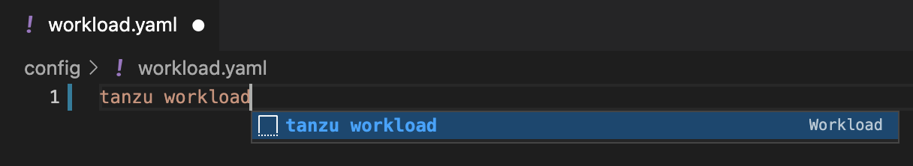
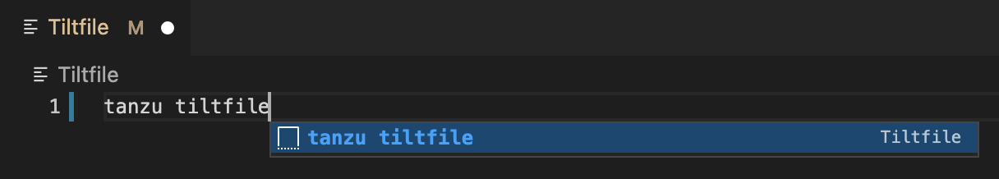

# Getting started with Tanzu Developer Tools for Visual Studio Code

This topic guides you through getting started with VMware Tanzu Developer Tools for Visual Studio Code
(VS Code).

## <a id="prereqs"></a> Prerequisite

[Install VMware Tanzu Developer Tools for Visual Studio Code](../vscode-extension/install.md).

Ensure you have completed the [Installation](../vscode-extension/install.md) before continuing on to
the following sections.

To use the extension with a project, the project must have these required files:

- `workload.yaml`
- `catalog-info.yaml`
- `Tiltfile`

There are two ways to create these files:

- Using the VS Code snippets that Tanzu Developer Tools provide, which create templates in empty files
  that you then fill in with the required information.
  For more information about the snippets, see the
  [VS Code documentation](https://code.visualstudio.com/docs/editor/userdefinedsnippets).

- Writing the files by setting up manually.

### <a id="the-workload-yaml-file"></a> Create the `workload.yaml` file

The `workload.yaml` file provides instructions to the Supply Chain Choreographer to build and manage
a workload.

The extension requires only one `workload.yaml` per project. The `workload.yaml` must be a
single-document YAML file, not a multidocument YAML file.

Before beginning to write your `workload.yaml` file, ensure that you know:

- The name of your application. For example, `my app`.
- The workload type of your application. For example, `web`.
- The GitHub source code URL. For example, `github.com/mycompany/myapp`.
- The Git branch of the source code that you intend to use. For example, `main`.

Code snippets
: To create a `workload.yaml` file by using code snippets:

  1. (Optional) Create a directory named `config` in the root directory of your project.
     For example, `my project/config`.
  2. Create a file named `workload.yaml` in the new config directory. For example,
     `my project/config/workload.yaml`.
  3. Open the new `workload.yaml` file in VS Code, enter `tanzu workload` in the file to trigger the
     code snippets, and either press Enter or left-click the `tanzu workload` text in the drop-down menu.

     

  4. Fill in the template by pressing the Tab key.

Manual
: To create your `workload.yaml` file manually, follow this example:

    ```yaml
    apiVersion: carto.run/v1alpa1
    kind: Workload
    metadata:
     name: APP-NAME
     labels:
       apps.tanzu.vmware.com/workload-type: WORKLOAD-TYPE
       app.kubernetes.io/part-of: APP-NAME
    spec:
     source:
       git:
         url: GIT-SOURCE-URL
         ref:
           branch: GIT-BRANCH-NAME
    ```

    Where:

    - `APP-NAME` is the name of your application.
    - `WORKLOAD-TYPE` is the type of this workload. For example, `web`.
    - `GIT-SOURCE-URL` is your GitHub source code URL.
    - `GIT-BRANCH-NAME` is the Git branch of your source code.

  Alternatively, you can use the Tanzu CLI to create a `workload.yaml` file.
  For more information about the Tanzu CLI command, see
  [Tanzu apps workload apply](../cli-plugins/apps/command-reference/workload_create_update_apply.hbs.md)
  in the Tanzu CLI documentation.

### <a id="catalog-info-yaml-file"></a> Create the `catalog-info.yaml` file

The `catalog-info.yaml` file enables the workloads of this project to appear in
[Tanzu Application Platform GUI](../tap-gui/about.md).

Before beginning to write your `catalog-info.yaml` file, ensure that you:

- Know the name of your application. For example, `my app`.
- Have a description of your application ready.

Code snippets
: To create a `catalog-info.yaml` file by using the code snippets:

  1. (Optional) Create a directory named `catalog` in the root directory of your project. For example,
     `my project/catalog`.
  2. Create a file named `catalog-info.yaml` in the new config directory.
     For example, `my project/catalog/catalog-info.yaml`.
  3. Open the new `catalog-info.yaml` file in VS Code, enter `tanzu catalog-info` in the file to trigger
     the code snippets, and then either press Enter or left-click the `tanzu catalog-info` text in the
     drop-down menu.
  4. Fill in the template by pressing the Tab key.

Manual
: To create your `catalog-info.yaml` file manually, follow this example:

    ```yaml
    apiVersion: backstage.io/v1alpha1
    kind: Component
    metadata:
     name: APP-NAME
     description: APP-DESCRIPTION
     tags:
       - tanzu
     annotations:
       'backstage.io/kubernetes-label-selector': 'app.kubernetes.io/part-of=APP-NAME'
    spec:
     type: service
     lifecycle: experimental
     owner: default-team
    ```

    Where:

    - `APP-NAME` is the name of your application
    - `APP-DESCRIPTION` is the description of your application

### <a id="tiltfile-file"></a> Create the Tiltfile file

The Tiltfile file provides the [Tilt](https://docs.tilt.dev/) configuration to enable your project to
Live Update on your Kubernetes cluster that has Tanzu Application Platform.
The Tanzu Developer Tools extension requires only one **Tiltfile** per project.

Before beginning to write your Tiltfile file, ensure that you know:

- The name of your application. For example, `my app`.
- The value of the source image. For example, `docker.io/mycompany/myapp`.
- Whether you want to compile the source image from a local directory other than the project directory
  or otherwise leave the `local path` value unchanged. For more information, see local path in the glossary.
- The path to your `workload.yaml` file. For example, `config/workload.yaml`.
- The name of your current
  [Kubernetes context](https://kubernetes.io/docs/tasks/access-application-cluster/configure-access-multiple-clusters/),
  if the targeting Kubernetes cluster enabled by Tanzu Application Platform is not running on your
  local machine.

Code Snippets
: To create a Tiltfile file by using the code snippets:

  1. Create a file named `Tiltfile` with no file extension in the root directory of your project.
     For example, `my project/Tiltfile`.
  2. Open the new Tiltfile file in VS Code and enter `tanzu tiltfile` in the file to trigger the
     code snippets, and then either press Enter or left-click the `tanzu tiltfile` text in the drop-down
     menu.

     

  3. Fill in the template by pressing the Tab key.
  4. If the targeting Kubernetes cluster enabled by Tanzu Application Platform is not running on your
     local machine, add a new line to the end of the **Tiltfile** template and enter:

    ```text
    allow_k8s_contexts('CONTEXT-NAME')
    ```

    Where `CONTEXT-NAME` is the name of your current Kubernetes context.

Manual
: To create a Tiltfile file manually, follow this example:

    ```text
    SOURCE_IMAGE = os.getenv("SOURCE_IMAGE", default='SOURCE-IMAGE')
    LOCAL_PATH = os.getenv("LOCAL_PATH", default='.')
    NAMESPACE = os.getenv("NAMESPACE", default='default')

    k8s_custom_deploy(
       'APP-NAME',
       apply_cmd="tanzu apps workload apply -f PATH-TO-WORKLOAD-YAML --live-update" +
           " --local-path " + LOCAL_PATH +
           " --SOURCE-IMAGE " + SOURCE_IMAGE +
           " --namespace " + NAMESPACE +
           " --yes >/dev/null" +
           " && kubectl get workload APP-NAME --namespace " + NAMESPACE + " -o yaml",
       delete_cmd="tanzu apps workload delete -f PATH-TO-WORKLOAD-YAML --namespace " + NAMESPACE + " --yes" ,
       deps=['pom.xml', './target/classes'],
       container_selector='workload',
       live_update=[
           sync('./target/classes', '/workspace/BOOT-INF/classes')
       ]
    )

    k8s_resource('APP-NAME', port_forwards=["8080:8080"],
       extra_pod_selectors=[{'carto.run/workload-name': 'APP-NAME', 'app.kubernetes.io/component': 'run'}])
    allow_k8s_contexts('CONTEXT-NAME')
    ```

    Where:

    - `SOURCE-IMAGE` is the value of source image.
    - `APP-NAME` is the name of your application.
    - `PATH-TO-WORKLOAD-YAML` is the local file system path to `workload.yaml`. For example, `config/workload.yaml`.
    - `CONTEXT-NAME` is the name of your current
      [Kubernetes context](https://kubernetes.io/docs/tasks/access-application-cluster/configure-access-multiple-clusters/).
      If your Kubernetes cluster enabled by Tanzu Application Platform is running locally on your local
      machine, you can remove the entire `allow_k8s_contexts` line. For more information, see the
      [Tilt documentation](https://docs.tilt.dev/api.html#api.allow_k8s_contexts).

## <a id="example-project"></a> Example project

Before you begin, you need a container registry for the sample application.

You can view a sample application that demonstrates the necessary configuration files.
There are two ways to obtain the sample application.

Application Accelerator
: If your company has configured
[Application Accelerator](../application-accelerator/app-accelerator-overview.hbs.md),
you can obtain the sample application from there if it was not removed.

  1. Open Application Accelerator.
  2. Search for `Tanzu Java Web App` in Application Accelerator.
  3. Add the required configuration information and generate the application.
  4. Unzip the file and open the project in a VS Code workspace.

Clone from GitHub
: To clone the sample application from GitHub:

  1. Run `git clone` to clone the
     [tanzu-java-web-app](https://github.com/sample-accelerators/tanzu-java-web-app) repository from
     GitHub.
  1. Open the Tiltfile and replace `your-registry.io/project` with your container registry.

## <a id="next-steps"></a> Next steps

Proceed to [Using Tanzu Developer Tools for VS Code](../vscode-extension/using-the-extension.md).
