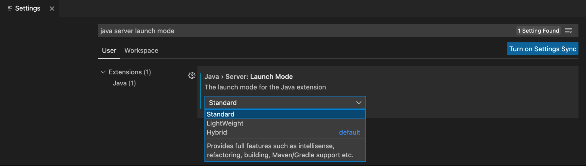

# Installing Tanzu Dev Tools for Visual Studio Code

This page explains how to install the VMware Tanzu Developer Tools extension for Visual Studio Code (VS Code).

##  On this page

- [Prerequisites](#prerequisites)
- [Installation](#installation)
- [Configuration](#configuration)
- [Uninstallation](#uninstallation)
- [What’s Next](#whats-next)

##  Prerequisites

> **Note:** The Tanzu Developer Tools extension currently only supports VS Code, Mac OS, and Java Applications.

Before installing the Tanzu Developer Tools IDE extension, you must have:

- [VS Code](https://code.visualstudio.com/download)
- The Kubernetes command-line tool. For more information, see the [kubectl section of the Kubernetes Install Tools page](https://kubernetes.io/docs/tasks/tools/#kubectl).
- [Tilt](https://docs.tilt.dev/install.html) v0.27.2 or later.

    >**Note:** Docker Desktop and local Kubernetes are not prerequisites for using Tanzu Developer Tools for VS Code.

- The Tanzu CLI and plug-ins. Follow the instructions on the [Installing the Tanzu CLI page](../install-tanzu-cli.md#-install-or-update-the-tanzu-cli-and-plug-ins).
- A cluster with Tanzu Application Platform’s [Iterate or Full profiles](../install.md#-install-your-tanzu-application-platform-profile). Download these from [Tanzu Network](https://network.tanzu.vmware.com/products/tanzu-application-platform/). For installation instructions, see [Installing the Tanzu Application Platform](../install.md).

>**Note:** If you are an application developer, the Tanzu Application Platform environment may have been set up by someone else in your organization. Contact the respective group within your organization to determine if a Tanzu Application Platform environment already exists.

##  Installation

To install VMware Tanzu Developer Tools for Visual Studio Code:

1. Download Tanzu Developer Tools for Visual Studio Code from the Tanzu Network.

1. Open VS Code.

    **Option 1:**

    1. From the Command Palette (cmd + shift + P), run "Extensions: Install from VSIX...".

    1. Select the extension file **tanzu-vscode-extension.vsix**.

    

    **Option 2:**

    1. Select the **Extensions** tab: 

    1. Select `Install from VSIX…` from the overflow menu.

    

1. The Tanzu Developer Tools extension will install  the Debugger for Java, Language Support for Java(™) by Red Hat, and YAML extensions if they are not previously installed. The Tanzu Developer Tools extension depends on these additional extensions to function.

    **Note:** If the extensions do not automatically install, manually install the following extensions from the VS Code Marketplace:

    - [Debugger for Java](https://marketplace.visualstudio.com/items?itemName=vscjava.vscode-java-debug)
    - [Language Support for Java(™) by Red Hat](https://marketplace.visualstudio.com/items?itemName=redhat.java)
    - [YAML](https://marketplace.visualstudio.com/items?itemName=redhat.vscode-yaml)

1. Ensure Language Support for Java is running in [Standard Mode](https://code.visualstudio.com/docs/java/java-project#_lightweight-mode).

    This can be configured in the Settings menu **Code** > **Preferences** > **Settings** under **Java > Server: Launch Mode**:

    

    When the JDK and Language Support for Java are configured correctly, you see that the integrated development environment creates a directory "target" where the code is compiled.

##  Configuration

To configure the VMware Tanzu Developer Tools extension for Visual Studio Code:

1. Ensure that you are targeting the correct cluster. See [Configure Access to Multiple Clusters](https://kubernetes.io/docs/tasks/access-application-cluster/configure-access-multiple-clusters/) in the Kubernetes documentation.

1. Select **File** > **Preferences** > **Settings** > **Extensions** > **Tanzu** and set the following:

    - **Confirm Delete**: Controls whether the extension asks for confirmation when deleting a workload.
    - **Enable Live Hover**: For more information, see [Live Hover integration with Spring Boot Tools](live-hover.md). Reload VS Code for this change to take effect.
    - **Source Image**: (Required) Registry location to publish local source code, for example `registry.io/yourapp-source`. This must include both a registry and a project name.
    - **Local Path**: (Optional) Path on the local file system to a directory of source code to build. This defaults to the current directory.
    - **Namespace**: (Optional) Namespace that workloads are deployed into. This defaults to the namespace set in `kubeconfig`.

##  Uninstallation

To uninstall the Tanzu Dev Tools extension:

1. Navigate to the extensions menu: 
1. Right-click the Tanzu Dev Tools extension and select `Uninstall`.

##  What's Next

Proceed to the [Getting Started](../vscode-extension/getting-started.md) page.
