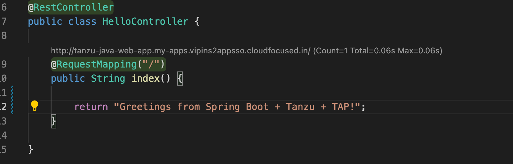

# Integrating Live Hover by using Spring Boot Tools (Experimental)

For more information about this feature, see the **Live application information hovers** section of
[VS Code documentation for Spring Boot Tools](https://marketplace.visualstudio.com/items?itemName=Pivotal.vscode-spring-boot).

## <a id="prerequisites"></a> Prerequisites

To integrate Live Hover by using Spring Boot Tools you need:

- A Tanzu Spring Boot application, such as
[tanzu-java-web-app](https://github.com/sample-accelerators/tanzu-java-web-app)
- Spring Boot Tools
[extension](https://marketplace.visualstudio.com/items?itemName=Pivotal.vscode-spring-boot) v1.33 or
later

## <a id="activate-feature"></a> Activate the Live Hover feature

Activate the Live Hover feature by enabling it in
**Code** > **Preferences** > **Settings** > **Extensions** > **Tanzu Developer Tools**.

## <a id="deploy-workload"></a> Deploy a Workload to the Cluster

Follow these steps to deploy the workload for an app to a cluster, making live hovers appear.
The examples in some steps reference the sample
[tanzu-java-web-app](https://github.com/sample-accelerators/tanzu-java-web-app).

1. Clone the repository by running:

    ```console
    git clone REPOSITORY-ADDRESS
    ```

    Where `REPOSITORY-ADDRESS` is your repository address.
    For example, `https://github.com/sample-accelerators/tanzu-java-web-app`.

1. Open the project in VS Code, with the Live Hover feature enabled, by running:

    ```console
    TAP_LIVE_HOVER=true code ./PROJECT-DIRECTORY
    ```

    Where `PROJECT-DIRECTORY` is your project directory.
    For example, `./tanzu-java-web-app`.

1. Verify that you are targeting the cluster on which you want to run the workload by running:

    ```console
    kubectl cluster-info
    ```

    For example:

    ```console
    $ kubectl cluster-info
    Kubernetes control plane is running at https://...
    CoreDNS is running at https://...

    To further debug and diagnose cluster problems, use 'kubectl cluster-info dump'.
    ```

    Tanzu Developer Tools for VS Code periodically connects to your cluster to search for pods from
    which live data can be extracted and shown.
    Tanzu Developer Tools for VS Code uses your current context from `~/.kube/config` to choose
    which cluster to connect with.

1. If you don't have the workload running yet, run `Tanzu: Apply Workload` from the Command Palette.
Tanzu Developer Tools for VS Code periodically searches for pods in your cluster that correspond to
the workload configurations it finds in your workspace.

1. The workload takes time to build and then start a running pod. To see if a pod has started running,
run:

    ```console
    kubectl get pods
    ```

    For example:

    ```console
    $ kubectl get pods
    NAME                                                   READY   STATUS      RESTARTS   AGE
    tanzu-java-web-app-00001-deployment-8596bfd9b4-5vgx2   2/2     Running     0          20s
    tanzu-java-web-app-build-1-build-pod                   0/1     Completed   0          2m26s
    tanzu-java-web-app-config-writer-fpnzb-pod             0/1     Completed   0          67s
    ```

    In this example, live data can be extracted from the `...-0001-deployment-...` pod.

1. Open a Java file, such as `HelloController.java`.
After a delay of up to 30 seconds, because of a 30-second polling loop, green highlights appear in
your code.


1. Hover over any of the bubbles to see live information about the corresponding element.
