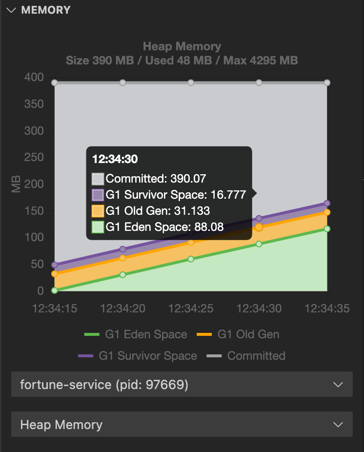
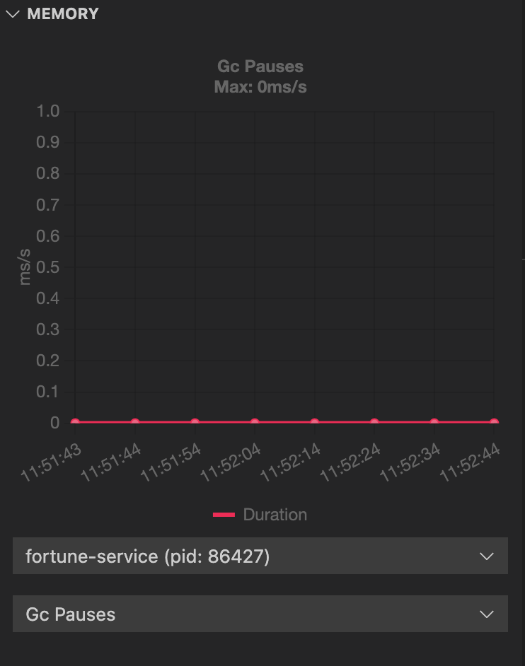
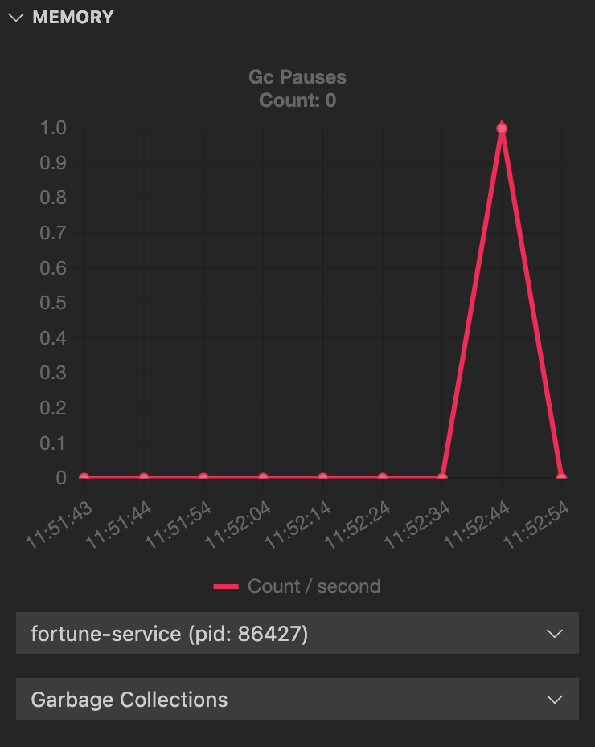
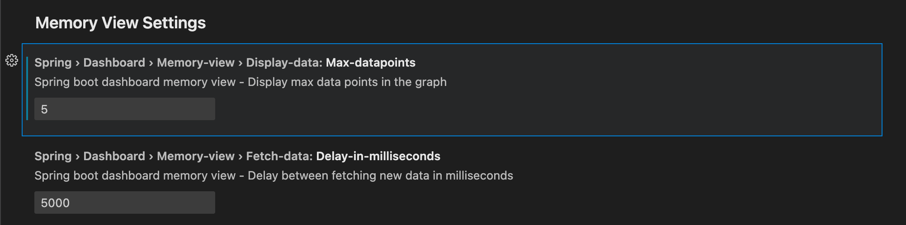

# Use Memory View in Spring Boot Dashboard

This topic tells you how to use Spring Boot Dashboard to view memory use.

For more information about Spring Boot Dashboard, see
[Spring Boot Dashboard](https://marketplace.visualstudio.com/items?itemName=vscjava.vscode-spring-boot-dashboard).

##  Prerequisites

To see the Memory View in Spring Boot Dashboard you need:

- A Tanzu Spring Boot application, such as
  [tanzu-java-web-app](https://github.com/vmware-tanzu/application-accelerator-samples/tree/main/tanzu-java-web-app)
- The [Spring Boot Extension Pack](https://marketplace.visualstudio.com/items?itemName=Pivotal.vscode-boot-dev-pack),
  which includes Spring Boot Dashboard

##  Deploy a workload

Deploy the workload for an app to a cluster by following the steps in
[Deploy a Workload to the Cluster](live-hover.hbs.md#deploy-workload).

##  View memory use in Spring Boot Dashboard

To view the Spring Boot Dashboard, run `View: Show Spring Boot Dashboard` from the Command Palette.

When the app is running, the Memory View section is displayed in Spring Boot Dashboard.
The graphical representation in the memory view highlights the memory use inside the Java virtual
machine (JVM).
The drop-down menus beneath the graph enable you to switch between different running processes and
graphical views.

The heap and non-heap memory regions provide memory insights into the application.
The real-time graphs display a stacked overview of the different spaces in memory relative to the
total memory used and total memory size.

The memory view also contains graphs to display the garbage-collection pauses and garbage-collection
events.
Long and frequent garbage-collection pauses indicate that the app is having a memory problem that
requires further investigation.

The graphs show only real-time data. You can configure the number of data points to view and the
interval by changing the settings. To access the settings on macOS, go to
**Code** > **Preferences** > **Settings** > **Extensions** > **Spring Boot Dashboard** >
**Memory View Settings**.
The navigation path might differ on other operating systems, such as Windows and Linux.

