# Using Tanzu Developer Tools for VS Code

Ensure the project that you want to use the extension with has the required files specified in
[Getting started with Tanzu Developer Tools for Visual Studio Code](../vscode-extension/getting-started.md).

The extension requires only one Tiltfile and one `workload.yaml` per project.
The `workload.yaml` must be a single-document YAML file, not a multidocument YAML file.

## <a id="multiple-projects"></a> Configure for multiple projects in the workspace

When working with multiple projects in a single workspace, you can configure the extension settings
on a per-project basis by using the drop-down menu in **Settings**.


## <a id="apply-workload"></a> Apply a workload

The extension enables you to apply workloads on your Kubernetes cluster that has
Tanzu Application Platform.

To apply a workload from the Command Palette:

1. Pressing ⇧⌘P on macOS to open the Command Palette.

1. Run `Tanzu: Apply Workload`.

    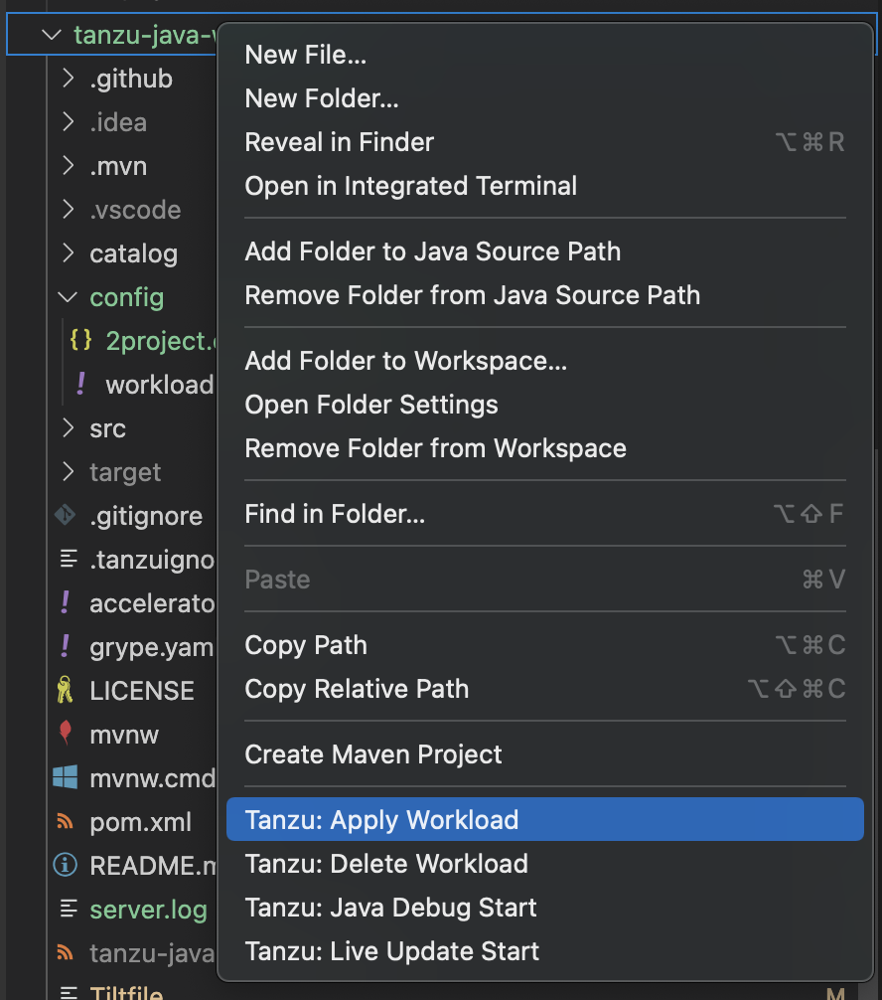

1. If there are multiple projects with workloads, select the workload to apply.

    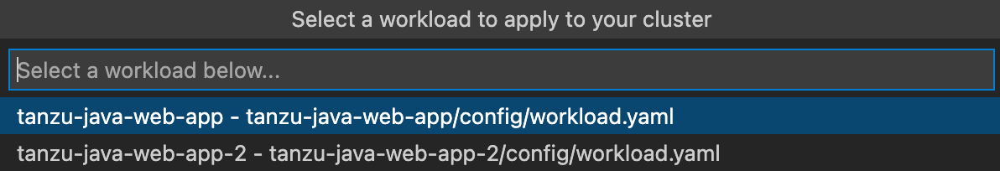

    A notification appears showing that the workload was applied.

    

    A new workload appears on the Tanzu Workloads panel.

    

    The Workloads panel shows the workloads running in the namespace that is defined in the current
    Kubernetes context.

1. (Optional) See the context and namespace currently configured by running:

    ```console
    kubectl config get-contexts
    ```

1. (Optional) Set a namespace for the current context by running:

    ```console
    kubectl config set-context --current --namespace=YOUR-NAMESPACE
    ```

    After the workload is deployed, the status on the Tanzu Workloads panel changes to `Ready`.

    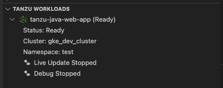

To apply a workload from the context menu:

1. Apply a workload from the context menu by right-clicking on your workload file and selecting
**Tanzu: Apply Workload**.

    

    A notification appears showing that the workload was applied.

    

    A new workload appears on the Tanzu Workloads panel.

    

    The workloads panel shows the workloads running in the namespace that is defined in the current
    Kubernetes context.

1. (Optional) See the context and namespace currently configured by running:

    ```console
    kubectl config get-contexts
    ```

1. (Optional) Set a namespace for the current context by running:

    ```console
    kubectl config set-context --current --namespace=YOUR-NAMESPACE
    ```

    After the workload is deployed, the status on the Tanzu Workloads panel changes to **Ready**.

    

## <a id="debugging-on-clust"></a> Debugging on the cluster

The extension enables you to debug your application on your Kubernetes cluster that has
Tanzu Application Platform.

Debugging requires a `workload.yaml` file in your project.
For information about creating a `workload.yaml` file, see
[Set up Tanzu Developer Tools](../vscode-extension/getting-started.md#set-up-tanzu-dev-tools).

Debugging on the cluster and Live Update cannot be used simultaneously.
If you use Live Update for the current project, ensure that you stop the
Tanzu Live Update Run Configuration before attempting to debug on the cluster.
For more information, see [Stop Live Update](#stop-live-update).

### <a id="start-debugging"></a> Start debugging on the cluster

To start debugging on the cluster:

1. Add a [breakpoint](https://code.visualstudio.com/docs/editor/debugging#_breakpoints) in your code.
1. Right-click the `workload.yaml` file in your project.
1. Select **Debug 'Tanzu Debug Workload...'** in the pop-up menu.

    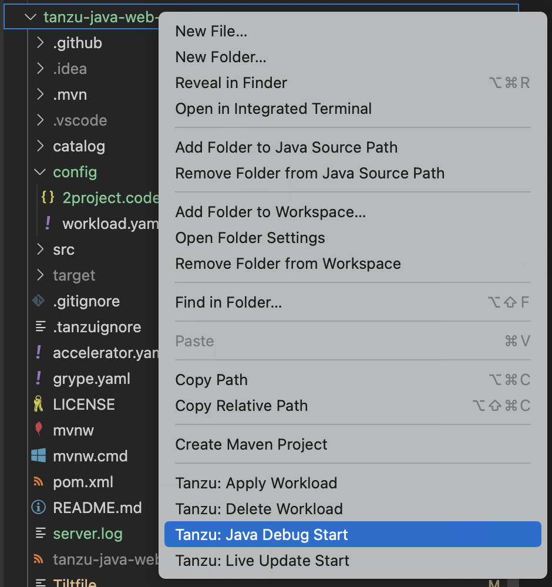

### <a id="stop-debugging"></a> Stop Debugging on the cluster

To stop debugging on the cluster, you can click the stop button in the Debug overlay.


Alternatively, you can press ⌘+J (Ctrl+J on Windows) to open the panel and then click the trash can
button for the debug task running in the panel.


## <a id="live-update"></a> Live Update

With the use of Live Update facilitated by [Tilt](https://docs.tilt.dev/), the extension enables you
to deploy your workload once, save changes to the code, and see those changes
reflected in the workload running on the cluster within seconds.

Live Update requires a `workload.yaml` file and a Tiltfile in your project.
For information about how to create a `workload.yaml` and a Tiltfile, see
[Set up Tanzu Developer Tools](../vscode-extension/getting-started.md#set-up-tanzu-dev-tools).

Live Update and Debugging on the cluster cannot be used simultaneously.
If you are currently debugging on the cluster, stop debugging before attempting to use Live Update.

### <a id="start-live-update"></a> Start Live Update

You can start Live Update by right-clicking anywhere in the VS Code project explorer and then clicking
**Tanzu: Live Update Start** in the pop-up menu.

   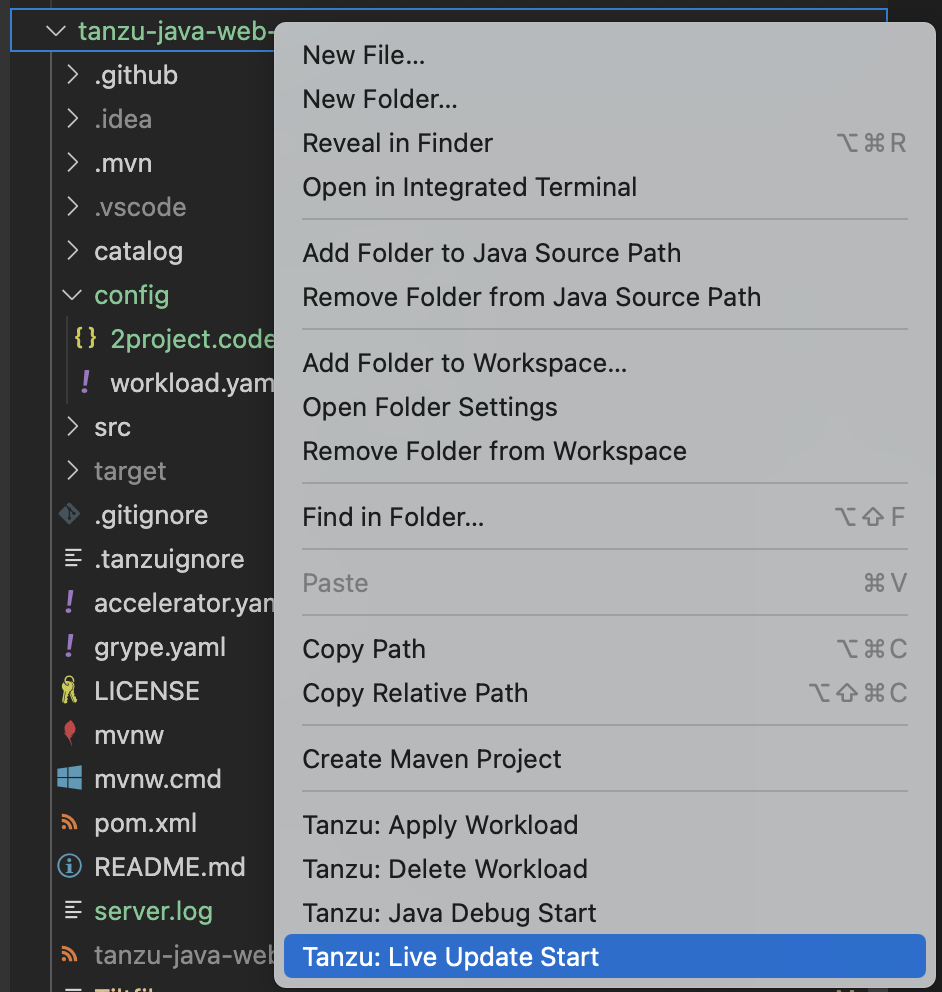

Alternatively, you can press `⇧⌘P` to open the Command Palette and run the `Tanzu: Live Update Start`
command.

   

### <a id="stop-live-update"></a> Stop Live Update

When Live Update stops, your application continues to run on the cluster, but the changes you made
and saved in your editor are not present in your running application unless you redeploy your
application to the cluster.

You can stop Live Update by right-clicking your project’s Tiltfile and selecting `Tanzu: Live Update Stop`.

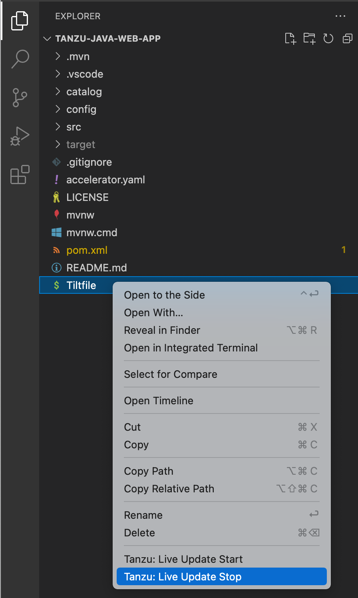

Alternatively, you can press ⇧⌘P to open the Command Palette and then run `Tanzu: Live Update Stop`.

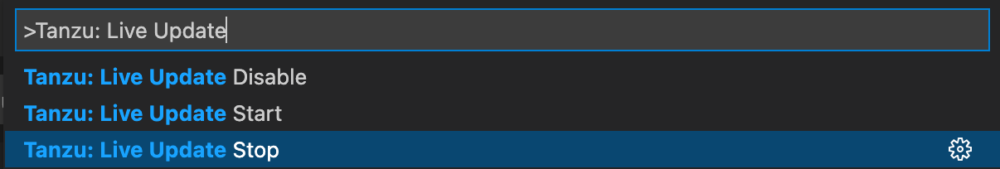

### <a id="disable-live-update"></a> Deactivate Live Update

You can remove the Live Update capability from your application entirely.
This option can be useful in a troubleshooting scenario.
Deactivating Live Update redeploys your workload to the cluster and removes the Live Update capability.

To deactivate Live Update:

1. Press ⇧⌘P to open the Command Palette.
1. Run `Tanzu: Live Update Disable`.

   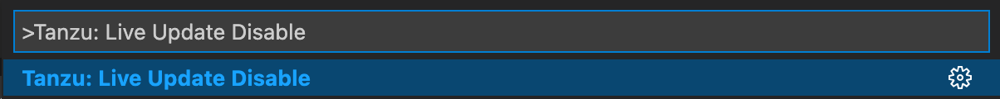

1. Type the name of the workload for which you want to deactivate Live Update.

### <a id="live-update-status"></a> Live Update status

The current status of Live Update is visible on the right side of the status bar at the bottom of
the VS Code window.


The Live Update status bar entry shows the following states:

- Live Update Stopped
- Live Update Starting…
- Live Update Running

To hide the Live Update status bar entry, right-click it and select
**Hide 'Tanzu Developer Tools (Extension)'**.

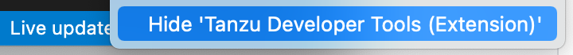

## <a id="delete-workload"></a> Delete a workload

The extension enables you to delete workloads on your Kubernetes cluster that has
Tanzu Application Platform.

To delete a workload:

1. Open the Command Palette by pressing ⇧⌘P on macOS.

1. Run `Tanzu: Delete Workload`.

    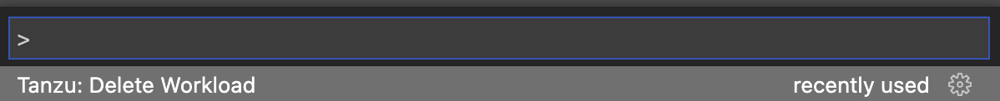

1. Select the workload to delete.

    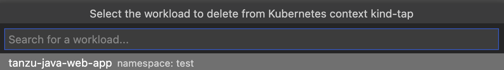

    If the **Tanzu: Confirm Delete** setting is enabled, a message appears that prompts you to delete
    the workload and not warn again, delete the workload, or cancel.

    

    A notification appears showing that the workload was deleted.

    

## <a id="switch-namespace"></a> Switch namespaces

To switch the namespace where you created the workload:

1. Go to **Code** > **Preferences** > **Settings**.
1. Expand the **Extensions** section of the settings and select **Tanzu**.
1. In the **Namespace** option, add the namespace you want to deploy to. This is the `default`
namespace by default.


## <a id="workload-panel"></a> Tanzu Workloads panel

The current state of the workloads is visible on the Tanzu Workloads panel in the bottom left corner
of the VS Code window. The panel shows the current status of each workload, namespace, and cluster.
It also shows whether Live Update and Debug is running, stopped, or deactivated.

The Tanzu Workloads panel uses the cluster and namespace specified in the current kubectl context.

1. View the current context and namespace by running:

    ```console
    kubectl config get-contexts
    ```

1. Set a namespace for the current context by running:

    ```console
    kubectl config set-context --current --namespace=YOUR-NAMESPACE
    ```

    
