# Use Tanzu Developer Tools for VS Code

This topic tells you how to use VMware Tanzu Developer Tools for Visual Studio Code (VS Code).

Ensure that the project you want to use the extension with has the required files specified in
[Get started with Tanzu Developer Tools for VS Code](../vscode-extension/getting-started.hbs.md).

The extension requires only one Tiltfile and one `workload.yaml` per project.
The `workload.yaml` must be a single-document YAML file, not a multidocument YAML file.

## <a id="multiple-projects"></a> Configure for multiple projects in the workspace

When working with multiple projects in a single workspace, you can configure the extension settings
on a per-project basis by using the drop-down menu in **Settings**.

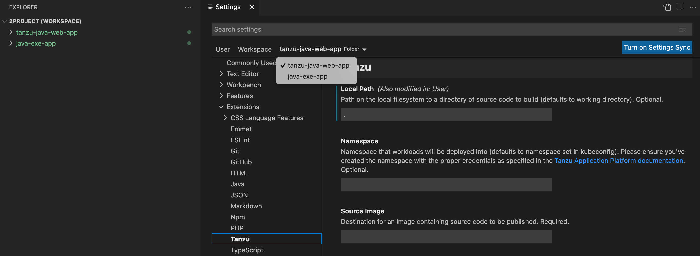

## <a id="workload-commands"></a> Workload Commands

All commands are available by right-clicking anywhere in the VS Code project explorer, on an associated
workload in the Tanzu Workloads panel, or in the Command Palette (⇧⌘P on Mac and Ctrl+Shift+P on Windows).

- Screenshot of pop-up menu opened from the workload panel:

  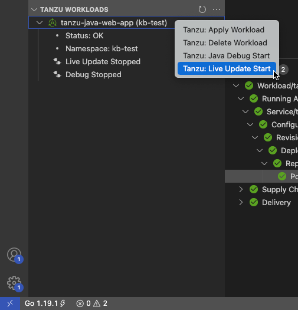

- Screenshot of the command palette:

  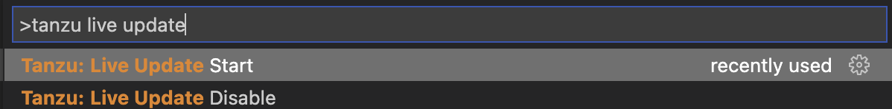

### <a id="apply-workload"></a> Apply a workload

The extension enables you to apply workloads on your Kubernetes cluster that has
Tanzu Application Platform.

To apply a workload:

1. Right-click anywhere in the VS Code project explorer, on an associated workload in the
   Tanzu Workloads panel, or open the Command Palette (⇧⌘P on Mac and Ctrl+Shift+P on Windows).

2. Select the `Tanzu: Apply Workload` command.

3. If applicable, select the workload to apply.

   

   A notification appears showing that the workload was applied.

   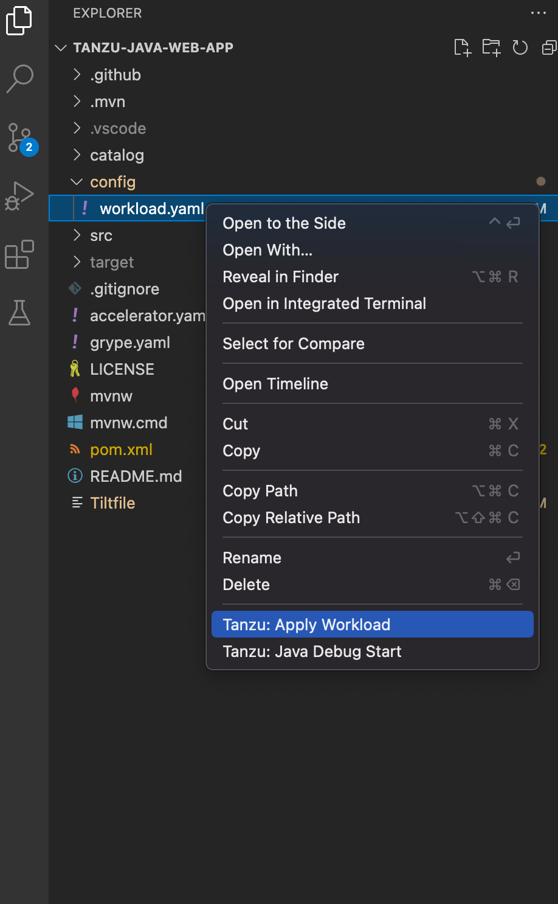

   A new workload appears on the Tanzu Workloads panel.

   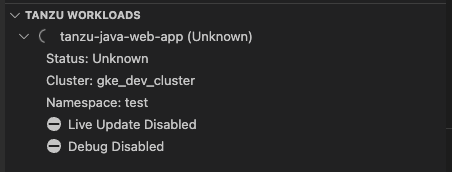

   After the workload is deployed, the status on the Tanzu Workloads panel changes to `Ready`.

### <a id="debugging-on-clust"></a> Debugging on the cluster

The extension enables you to debug your application on your Kubernetes cluster that has
Tanzu Application Platform.

Debugging requires a `workload.yaml` file in your project.
For information about creating a `workload.yaml` file, see
[Get Started with Tanzu Developer Tools for VS Code](../vscode-extension/getting-started.hbs.md#set-up-tanzu-dev-tools).

The developer sandbox experience enables developers to Live Update their code, and simultaneously
debug the updated code, without having to deactivate Live Update when debugging.

#### <a id="start-debugging"></a> Start debugging on the cluster

To start debugging on the cluster:

1. Add a [breakpoint](https://code.visualstudio.com/docs/editor/debugging#_breakpoints) in your code.

2. Right-click anywhere in the VS Code project explorer, on an associated workload in the
   Tanzu Workloads panel, or open the Command Palette (⇧⌘P on Mac and Ctrl+Shift+P on Windows).

3. Select the `Tanzu: Java Debug Start` command..

#### <a id="stop-debugging"></a> Stop Debugging on the cluster

To stop debugging on the cluster, you can click the stop button in the Debug overlay.

  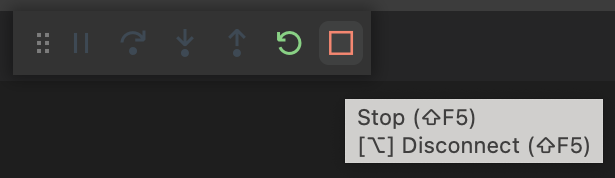

Alternatively, you can press ⌘+J (Ctrl+J on Windows) to open the panel and then click the trash can
button for the debug task running in the panel.

  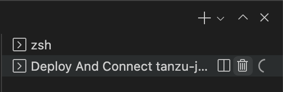

#### <a id="microservices-debug"></a> Debug apps in a microservice repository

To debug multiple apps in a microservice repository:

1. Add each app folder as a workspace folder. For instructions, see the
   [Visual Studio Code documentation](https://code.visualstudio.com/docs/editor/multi-root-workspaces#_adding-folders).

2. Update the `tanzu.debugPort` setting so that it does not conflict with other debugging sessions.
   For how to update individual workspace folder settings, see the
   [Visual Studio Code documentation](https://code.visualstudio.com/docs/editor/multi-root-workspaces#_settings).

### <a id="live-update"></a> Live Update

With the use of Live Update facilitated by [Tilt](https://docs.tilt.dev/), the extension enables you
to deploy your workload once, save changes to the code, and see those changes reflected in the
workload running on the cluster within seconds.

Live Update requires a `workload.yaml` file and a Tiltfile in your project.
For information about how to create a `workload.yaml` and a Tiltfile, see
[Get Started with Tanzu Developer Tools for VS Code](../vscode-extension/getting-started.hbs.md#set-up-tanzu-dev-tools).

The developer sandbox experience enables developers to Live Update their code, and simultaneously
debug the updated code, without having to deactivate Live Update when debugging.

#### <a id="start-live-update"></a> Start Live Update

Before using Live Update, verify that your auto-save setting is either off or on with a delay.
The delay must be long enough for the application to restart between auto saves to allow enough
time for your app to Live Update when files change.
The auto-save setting is in
**Preferences** > **Text Editor** > **Files** > **Auto Save** > **Auto Save Delay**.

To start Live Update:

1. Right-click anywhere in the VS Code project explorer, on an associated workload in the
   Tanzu Workloads panel, or open the Command Palette (⇧⌘P on Mac and Ctrl+Shift+P on Windows).

2. Select the `Tanzu: Live Update Start` command.

#### <a id="stop-live-update"></a> Stop Live Update

When Live Update stops, your application continues to run on the cluster, but the changes you made
and saved in your editor are not present in your running application unless you redeploy your
application to the cluster.

To stop Live Update, click the trash can button in the terminal pane to stop the Live Update process.

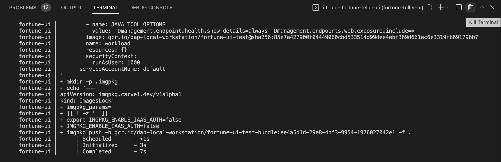

#### <a id="microservices-live-update"></a> Live Update apps in a microservices repository

To Live Update multiple apps in a microservice repository:

1. Add each app folder as a workspace folder. For instructions, see the
   [Visual Studio Code documentation](https://code.visualstudio.com/docs/editor/multi-root-workspaces#_adding-folders).

2. Ensure that a port is available to port-forward the Knative service.
   For example, you might have this in your Tiltfile:

   ```bazel
   k8s_resource('tanzu-java-web-app', port_forwards=["NUMBER:8080"],
               extra_pod_selectors=[{'carto.run/workload-name': 'tanzu-java-web-app', 'app.kubernetes.io/component': 'run'}])
   ```

   Where `NUMBER` is the port you choose. For example, `port_forwards=["9999:8080"]`.

### <a id="delete-workload"></a> Delete a workload

The extension enables you to delete workloads on your Kubernetes cluster that has
Tanzu Application Platform.

To delete a workload:

1. Right-click anywhere in the VS Code project explorer, on an associated workload in the
   Tanzu Workloads panel, or open the Command Palette (⇧⌘P on Mac and Ctrl+Shift+P on Windows).

2. Select the `Tanzu: Delete Workload` command.

3. If applicable, select the workload to delete.

   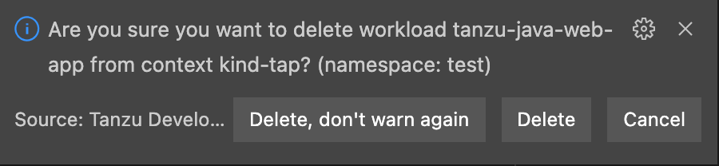

   If the **Tanzu: Confirm Delete** setting is enabled, a message appears that prompts you to delete
   the workload and not warn again, delete the workload, or cancel.

   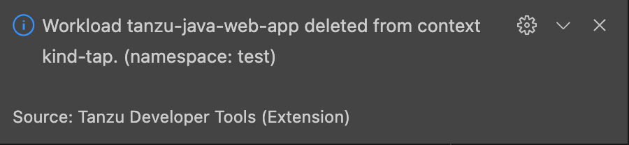

   A notification appears showing that the workload was deleted.

## <a id="switch-namespace"></a> Deploy to different namespaces

To switch the namespace where you created the workload:

1. Go to **Code** > **Preferences** > **Settings**.
1. Expand the **Extensions** section of the settings and click **Tanzu**.
1. In the **Namespace** option, add the namespace you want to deploy to. This is the `default`
   namespace by default.

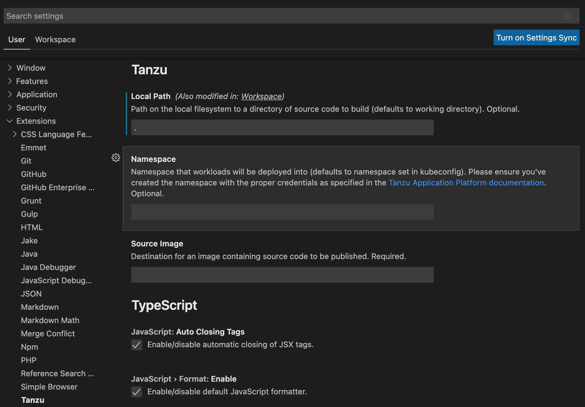

## <a id="workload-panel"></a> Tanzu Workloads panel

{{> 'partials/ide-extensions/workload-panel-intro' }}

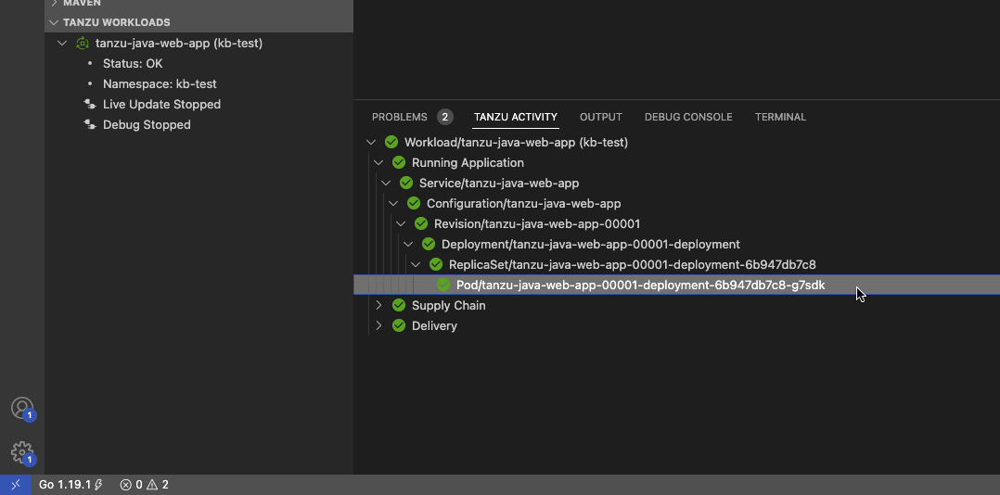

To add a namespace:

1. View the current context and namespace by running:

   ```console
   kubectl config get-contexts
   ```

2. Set a namespace for the current context by running:

   ```console
   kubectl config set-context --current --namespace=YOUR-NAMESPACE
   ```

3. Use one of these methods to add additional namespaces to your Tanzu Workloads panel:

   - Go to **Preferences** > **Extensions** > **Tanzu Developer Tools** > **Tracked Namespaces** and
     then select the namespaces that you want.

   - Go to **Workload Panel** > **Additional Options** > **Select Namespaces** and then select the
     namespaces that you want.

   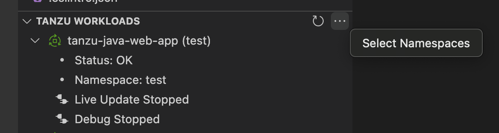

## <a id="mono-repo"></a> Working with Microservices in a Monorepo

A monorepo is single Git repository that contains multiple workloads.
Each individual workload is placed in a subfolder of the main repository.

You can find an example of this in [Application Accelerator](../application-accelerator/about-application-accelerator.hbs.md).
The relevant accelerator is called Spring SMTP Gateway, and you can obtain its source code as an
accelerator or directly from the
[application-accelerator-samples](https://github.com/vmware-tanzu/application-accelerator-samples/tree/tap-1.3.x/spring-smtp-gateway)
GitHub repository.

This project exemplifies a typical layout:

- `MONO-REPO-ROOT/`
  - `pom.xml` (parent pom)
  - `microservice-app-1/`
    - `pom.xml`
    - `mvnw` (and other mvn-related files for building the workload)
    - `Tiltfile` (supports Live Update)
    - `config`
      - `workload.yaml` (supports deploying and debugging from IntelliJ)
    - `src/` (contains source code for this microservice)
  - `microservice-app-2/`
    - ...similar layout

## <a id="rec-struct"></a> Recommended structure: Microservices that can be built independently

In this example, each of the microservices can be built independently of one another.
Each subfolder contains everything needed to build that workload.

This is reflected in the `source` section of `workload.yaml` by using the `subPath` attribute:

```yaml
apiVersion: carto.run/v1alpha1
kind: Workload
metadata:
  name: microservice-app-1
  ...
spec:
  source:
    git:
      ref:
        branch: main
      url: https://github.com/kdvolder/sample-mono-repo.git
    subPath: microservice-app-1 # build only this
  ...
```

For setting up your own repositories, it's best practice to set up a monorepo so that each
microservice can be built completely independently.

To work with these monorepos:

- Import the monorepo as a project into VS Code.
- Interact with each of the subfolders in the same way you would interact with a project containing
  a single workload.

## <a id="alt-struct"></a> Alternative structure: Services with build-time interdependencies

Some monorepos do not have submodules that can be independently built.
Instead the `pom.xml` files of the submodules are set up to have some build-time interdependencies.
For example:

- A submodule `pom.xml` can reference the parent `pom.xml` as a common place for
  centralized dependency management.
- A microservice submodule can reference another, as a maven dependency.
- Several microservice submodules can reference one or more shared library modules.

For these projects, make these adjustments:

1. Make `workload.yaml` point to the repository root, not a subfolder.
   Because submodules have dependencies on code outside of their own subfolder, all source code
   from the repository must be supplied to the workload builder.

2. Make `workload.yaml` specify additional buildpack arguments through environment variables.
   They differentiate the submodule that the build is targeting.

   Both of these `workload.yaml` changes are in the following example:

   ```yaml
   apiVersion: carto.run/v1alpha1
   kind: Workload
   metadata:
   name: fortune-ui
   labels:
      apps.tanzu.vmware.com/workload-type: web
      app.kubernetes.io/part-of: fortune-ui
   spec:
   build:
      env:
         - name: BP_MAVEN_BUILD_ARGUMENTS
         value: package -pl fortune-teller-ui -am # indicate which module to build.
         - name: BP_MAVEN_BUILT_MODULE
         value: fortune-teller-ui # indicate where to find the built artefact to deploy.
   source:
      git:
         url: https://github.com/my-user/fortune-teller # repo root
         ref:
         branch: main
   ```

   For more information about these and other `BP_xxx` buildpack parameters, see the
   [Buildpack Documentation](https://github.com/paketo-buildpacks/maven/blob/main/README.md).

3. Make the local path preference for each subfolder point to the path of the repository root
   Because submodules have dependencies on code outside of their own subfolder, all source code
   from the repository must be supplied to the workload builder.

   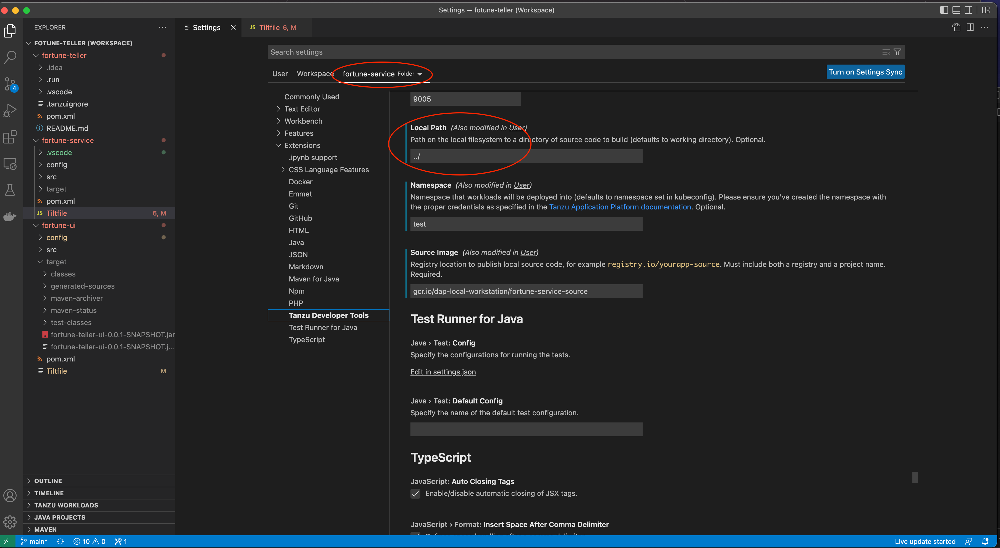

## <a id="log-setting"></a> Changing logging verbosity

The Tanzu Language Server saves logs to `~/tanzu-langserver.log`.
You can change the log verbosity in **Preferences** > **Settings** > **Extensions** >
**Tanzu Developer Tools** > **Language Server: Log Verbosity**.

## <a id="java-native"></a> Working with Java Native images

{{> 'partials/ide-extensions/java-native-images' }}

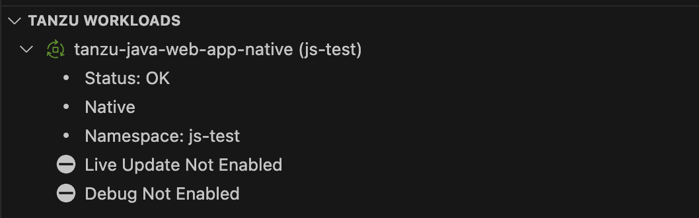.
