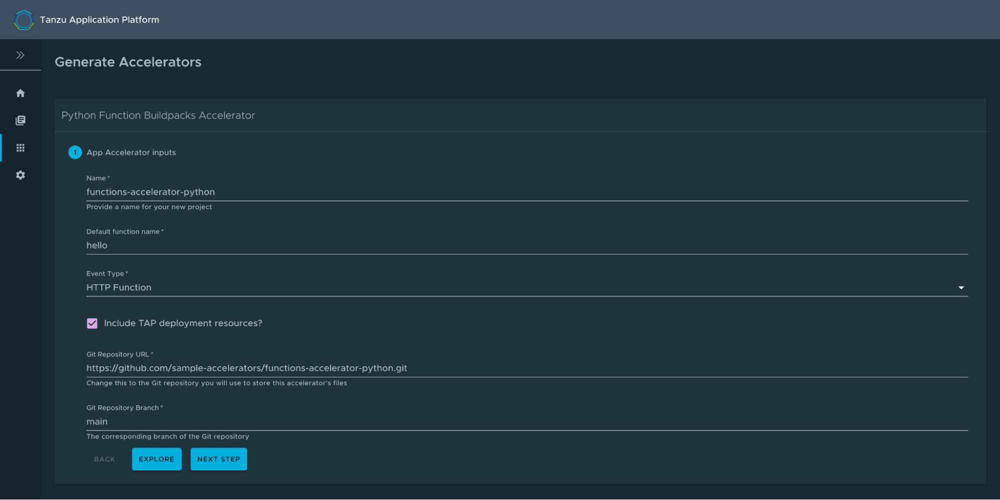

# Functions (Beta Feature)

## <a id="overview"></a>Overview

The function experience on Tanzu Application Platform enables developers to deploy functions, use starter templates to bootstrap their function and write only the code that matters to your business. Developers can run a single CLI command to deploy their functions to an auto-scaled cluster.

This document describes how to create and deploy an HTTP function from an application accelerator starter template.

> **Important:** The functionality of beta features has been tested, but performance has not.
> Features enter the beta stage for customers to gain early access to them and give feedback on their
> design and behavior.
> Beta features might undergo changes based on that feedback before leaving beta.
> VMware discourages running beta features in production.
> VMware doesn't guarantee that any beta feature can be upgraded in the future.

## <a id="prereqs"></a>Prerequisites

Before using functions workloads on Tanzu Application Platform, complete the following prerequisites:

- Complete all steps described in [Installing Tanzu Application Platform](../install-intro.md).
- Download and install the kp CLI for your operating system from the [Tanzu Build Service](https://network.tanzu.vmware.com/products/build-service/) page on Tanzu Network. For more information, see the [kp CLI help text](https://github.com/vmware-tanzu/kpack-cli/blob/v0.4.0/docs/kp.md) on GitHub.
- [Set up developer namespaces to use installed packages](../install-components.html#setup).

## <a id="add-buildpacks"></a>Adding function buildpacks

To use the function `buildpacks`, you must upload their buildpackages to Build Service stores.

1. Add the function's buildpackages to the default [ClusterStore](https://docs.vmware.com/en/Tanzu-Build-Service/1.6/vmware-tanzu-build-service/GUID-managing-stores.html) by running:

    ```
    kp clusterstore add default \
    -b registry.tanzu.vmware.com/python-function-buildpack-for-vmware-tanzu/python-buildpack-with-deps:0.0.11 \
    -b registry.tanzu.vmware.com/java-function-buildpack-for-vmware-tanzu/java-buildpack-with-deps:0.0.6
    ```

1. Create and save a new [ClusterBuilder](https://docs.vmware.com/en/Tanzu-Build-Service/1.6/vmware-tanzu-build-service/GUID-managing-builders.html) by running:

    ```
    kp clusterbuilder save function --store default -o - <<EOF
    ---
    - group:
      - id: tanzu-buildpacks/python-lite
      - id: kn-fn/python-function
    - group:
      - id: tanzu-buildpacks/java-native-image-lite
      - id: kn-fn/java-function
    - group:
      - id: tanzu-buildpacks/java-lite
      - id: kn-fn/java-function

    EOF
    ```

    If you still want to use default Java and Python buildpacks for non-functions workloads,
    add optional `true` flags for cluster builder groups.
    This does not enable the full capability of non-function workloads provided by the default
    ClusterBuilder. See the following example.

    ```
    kp clusterbuilder save function --store default -o - <<EOF
    ---
    - group:
      - id: tanzu-buildpacks/python-lite
      - id: kn-fn/python-function
      optional: true
    - group:
      - id: tanzu-buildpacks/java-native-image-lite-
      - id: kn-fn/java-function
      optional: true
    - group:
      - id: tanzu-buildpacks/java-lite
      - id: kn-fn/java-function
      optional: true

    EOF
    ```

1. After creating the ClusterBuilder, update your `tap-values.yaml` configuration to use the cluster builder you created. See the following example:

    ```
    ootb_supply_chain_basic:
     cluster_builder: function
     registry:
       server: "SERVER"
       repository: "REPO"
    ```

    Where:

    * `SERVER` is your server. For example, `index.docker.io`.
    * `REPO` is your repository.

1. Apply the update by going to the directory containing `tap-values.yml` and running:

    ```
    tanzu package installed update tap -p tap.tanzu.vmware.com -v VERSION --values-file tap-values.yml -n tap-install
    ```

    Where `VERSION` is the version of Tanzu Application Platform GUI you have installed. For example, `1.0.2`.

## <a id="add-accelerators"></a>Add accelerators to Tanzu Application Platform GUI

Application Accelerator is a component of Tanzu Application Platform. An accelerator contains your enterprise-conformant code and configurations that developers can use to create new projects that automatically follow the standards defined in your accelerators.

The accelerator ZIP file contains a file called k8s-resource.yaml. This file contains the resource manifest for the function accelerator.

1. Download the ZIP file for the appropriate accelerator:

    - [Python HTTP Function](https://github.com/sample-accelerators/python-functions-accelerator) on GitHub.
    - [Java HTTP Function](https://github.com/sample-accelerators/java-functions-accelerator) on GitHub.

1. Expand the accelerator ZIP file in your target cluster with Tanzu Application Platform GUI installed.
1. To update the Application Accelerator templates in Tanzu Application Platform GUI, you must apply the k8s-resource.yaml. Run the following command in your terminal in the folder where you expanded the ZIP file:

    ```
    kubectl apply -f k8s-resource.yaml --namespace accelerator-system
    ```

1. Refresh Tanzu Application Platform GUI to reveal functions accelerator(s).

    

    It might take time for Tanzu Application Platform GUI to refresh the catalog to see your added functions accelerators.

## <a id="create-functions-proj"></a>Create a functions project from an accelerator

1. From the Tanzu Application Platform GUI portal, click **Create** on the left navigation bar to see the list of available accelerators.

    

1. Locate the Function Buildpacks accelerator and click **CHOOSE**.
1. Provide a name for your function project and function. If creating a Java function, select a project type\*. Select HTTP for your event type. Provide a Git repository to store this accelerator's files. Click **NEXT STEP**, verify the provided information, and click **CREATE**.

    

1. After the Task Activity processes complete, click **DOWNLOAD ZIP FILE**.

1. After downloading the ZIP file, expand it in a workspace directory and follow your preferred procedure for uploading the generated project files to a Git repository for your new project.

## <a id="deploy-function"></a>Deploy your function

1. Deploy the Function accelerator by running the tanzu apps workload create command:

    ```
    tanzu apps workload create functions-accelerator-python \
    --local-path . \
    --source-image REGISTRY/IMAGE:TAG \
    --type web \
    --yes
    ```

    Where:

    - `--source-image` is a writable repository in your registry.

    Harbor has the form: "my-harbor.io/my-project/functions-accelerator-python".

    Dockerhub has the form: "my-dockerhub-user/functions-accelerator-python".

    Google Cloud Registry has the form: "gcr.io/my-project/functions-accelerator-python".

1. View the build and runtime logs for your application by running the tail command:

    ```
    tanzu apps workload tail functions-accelerator-python --since 10m --timestamp
    ```

1. After the workload is built and running, you can view the web application in your browser. To view the URL of the web application, run the following command and then ctrl-click the Workload Knative Services URL at the bottom of the command output.

    ```
    tanzu apps workload get functions-accelerator-python
    ```
