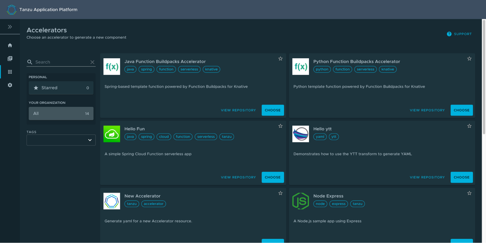

# Use functions (Beta)

This topic tells you how to create and deploy a HTTP or CloudEvent function from an
Application Accelerator starter template in an online or air-gapped environment on Tanzu Application Platform (commonly known as TAP).

## <a id="overview"></a> Overview

The function experience on Tanzu Application Platform enables developers to deploy functions, use starter templates to bootstrap their function and write only the code that matters to your business. Developers can run a single CLI command to deploy their functions to an auto-scaled cluster.

Functions provide a quick way to get started writing an application. Compared with a traditional application:

* Functions have a single entry-point and perform a single task. This means that functions can be easier to understand and monitor.

* The initial webserver and application boilerplate are managed by the function supply chain.
This means that you can update the webserver and application boilerplate without needing to update each function application.

* A traditional webserver application might be a better fit if you want to implement an entire website or API in a single container

> **Important:** Beta features have been tested for functionality, but not performance.
> Features enter the beta stage so that customers can gain early access, and give
> feedback on the design and behavior.
> Beta features might undergo changes based on this feedback before the end of the beta stage.
> VMware discourages running beta features in production.
> VMware cannot guarantee that you can upgrade any beta feature in the future.

## <a id="prereqs"></a> Prerequisites

Before using function workloads on Tanzu Application Platform, complete the following prerequisites:

* Follow all instructions in [Installing Tanzu Application Platform](../install-online/intro.hbs.md).

* Download and install the kp CLI for your operating system from the
[Tanzu Build Service](https://network.tanzu.vmware.com/products/build-service/) page on Tanzu Network.
For more information, see the [kp CLI help text](https://github.com/vmware-tanzu/kpack-cli/blob/v0.4.0/docs/kp.md) on GitHub.

* Follow all instructions in [Set up developer namespaces to use installed packages](../install-online/set-up-namespaces.hbs.md).

## <a id="add-buildpacks"></a> Adding function buildpacks

To use the function `buildpacks`, you must upload their buildpackages to Build Service stores.

1. Add the function's buildpackages to the default [ClusterStore](https://docs.vmware.com/en/Tanzu-Build-Service/1.6/vmware-tanzu-build-service/GUID-managing-stores.html) by running:

    ```console
    kp clusterstore add default \
    -b registry.tanzu.vmware.com/python-function-buildpack-for-vmware-tanzu/python-buildpack-with-deps:0.0.11 \
    -b registry.tanzu.vmware.com/java-function-buildpack-for-vmware-tanzu/java-buildpack-with-deps:0.0.6
    ```

1. Create and save a new [ClusterBuilder](https://docs.vmware.com/en/Tanzu-Build-Service/1.6/vmware-tanzu-build-service/GUID-managing-builders.html).
Run one of the following commands depending on the dependencies
you used in the `buildservice` section of your [`tap-values.yaml` file](../install-online/profile.hbs.md#full-profile):

    - For the **full dependencies**, run:

        ```console
        kp clusterbuilder save function --store default -o - <<EOF
        ---
        - group:
          - id: tanzu-buildpacks/python
          - id: kn-fn/python-function
        - group:
          - id: tanzu-buildpacks/java-native-image
          - id: kn-fn/java-function
        - group:
          - id: tanzu-buildpacks/java
          - id: kn-fn/java-function

        EOF
        ```

        If you still want to use default Java and Python buildpacks for non-functions workloads,
        add `optional: true` flags for cluster builder groups.
        This does not enable the full capability of non-function workloads provided by the default
        ClusterBuilder. For example:

        ```console
        kp clusterbuilder save function --store default -o - <<EOF
        ---
        - group:
          - id: tanzu-buildpacks/python
          - id: kn-fn/python-function
          optional: true
        - group:
          - id: tanzu-buildpacks/java-native-image
          - id: kn-fn/java-function
          optional: true
        - group:
          - id: tanzu-buildpacks/java
          - id: kn-fn/java-function
          optional: true

        EOF
        ```

    - For the **lite dependencies**, run:

        ```console
        kp clusterbuilder save function --store default -o - <<EOF
        ---
        - group:
          - id: tanzu-buildpacks/python-lite
          - id: kn-fn/python-function
        - group:
          - id: tanzu-buildpacks/java-native-image-lite
          - id: kn-fn/java-function
        - group:
          - id: tanzu-buildpacks/java-lite
          - id: kn-fn/java-function

        EOF
        ```

        If you still want to use default Java and Python buildpacks for non-functions workloads,
        add `optional: true` flags for cluster builder groups.
        This does not enable the full capability of non-function workloads provided by the default
        ClusterBuilder. For example:

        ```console
        kp clusterbuilder save function --store default -o - <<EOF
        ---
        - group:
          - id: tanzu-buildpacks/python-lite
          - id: kn-fn/python-function
          optional: true
        - group:
          - id: tanzu-buildpacks/java-native-image-lite
          - id: kn-fn/java-function
          optional: true
        - group:
          - id: tanzu-buildpacks/java-lite
          - id: kn-fn/java-function
          optional: true

        EOF
        ```

1. After creating the ClusterBuilder, update your `tap-values.yaml` configuration to use the cluster builder you created. See the following example:

    ```yaml
    ootb_supply_chain_basic:
     cluster_builder: function
     registry:
       server: "SERVER"
       repository: "REPO"
    ```

    Where:

    * `SERVER` is your server. For example, `index.docker.io`.
    * `REPO` is your repository.

1. Apply the update by going to the directory containing `tap-values.yaml` and running:

    ```console
    tanzu package installed update tap -p tap.tanzu.vmware.com -v VERSION --values-file tap-values.yaml -n tap-install
    ```

    Where `VERSION` is the version of Tanzu Application Platform GUI you have installed. For example, `1.0.2`.

## <a id="add-accelerators"></a> Add accelerators to Tanzu Application Platform GUI

Application Accelerator is a component of Tanzu Application Platform. An accelerator contains your enterprise-conformant code and configurations that developers can use to create new projects that automatically follow the standards defined in your accelerators.

The accelerator ZIP file contains a file called k8s-resource.yaml. This file contains the resource manifest for the function accelerator.

1. Download the ZIP file for the appropriate accelerator:

    - [Python HTTP Function](https://github.com/sample-accelerators/python-functions-accelerator) on GitHub.
    - [Java HTTP Function](https://github.com/sample-accelerators/java-functions-accelerator) on GitHub.

1. Expand the accelerator ZIP file in your target cluster with Tanzu Application Platform GUI installed.
1. To update the Application Accelerator templates in Tanzu Application Platform GUI, you must apply the k8s-resource.yaml. Run the following command in your terminal in the folder where you expanded the ZIP file:

    ```console
    kubectl apply -f k8s-resource.yaml --namespace accelerator-system
    ```

1. Refresh Tanzu Application Platform GUI to reveal function accelerator(s).

    

    It might take time for Tanzu Application Platform GUI to refresh the catalog to see your added function accelerators.

## <a id="create-function-proj-acc"></a> Create a function project from an accelerator

1. From the Tanzu Application Platform GUI portal, click **Create** on the left navigation bar to see the list of available accelerators.

    

1. Locate the Function Buildpacks accelerator and click **CHOOSE**.
1. Provide a name for your function project and function. If creating a Java function, select a project type\*. Select HTTP for your event type. Provide a Git repository to store this accelerator's files. Click **NEXT STEP**, verify the provided information, and click **CREATE**.

    

1. After the Task Activity processes complete, click **DOWNLOAD ZIP FILE**.

1. After downloading the ZIP file, expand it in a workspace directory and follow your preferred procedure for uploading the generated project files to a Git repository for your new project.

## <a id="create-function-proj-cli"></a> Create a function project using the Tanzu CLI

From the CLI, you can generate a function project using an accelerator template,
then download the project artifacts as a ZIP file.

1. Validate that you have added the function accelerator template to the application accelerator server by running:

     ```console
    tanzu accelerator list
    ```

1. Get the `server-url` for the Application Accelerator server.
The URL depends on the configuration settings for Application Accelerator:

    - For installations configured with a shared ingress, use `https://accelerator.DOMAIN`
    where `DOMAIN` is provided in the values file for the accelerator configuration.

    - For installations using a LoadBalancer, look up the External IP address by running:

         ```console
        kubectl get -n accelerator-system service/acc-server
        ```

        Use `http://EXTERNAL-IP` as the URL.


    - For any other configuration, you can use port forwarding by running:

        ```console
        kubectl port-forward service/acc-server -n accelerator-system 8877:80
        ```

        Use `http://localhost:8877` as the URL.

1. Generate a function project from an accelerator template by running:

    ```console
    tanzu accelerator generate ACCELERATOR-NAME \
    --options '{"projectName": "FUNCTION-NAME", "interfaceType": "TYPE"}' \
    --server-url APPLICATION-ACCELERATOR-URL
    ```

    Where:

    - `ACCELERATOR-NAME` is the name of the function accelerator template you want to use.
    - `FUNCTION-NAME` is the name of your function project.
    - `TYPE` is the interface you want to use for your function. Available options are `http` or `cloudevents`. CloudEvents is experimental.
    - `APPLICATION-ACCELERATOR-URL` is the URL for the Application Accelerator
    server that you retrieved in the previous step.

    For example:

    ```console
    tanzu accelerator generate java-function \
    --options '{"projectName": "my-func", "interfaceType": "http"}' \
    --server-url http://localhost:8877
    ```

1. After generating the ZIP file, expand it in your directory and follow your
preferred procedure for uploading the generated project files to a Git repository for your new project.

## <a id="deploy-function"></a> Deploy your function

1. Deploy the function accelerator by running the `tanzu apps workload` create command:

    ```console
    tanzu apps workload create functions-accelerator-python \
    --local-path . \
    --source-image REGISTRY/IMAGE:TAG \
    --type web \
    --yes
    ```

    Where:

    - `--source-image` is a writable repository in your registry.

    Harbor has the form: "my-harbor.io/my-project/functions-accelerator-python".

    Docker Hub has the form: "my-dockerhub-user/functions-accelerator-python".

    Google Cloud Registry has the form: "gcr.io/my-project/functions-accelerator-python".

1. View the build and runtime logs for your application by running the tail command:

    ```console
    tanzu apps workload tail functions-accelerator-python --since 10m --timestamp
    ```

1. After the workload is built and running, you can view the web application in your browser. To view the URL of the web application, run the following command and then ctrl-click the Workload Knative Services URL at the bottom of the command output.

    ```console
    tanzu apps workload get functions-accelerator-python
    ```
